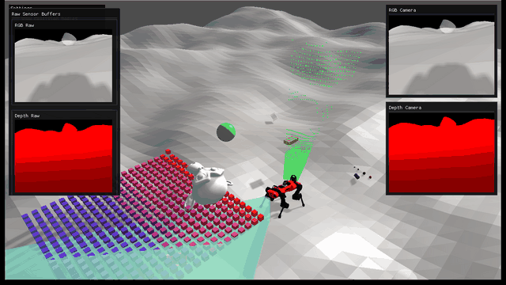
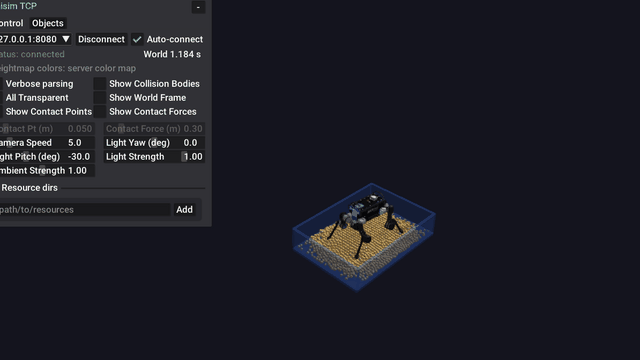
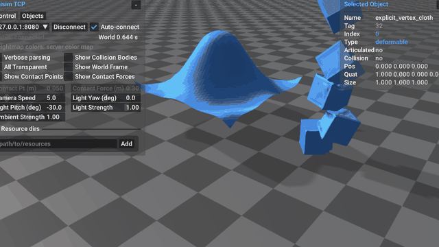
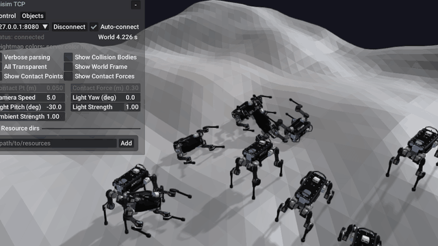

#############################
RaiSim |raisim_version_title|
#############################

RaiSim is a cross-platform multi-body physics engine for robotics and AI. The
binary package includes rigid bodies, articulated systems, deformable bodies,
granular particles, rayrai RGB/depth sensor rendering, deterministic CPU ray
sensors for headless fallback, ``RaisimServer`` streaming, and the rayrai
OpenGL visualizer.

Use this documentation in this order if you are new to RaiSim:

.. list-table::
   :header-rows: 1
   :widths: 28 72

   * - Goal
     - Start here
   * - Install and run one example
     - :doc:`sections/QuickStart`
   * - Find the right example target
     - :doc:`sections/Examples`
   * - Visualize a running ``RaisimServer`` scene
     - :doc:`sections/Visualization`, :doc:`sections/RaisimServer`, and
       :doc:`sections/Rayrai`
   * - Add objects, contacts, sensors, or materials
     - :doc:`sections/WorldSystem`, :doc:`sections/Object`,
       :doc:`sections/Contact`, :doc:`sections/Sensors`, and
       :doc:`sections/MaterialSystem`

.. image:: image/examples_overview.png
  :alt: Current RaiSim and rayrai example overview
  :width: 100%

.. toctree::
   :maxdepth: 1
   :caption: Get started

   sections/QuickStart
   sections/Installation
   sections/Visualization
   sections/Examples
   sections/Troubleshooting
   sections/Changelog
   sections/License
   sections/Support
   sections/Acknowledgement

.. toctree::
   :maxdepth: 1
   :caption: RaiSim C++

   sections/Introduction
   sections/ConventionsAndNotations
   sections/Determinism
   sections/Math
   sections/LoggingSystem
   sections/WorldSystem
   sections/WorldConfigurationFile
   sections/RaisimServer
   sections/Object
   sections/Contact
   sections/CollisionDetection
   sections/MaterialSystem
   sections/HeightMap
   sections/Constraints
   sections/RayTest
   sections/Sensors

.. toctree::
   :maxdepth: 1
   :caption: Related software

   sections/Rayrai
   sections/RayraiTcpViewer
   sections/RaisimEngine2
   sections/RaisimGymTorch
   sections/RaiSimPy
   sections/RaiSimMatlab
   sections/LegacyIntegrations
