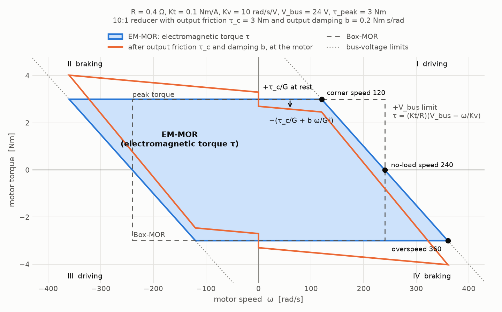
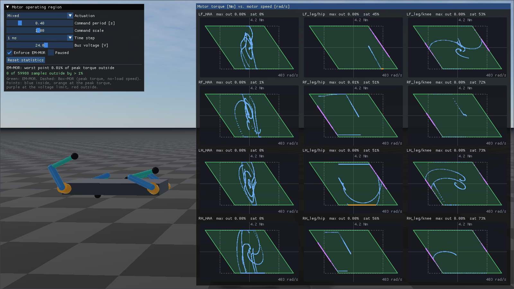

#############################
Actuators
#############################

An **actuator** is a set of DC or BLDC motors that drive one or more joints of an articulated
system through a transmission. RaiSim uses it to limit the joint torques to what the motors can
actually produce: the **motor operating region** (MOR) of each motor, which depends on the motor
speed, the bus voltage and the peak torque.

The URDF ``<limit effort velocity>`` of a joint describes a rectangle in the torque-speed plane. Kim
et al. call it the *Box-MOR* in "Reinforcement Learning for High-Speed Quadrupedal Locomotion With
Motor Operating Region Constraints" (IEEE Robotics & Automation Magazine, 2025). A real motor
cannot use that whole rectangle. While it drives a load, the back EMF eats into the bus voltage, so
the available torque drops with speed. While it brakes, the back EMF adds to the bus voltage and
more torque is available than the rectangle allows. Policies trained with the Box-MOR exploit
torques that the real motors cannot deliver at high speed. Training with the electro-mechanical
MOR (*EM-MOR*) removes that sim-to-real gap.

RaiSim:

* reads actuators from the URDF (an ``<actuator>`` links an actuator file, just like a ``<link>``
  links a sensor file) or from C++,
* clips the motor torques to the EM-MOR every step, including the torques that act during contacts
  and impacts,
* handles coupled transmissions where one motor drives several joints, and
* reports the speed and the applied torque of every motor.

.. contents:: On this page
   :local:
   :depth: 2

The motor model
=============================
Under quasi-static conditions (the current changes slowly compared to the simulation step, the same
assumption as a dynamometer torque-speed curve), the voltage over a DC motor is

.. math::

   V = R\,i + \frac{\omega}{K_v}, \qquad \tau = K_t\, i,

with the winding resistance :math:`R`, the current :math:`i`, the motor speed :math:`\omega`, the
velocity constant :math:`K_v` (the inverse of the back-EMF constant) and the torque constant
:math:`K_t`. The motor driver can apply any voltage between :math:`-V_{bus}` and :math:`V_{bus}`.
Together with the peak torque :math:`\tau_{peak}`, at which the iron core saturates and the windings
heat up quickly, the motor torque is limited to

.. math::

   -V_{bus} \le \frac{R}{K_t}\,\tau + \frac{\omega}{K_v} \le V_{bus},
   \qquad |\tau| \le \tau_{peak}.

All values are on the motor (rotor) side of the reducer and in SI units.

The electromagnetic torque :math:`\tau = K_t i` is what the operating region limits. The drive also
loses torque to friction and damping. They are specified as measured **at the output** of the drive,
i.e., at the joint, and they simply add to the joint's own ``<dynamics friction damping>`` with the
same model (see :doc:`articulated_system/JointDampingAndFriction`). With the joint speed
:math:`\dot q`, the joint torque from motor :math:`\tau` through a reducer :math:`G` is

.. math::

   \tau_j = G\,\tau - (b_{joint} + b_{out})\,\dot q - (\tau_{c,joint} + \tau_{c,out})\,\mathrm{sgn}(\dot q),

and at rest the friction holds the joint as long as the other torques on it stay below
:math:`\tau_{c,joint} + \tau_{c,out}` (stiction). The losses are passive: they are never clipped
by the region, and they do not change it. In the motor's torque-speed plane, output losses appear
reduced by the gear ratio, :math:`\tau_{c}/G` and :math:`b/G^2`, which is the orange outline below.

         parallel voltage-limit lines, next to the Box-MOR rectangle
   :width: 100%

The region is a parallelogram. Its slanted edges are the bus-voltage limits, its horizontal edges
the peak torque. Several speeds characterize it:

.. list-table::
   :header-rows: 1
   :widths: 25 30 45

   * - Quantity
     - Value
     - Meaning
   * - stall torque
     - :math:`K_t V_{bus} / R`
     - voltage-limited torque at zero speed
   * - no-load speed
     - :math:`K_v V_{bus}`
     - the motor cannot drive faster
   * - corner speed
     - :math:`K_v (V_{bus} - R\,\tau_{peak}/K_t)`
     - above it, the voltage limit (not the peak torque) limits driving
   * - overspeed limit
     - :math:`K_v (V_{bus} + R\,\tau_{peak}/K_t)`
     - above it, even full reverse voltage drives more than the peak current
   * - back-EMF damping
     - :math:`K_t / (R K_v)`
     - slope of the voltage limit; a motor at its voltage limit acts as a damper

Beyond the overspeed limit the peak-torque band and the voltage band no longer overlap. The motor
cannot produce any torque below its peak there; the only physical torque left is the voltage limit
closest to the peak band (full voltage against the rotation), and RaiSim uses that torque. The
region collapses to a point.

Defining actuators in a URDF
=============================
An ``<actuator>`` element, placed directly under ``<robot>``, attaches an actuator to joints. All
parameters of the actuator are in a ``<motor_group>`` element and its ``<motor>`` children. Like a
sensor set, the ``<motor_group>`` usually lives in its own file, so that one actuator model can be
shared by all joints and robots that use it:

.. code-block:: xml

    <robot name="quadruped">
      ...
      <actuator name="LF_HAA" joints="LF_HAA" file="abduction_actuator.xml"/>
      <actuator name="LF_leg" joints="LF_HFE LF_KFE" file="hound_leg_actuator.xml"/>
    </robot>

``actuators/abduction_actuator.xml``, a motor behind a 6:1 reducer:

.. code-block:: xml

    <motor_group name="abduction_6to1" gear_ratio="6" bus_voltage="24">
      <motor resistance="0.4" torque_constant="0.1" velocity_constant="10" peak_torque="3"/>
    </motor_group>

``actuators/hound_leg_actuator.xml``, two motors coupled through the transmission described in
`Coupled transmissions`_:

.. code-block:: xml

    <motor_group name="hound_leg" motor_from_joint="10 0 1 10" bus_voltage="24">
      <motor name="hip" resistance="0.4" torque_constant="0.1" velocity_constant="10" peak_torque="3"/>
      <motor name="knee" resistance="0.4" torque_constant="0.1" velocity_constant="10" peak_torque="3"/>
    </motor_group>

The actuator file is searched like a sensor file: first in the directory of the URDF file, then in
``[urdf_dir]/actuator``, ``[urdf_dir]/actuators``, ``[urdf_dir]/..`` and
``[urdf_dir]/../actuators``. For a URDF given as a string, the resource directory passed to
``World::addArticulatedSystem()`` takes the place of ``[urdf_dir]``.

Instead of linking a file, the ``<motor_group>`` can be written inside the ``<actuator>``. This is
convenient for URDF strings and quick experiments:

.. code-block:: xml

    <actuator name="wheel" joints="wheel">
      <motor_group gear_ratio="8" bus_voltage="48">
        <motor resistance="0.2" torque_constant="0.1" back_emf_constant="0.1" peak_torque="1.5"/>
      </motor_group>
    </actuator>

``<actuator>``
*****************************

.. list-table::
   :header-rows: 1
   :widths: 20 80

   * - Attribute
     - Meaning
   * - ``joints``
     - the driven joints, separated by spaces (required). They must be revolute (or continuous) or
       prismatic joints, and each joint can be driven by only one actuator. Their order is the
       column order of the transmission.
   * - ``name``
     - actuator name, unique within the robot (default: the joint names joined by ``_``)
   * - ``file``
     - actuator file with a ``<motor_group>`` root. Without it, the ``<actuator>`` must contain one
       ``<motor_group>``.

``<motor_group>``
*****************************

.. list-table::
   :header-rows: 1
   :widths: 20 80

   * - Attribute
     - Meaning
   * - ``name``
     - actuator model name, reported by ``ActuatorDefinition::model``
   * - ``motor_from_joint``
     - the transmission :math:`T`, row by row (:math:`n \times n` values for :math:`n` joints).
       Default: identity (direct drive).
   * - ``gear_ratio``
     - shorthand for ``motor_from_joint`` of an actuator with a single motor. Negative values reverse
       the direction. Do not give both.
   * - ``bus_voltage``
     - bus voltage :math:`V_{bus}` [V] of all motors in the group (see `Bus voltage`_)

It contains one ``<motor>`` per driven joint.

``<motor>``
*****************************

.. list-table::
   :header-rows: 1
   :widths: 30 70

   * - Attribute
     - Meaning
   * - ``resistance``
     - winding resistance :math:`R` [Ohm] (required)
   * - ``torque_constant``
     - :math:`K_t` [Nm/A] (required)
   * - ``velocity_constant``
     - :math:`K_v` [rad/s/V]
   * - ``back_emf_constant``
     - :math:`1/K_v` [V s/rad]. Give exactly one of ``velocity_constant`` and ``back_emf_constant``.
   * - ``peak_torque``
     - :math:`\tau_{peak}` [Nm] (optional; without it, only the voltage limits apply)
   * - ``output_damping``
     - viscous damping of the drive measured at its output [Nm s/rad] (optional, default 0). It adds
       to the damping of the joint driven by this motor.
   * - ``output_friction``
     - Coulomb friction torque of the drive measured at its output [Nm] (optional, default 0). It
       adds to the friction of the joint driven by this motor.
   * - ``bus_voltage``
     - overrides the bus voltage of the ``<motor_group>`` for this motor
   * - ``name``
     - motor name within the actuator

Datasheets often list :math:`K_v` in rpm/V: multiply by :math:`2\pi/60` to get rad/s/V. Make sure
:math:`R` and :math:`K_t` refer to the same winding convention (phase or line-to-line) that the
driver's current control uses.

Unlike the other ``<motor>`` attributes, ``output_damping`` and ``output_friction`` are joint-side
values: the friction and damping you measure at the joint, e.g., by back-driving it. They act on the
joint in the same position of ``joints`` as the ``<motor>``. In the Hound leg below, this is also
where the knee reducer's gears move: its ring gear turns with the thigh, so its meshes slide with
the knee speed, not with the knee motor speed. RaiSim adds them to the joint's own
``<dynamics friction damping>``, so you can keep losses in either place or split them. The rotor
inertia is still set at the joint with ``<dynamics rotor_inertia>`` as the reflected inertia
:math:`G^2 J_{rotor}`.

Bus voltage
*****************************
The bus voltage belongs to the power supply, not to the motor: all motors on one battery see the
same voltage, and it sags together as the battery drains. Set it once on the ``<motor_group>``; a
``<motor>`` only overrides it in the rare case that one motor of an actuator is on a different bus.
At least one of the two is required.

The voltage can be changed at runtime with a single call, for example to follow the battery voltage
or to randomize it during training. It only changes the stored voltage and can be called every step:

.. code-block:: cpp

  robot->setBusVoltage(46.5);            // all motors
  robot->setBusVoltage("LF_leg", 46.5);  // the motors of one actuator

Motor names
*****************************
Motor names are unique within an articulated system and look like ``<actuator>/<motor>``:
``LF_leg/hip`` and ``LF_leg/knee`` above. An actuator with a single unnamed motor gives the motor
its own name (``LF_HAA``); unnamed motors of a larger actuator are numbered (``LF_leg/0``).
``getMotorNames()`` lists them in the order of the ``<actuator>`` elements and, within an actuator,
in the order of its ``<motor>`` elements.

Errors
*****************************
RaiSim stops with a message that names the file, row and element for: a missing or doubly given
motor constant, a missing bus voltage, a non-positive parameter, a missing actuator file, a file
attribute together with an inline ``<motor_group>``, a motor count that differs from the joint
count, a transmission of the wrong size or a singular one, a ``gear_ratio`` for several motors, an
unknown or fixed joint, a joint driven by two actuators, and duplicate motor names.

Coupled transmissions
=============================
The transmission :math:`T` maps the joint speeds :math:`\omega_j` of an actuator to its motor
speeds :math:`\omega_m`; by conservation of power the motor torques :math:`\tau_m` map back to the
joint torques with its transpose:

.. math::

   \omega_m = T\,\omega_j, \qquad \tau_j = T^T \tau_m, \qquad
   \tau_j^T \omega_j = \tau_m^T \omega_m.

A geared joint has :math:`T = G`, the gear ratio. :math:`T` must be invertible: every motor drives
the joints through its own path.

KAIST Hound (the robot of the paper) puts the hip (HFE) and the knee (KFE) motor of a leg on the
body. The hip motor turns the thigh through a planetary reducer with ratio :math:`G_H`. The knee
motor drives the sun gear of a planetary reducer whose ring gear is attached to the thigh, and the
planet carrier drives the knee. Relative to the thigh, the knee reducer is an ordinary reducer with
ratio :math:`G_K`, so :math:`\omega_{sun} - \omega_{HFE} = G_K\,\omega_{KFE}`, i.e.,

.. math::

   \begin{bmatrix}\omega_{HFE,m}\\ \omega_{KFE,m}\end{bmatrix} =
   \begin{bmatrix}G_H & 0\\ 1 & G_K\end{bmatrix}
   \begin{bmatrix}\omega_{HFE}\\ \omega_{KFE}\end{bmatrix},

which is ``motor_from_joint="10 0 1 10"`` for :math:`G_H = G_K = 10`. The transpose shows that the
knee motor also loads the hip: :math:`\tau_{HFE} = G_H\,\tau_{HFE,m} + \tau_{KFE,m}`. When the hip
swings, the knee motor turns even if the knee does not, and it can run out of voltage because of
the hip speed alone.

What happens in a simulation step
=================================
For every actuator, each step:

#. The actuation command of every driven joint, the feedforward torque (``setGeneralizedForce()``)
   plus the built-in PD torque, is clipped to the joint's actuation limits (the URDF ``effort``,
   i.e., the Box-MOR).
#. The joint torques are mapped to motor torques with :math:`T^{-T}`, and each motor torque is
   clipped to its operating region. The region is evaluated at the motor speed predicted for the
   middle of the step from the speed change of the previous step: a fast motor can cross its corner
   speed within one step.
#. The clipped motor torques are mapped back to the joints with :math:`T^T`. Joint damping (the
   joint's own plus the actuator's output damping) and springs are added afterwards and are never
   clipped. The damping is integrated implicitly with the trapezoidal rule, so a large damping stays
   stable at large time steps.
#. RaiSim integrates the PD controller implicitly, so its velocity-dependent part is not part of the
   explicit torque. A saturated motor no longer follows the PD law: its torque is constant at the
   peak torque, or it follows the voltage limit, which is a damper with the back-EMF coefficient.
   For that step, the implicit PD gains of its joints are removed and the back-EMF damping is
   integrated implicitly instead. This keeps stiff motors stable at large time steps and puts the
   torque exactly on the limit.
#. Contacts, joint limits and pin constraints change the joint velocities within the contact
   solver. An impact can make the implicit PD or back-EMF torque jump far outside the region. RaiSim
   therefore adds a solver row that keeps every motor torque inside its region together with the
   contact impulses. The same row corrects the rare steps in which the speed prediction missed.
#. The same row solves the joint friction (the joint's own plus the actuator's output friction) as
   an impulse bounded by :math:`\tau_c\,\Delta t` that stops the joint or opposes its motion,
   together with the contacts. Friction therefore holds a joint exactly at rest instead of
   chattering around zero speed. This also applies to the ``<dynamics friction>`` of joints without
   an actuator.

The result is the torque the motor applies over the step. It is constant over the step while the
speed changes, so compare it with the region at the **step-averaged** speed.

Accuracy
*****************************
With the solver row, the applied torques stay inside their regions to the solver tolerance in
almost every step. The tests and the example measure, as the largest distance outside the region
relative to the peak torque:

* single-joint actuators without contacts, at 1 ms and 5 ms: below :math:`10^{-12}` %,
* single-joint actuators of ANYmal with foot impacts at 2 ms: below 0.02 %,
* coupled actuators without contacts (the test leg and the example rig), at 1 ms and 5 ms: below
  0.01 %,
* coupled hip/knee actuators of ANYmal with foot impacts at 2 ms: below 0.02 % with a reflected
  rotor inertia of 0.05 kg m², and one sample in 240,000 above 1 % (3 %) with 0.01 kg m².

Coupled transmissions are integrated implicitly with a diagonal (per-joint) gain. In rare impacts
that back-drive a coupled motor past its overspeed limit, the non-smooth contact response can leave
a few percent: up to 9 % of the peak torque in the ANYmal benchmark without rotor inertia
(``benchmarks --bench motor_operating_region``). Model the reflected rotor inertia (``rotor_inertia`` in ``<dynamics>``,
:math:`G^2 J_{rotor}` at the joint): without it, a motor can accelerate unrealistically fast, which
makes these events more frequent.

Reading the motor states
=============================
``getMotorStates()`` returns one ``raisim::MotorState`` per motor after every step:

.. list-table::
   :header-rows: 1
   :widths: 25 75

   * - Field
     - Meaning
   * - ``speed``
     - motor speed at the beginning of the step [rad/s]
   * - ``averageSpeed``
     - motor speed averaged over the step [rad/s]
   * - ``commandedTorque``
     - motor torque requested by the feedforward torque and the PD controller [Nm]
   * - ``torque``
     - electromagnetic motor torque :math:`K_t i` applied over the step, including the implicitly
       integrated part and the solver correction [Nm]. The operating region limits this torque.
   * - ``jointLossTorque``
     - friction and damping torque on the driven joint over the step [Nm, at the joint]: the joint's
       own plus the actuator's output losses. It opposes the joint motion.
   * - ``saturation``
     - ``NONE``, ``PEAK_TORQUE`` or ``VOLTAGE``: the bound that limited the command

To check the region, or to use the motor torques in a reward (power, saturation penalties):

.. code-block:: cpp

  const auto& states = robot->getMotorStates();
  const auto& motors = robot->getMotorParameters();
  for (size_t i = 0; i < states.size(); ++i) {
    // [Nm], zero inside the region
    const double outside = raisim::motorOperatingRegionViolation(
        motors[i], states[i].averageSpeed, states[i].torque);
    // mechanical motor power [W]
    const double power = states[i].torque * states[i].averageSpeed;
  }

``motorTorqueBounds(parameters, speed)`` returns the admissible torque interval at a speed and
``clipMotorTorque(parameters, speed, torque)`` clips a torque to it. ``getGeneralizedForce()``
applies the operating regions at the current motor speeds.

Monitoring without enforcing
=============================
``setMotorOperatingRegionEnforced(false)`` keeps the Box-MOR dynamics, i.e., the joints get the
torque clipped by the actuation limits only, and ``getMotorStates()`` still reports the motor
quantities. This reproduces the paper's comparison: train or evaluate a controller with the Box-MOR
and measure how far it leaves the motor operating region. The output friction and damping still
act; without them, the dynamics are identical to the same robot without actuators.

C++ API
=============================
To change only the bus voltage, use ``setBusVoltage()`` (see `Bus voltage`_). Other parameters,
such as a randomized winding resistance, are changed by editing the definitions and setting them
again, which also replaces the actuators from the URDF:

.. code-block:: cpp

  auto actuators = robot->getActuators();
  for (auto& actuator : actuators)
    for (auto& motor : actuator.motors)
      motor.resistance *= uniform(0.9, 1.1);
  robot->setActuators(actuators);

A geared knee from scratch:

.. code-block:: cpp

  raisim::ActuatorDefinition knee;
  knee.name = "LF_KFE";
  knee.joints = {"LF_KFE"};
  knee.motorFromJoint = {10.};
  knee.motors.resize(1);
  knee.motors[0].resistance = 0.4;
  knee.motors[0].torqueConstant = 0.1;
  knee.motors[0].velocityConstant = 10.;
  knee.motors[0].busVoltage = 24.;
  knee.motors[0].peakTorque = 3.;
  robot->setActuators({knee});

.. list-table:: ``raisim::ArticulatedSystem``
   :header-rows: 1
   :widths: 40 60

   * - Method
     - Purpose
   * - ``setActuators(actuators)``
     - replace the actuators; an empty vector removes them
   * - ``getActuators()``
     - the actuator definitions
   * - ``getNumberOfMotors()``, ``getMotorNames()``, ``getMotorIndex(name)``
     - motors of all actuators, in order
   * - ``getMotorParameters()``
     - the motor parameters, in the same order
   * - ``setBusVoltage(voltage)``, ``setBusVoltage(actuatorName, voltage)``
     - change the bus voltage of all motors or of one actuator
   * - ``getMotorStates()``
     - motor speeds and torques of the last step
   * - ``setMotorOperatingRegionEnforced(enforce)``
     - clip to the region (default) or only monitor it

Actuators are part of world checkpoints (``World::captureCheckpoint()``), so changing them between
a capture and a restore is undone by the restore.

raisimGymTorch and raisim_engine2
=================================
Actuators are part of the URDF, so a ``world.xml`` that refers to the URDF brings them along.
``raisim_engine2``'s **Export for raisimGymTorch** bundles linked actuator files together with the
URDF, like sensor files, so the exported package loads with its actuators on another machine.

In a raisimGymTorch environment, read ``getMotorStates()`` after ``world->integrate()`` to add the
motor speeds or the saturation to the observation, or to penalize torques that saturate the motors.

Example
=============================
``rayrai_motor_operating_region`` actuates the twelve motors of a fixed-base quadruped rig randomly
and plots their operating regions and operating points. See
:doc:`examples/rayrai/rayrai_motor_operating_region`.

API
=============================

.. doxygenstruct:: raisim::DcMotorParameters
   :members:

.. doxygenstruct:: raisim::ActuatorDefinition
   :members:

.. doxygenstruct:: raisim::MotorState
   :members:

.. doxygenenum:: raisim::MotorSaturation

.. doxygenstruct:: raisim::MotorTorqueBounds
   :members:

.. doxygenfunction:: raisim::motorTorqueBounds

.. doxygenfunction:: raisim::clipMotorTorque

.. doxygenfunction:: raisim::motorOperatingRegionViolation
