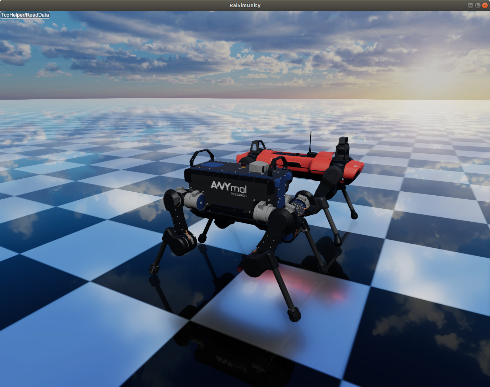
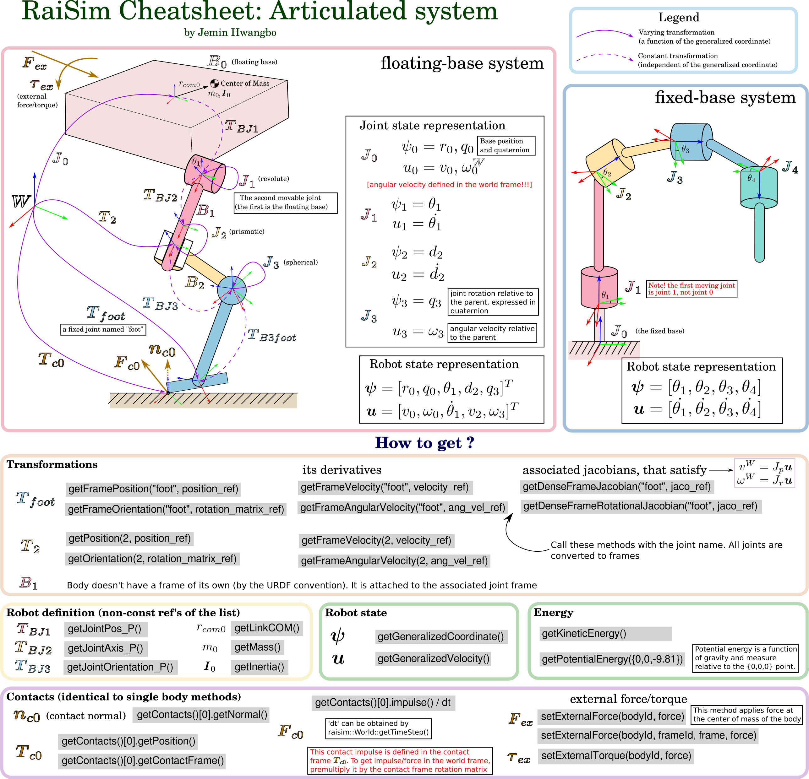

#############################
Articulated Systems
#############################

ANYmal robots (B and C versions) simulated in RaiSim.

.. _introduction:

An articulated system comprises multiple bodies interconnected via joints.
There exist two primary configurations of an articulated system: Kinematic trees and closed-loop systems.
Kinematic trees are characterized by their absence of loops, ensuring that each body has only one parent joint.
Consequently, the number of joints in a kinematic tree equals the number of bodies, with the provision of a floating joint on the root body for floating systems.

A closed-loop system has one or more loops.
A loop means that there are multiple routes from the link to the ROOT.
RaiSim's algorithmic backbone, the Articulated Body Algorithm, cannot solve the dynamics of a closed system.
However, we can simulate a closed-loop system using RaiSim's contact solver.
These pages focus on kinematic trees.
Closed-loop systems are described in :doc:`articulated_system/ClosedLoopSystems`.

In kinematic trees, **since each body has only one joint, the index of a body always matches that of its parent joint**.
Here, a "body" denotes a rigid body composed of one or more "links", each of which is rigidly connected to others within the same body via fixed joints.

.. toctree::
   :maxdepth: 1

   articulated_system/Creation
   articulated_system/StateAndKinematics
   articulated_system/DynamicsAndControl
   articulated_system/JointDampingAndFriction
   Actuators
   Sensors
   articulated_system/ModifyingTheModel
   articulated_system/ClosedLoopSystems
   articulated_system/API

.. rubric:: TL;DR

Click the image for vector graphics

