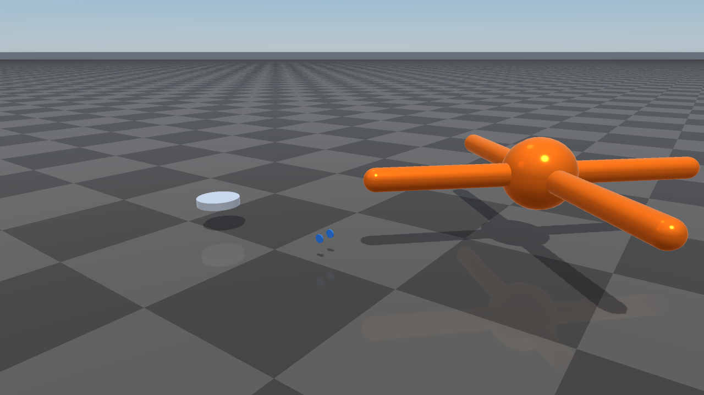
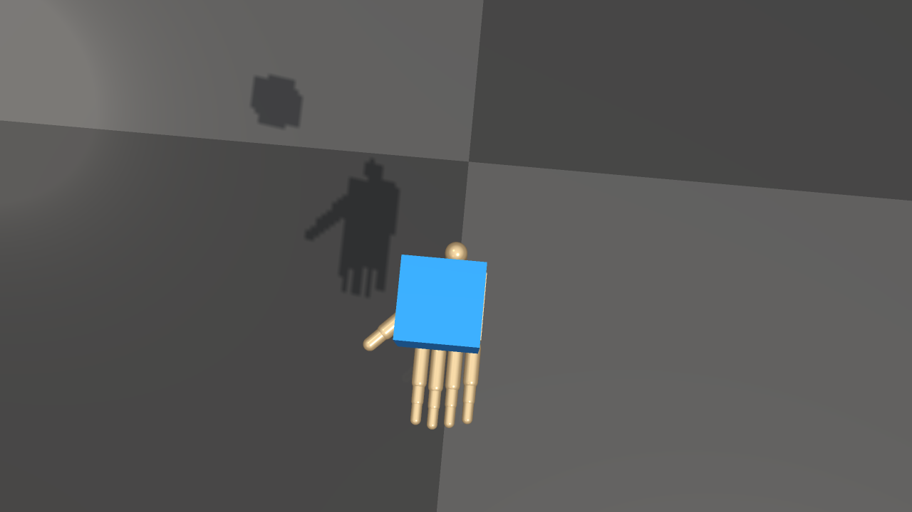

#############################
OpenUSD Loading
#############################

RaiSim loads OpenUSD files directly through the bundled OpenUSD runtime.
OpenUSD support is part of supported RaiSim packages and source builds; it is
not an optional Assimp importer path and there is no CMake switch to build
RaiSim without it.

   Collision bodies from Isaac Sim robot USD assets imported as RaiSim
   articulated systems.

Instantiating a World From USD
==============================

The **default way to instantiate a ``raisim::World``** is to point the
constructor at a USD scene file. The constructor inspects the file's
extension and, when it is ``.usd``, ``.usda``, ``.usdc``, or ``.usdz``,
dispatches to the USD scene loader to build the world's bodies, joints, and
collision shapes in a single call:

.. code-block:: cpp

    #include <raisim/World.hpp>

    raisim::World world("scene.usd");   // <-- recommended default

    // World is now populated with the rigid bodies, articulated systems, and
    // collision shapes declared in scene.usd. Add a ground, set the time
    // step, attach controllers, and start stepping as usual.
    world.addGround();
    world.setTimeStep(0.0025);

This unifies physics scene authoring on a single text/binary format that USD
tooling — Isaac Sim, Omniverse, Blender's USD exporter, RaiSim's own
:doc:`RaisimEngine2` editor — can produce and consume. Prefer it over
hand-written XML when the scene is going to be authored by a tool or
exchanged with other USD-native ecosystems.

The same constructor still accepts a RaiSim ``.xml`` :doc:`world configuration
file <WorldConfigurationFile>` or a MuJoCo ``.mjcf``; the file's extension
(for USD) and root tag (``<raisim>`` / ``<mujoco>``) determine the loader.
USD is the recommended default; XML stays available for hand-edited and
template-driven worlds.

.. code-block:: cpp

    raisim::World usdWorld("scene.usd");           // USD scene loader
    raisim::World xmlWorld("scene.xml");           // RaiSim XML loader
    raisim::World mjcWorld("scene.mjcf");          // MuJoCo MJCF loader
    raisim::World emptyWorld;                      // empty world, build it
                                                   // up programmatically

   ``World(shadow_hand.usd)`` imports the ShadowHand physical geometry; the
   cube is a native RaiSim rigid body.

What is imported from a USD scene
---------------------------------

The USD constructor reads:

* ``UsdPhysicsRigidBodyAPI`` bodies as rigid objects.
* ``PhysicsFixedJoint``, ``PhysicsRevoluteJoint``, and
  ``PhysicsPrismaticJoint`` relationships between bodies, assembled into
  articulated systems.
* Primitive collision shapes — cube, sphere, capsule, cylinder — and
  triangle-mesh collision shapes via ``UsdGeomMesh``.
* Per-body and per-link transforms.

The constructor does **not** import PhysX tendons, drives, variants,
skeletons, lights, or full material graphs. For high-fidelity rendering
materials, pair USD physics import with the :doc:`Rayrai <Rayrai>` visual
pipeline, or keep a separate render-quality USD/glTF alongside the physics
USD.

Loading USD as Mesh Geometry
============================

The mesh loader also accepts ``.usd``, ``.usda``, ``.usdc``, and ``.usdz``
files wherever a RaiSim mesh path is accepted, for individual single-body
mesh objects rather than whole scenes:

.. code-block:: cpp

    raisim::World world;
    auto* mesh = world.addMesh("asset.usd",
                               1.0,
                               1.0,
                               "default",
                               raisim::MeshCollisionMode::ORIGINAL_MESH);

The same OpenUSD-backed path is used by ``raisim::Mesh::loadMesh`` and
``raisim::Mesh::preprocessMesh``. Use ``preprocessMesh`` when you want a
deterministic triangulated OBJ cache that can be reused by later runs.

Runtime requirements
====================
Installed packages include the OpenUSD runtime next to RaiSim:

* On Linux, the runtime is installed under ``raisim/lib/openusd`` and the
  package environment script adds the required library path.
* On Windows, the USD DLLs are installed next to the RaiSim binaries and the
  plugin resources are under ``raisim/bin/openusd``.

Keep the ``bin``, ``lib``, ``openusd``, and ``rsc`` directories together when
copying an installed package. If you build from source, the bundled prebuilt
OpenUSD tree must exist under ``prebuilt/openusd/<platform>``; CMake fails at
configure time if the required OpenUSD headers or libraries are missing.

Mesh Import Semantics
=====================
When USD is loaded as a mesh asset (via ``addMesh`` or ``Mesh::loadMesh``),
RaiSim treats it as triangle-mesh geometry:

* The loader opens the file as a ``UsdStage`` and traverses ``UsdGeomMesh``
  prims.
* Parent transforms are applied to each mesh before vertices are added.
* Polygon faces are triangulated, and left-handed USD mesh winding is reversed.
* Multiple mesh prims in one USD file are merged into one RaiSim mesh object.

For high-detail render assets, keep a separate simplified collision mesh or
use ``MeshCollisionMode::CONVEX_HULL`` / ``MeshCollisionMode::CONVEXIFY``
when appropriate.

Examples
========
``shadow_hand_usd_cube`` loads
``rsc/isaac/Robots/ShadowRobot/ShadowHand/shadow_hand.usd`` through
``World(shadow_hand.usd)`` and publishes the scene through ``RaisimServer``.
The example target is generated only when CMake finds a RaiSim package with USD
scene loading. RaiSim is expected to include OpenUSD on every supported
architecture. Start the TCP viewer, then run:

.. code-block:: bash

    <raisim-install>/bin/rayrai_tcp_viewer
    <raisim-install>/bin/shadow_hand_usd_cube

``nvidia_usd_robots`` provides additional vetted Isaac Sim robot scenes:
``create3``, ``jetbot``, and ``ant``.

.. code-block:: bash

    <raisim-install>/bin/nvidia_usd_robots

On Windows, use the corresponding ``.exe`` binaries.

rayrai can also load USD files as visual-only meshes through
``RayraiWindow::addVisualMesh``. This is useful for inspection, but the same
scope applies: geometry, transforms, basic display colour/opacity, not full USD
scene semantics.

Troubleshooting
===============
If a USD asset fails to load:

* Verify that the asset path exists and that the package ``rsc`` directory was
  copied with the binaries.
* Run the package environment script before launching examples from outside the
  installed ``bin`` directory.
* On Windows, make sure the USD DLLs are beside the executable and
  ``bin/openusd`` is still present.
* If source configuration fails, regenerate or restore the matching bundled
  OpenUSD prebuilt runtime for your platform.
