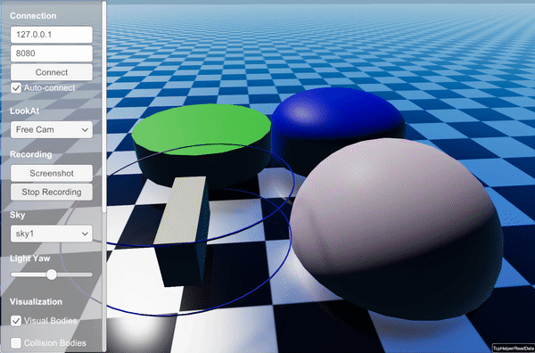

#############################
Raisim Server
#############################

RaisimServer serializes ``raisim::World`` and streams the data to clients via TCP/IP.
Use the rayrai TCP viewer for supported server-side visualization.
For older Unity or Unreal visualization workflows, see :doc:`LegacyIntegrations`.
For a workflow-level comparison between server-based visualization and
in-process rayrai rendering, see :doc:`Visualization`.

In addition to visualizing a ``raisim::World``, ``raisim::RaisimServer`` can visualize additional objects.
The legacy visual-object showcase is displayed as follows; use the current
examples index for runnable source targets:

Typical usage
=========================
Create the server, launch it, and advance the world through the thread-safe
integration helper:

.. code-block:: cpp

  raisim::World world;
  raisim::RaisimServer server(&world);
  server.launchServer(8080);
  for (;;) {
    server.integrateWorldThreadSafe();
  }

``integrateWorldThreadSafe()`` locks the world mutex, applies any user
interaction force coming from the visualizer, integrates the world, and
unlocks the mutex.

Thread safety and lifecycle
===========================
The server reads the world state from a background thread. If you modify the
world manually while the server is running, guard it with the visualization
mutex (``lockVisualizationServerMutex()`` / ``unlockVisualizationServerMutex()``)
to avoid races.

The server can be paused with ``hibernate()`` and resumed with ``wakeup()``.
Call ``killServer()`` to stop the server thread and disconnect the client.

Sensor measurements
==================================
RaiSim does not support sensor measurement updates from a visualizer.
``RaisimServer`` streams the world state to visualizer clients, but it does not
request RGB or depth frames back from TCP visualizers and does not write
visualizer-rendered data into RaiSim sensor buffers.

Use ``Sensor::MeasurementSource::RAISIM`` for sensors that RaiSim can compute
from the physics world, such as IMU, spinning LiDAR, and depth-camera CPU ray
updates. Use ``Sensor::MeasurementSource::MANUAL`` when user code or an
in-process renderer writes the sensor buffer.

Synchronous updates (optional)
==============================
``processRequests()`` implements a synchronous request/response loop used by
clients that explicitly pull world-state updates. It returns ``false`` if the
client does not respond or rejects the protocol version.

RaisimServer API
=========================

.. doxygenclass:: raisim::RaisimServer
   :members:

Visuals API
=========================

.. doxygenstruct:: raisim::Visuals
   :members:

Polyline API
=========================

.. doxygenstruct:: raisim::PolyLine
   :members:

ArticulatedSystemVisual API
============================

.. doxygenstruct:: raisim::ArticulatedSystemVisual
   :members:
