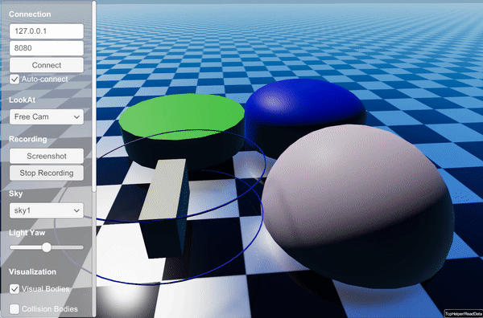

#############################
Raisim Server
#############################

RaisimServer serializes ``raisim::World`` and streams the data to clients via TCP/IP.
Use ``rayrai_tcp_viewer`` for supported server-side visualization.
For older Unity or Unreal visualization workflows, see :doc:`LegacyIntegrations`.
For a workflow-level comparison between server-based visualization and
in-process rayrai rendering, see :doc:`Visualization`.

In addition to visualizing a ``raisim::World``, ``raisim::RaisimServer`` can visualize additional objects.
The legacy visual-object showcase is displayed as follows; use the current
examples index for runnable source targets:

Typical usage
=========================
Create the server, launch it, and advance the world through the thread-safe
integration helper:

.. code-block:: cpp

  raisim::World world;
  raisim::RaisimServer server(&world);
  server.launchServer(8080);
  for (;;) {
    server.integrateWorldThreadSafe();
  }

``integrateWorldThreadSafe()`` locks the world mutex, drains pending
client requests, decides whether this call is allowed to advance the world
(pause / step state), applies active client forces only on advancing ticks,
runs any callback overload, integrates the world when allowed, and unlocks
the mutex.

``launchServer(port)`` binds its socket before it returns. If ``port`` is
already in use, the server tries the next 63 ports, logs
``Port <requested> is in use; bound to port <actual> instead``, and reports an
error only when none of them is free. ``getPort()`` returns the port actually
bound, and the discovery beacons advertise it (see `Discovery beacons`_). The
server serves one client at a time and accepts the next one after the current
client disconnects.

Thread safety and lifecycle
===========================
The server reads the world state from a background thread. If you modify the
world manually while the server is running, guard it with the visualization
mutex (``lockVisualizationServerMutex()`` / ``unlockVisualizationServerMutex()``)
to avoid races.

The server can be paused with ``hibernate()`` and resumed with ``wakeup()``.
Call ``killServer()`` to stop the server thread and disconnect the client.

Sensor measurements
==================================
``RaisimServer`` can request manual RGB/depth measurements from the current
rayrai TCP viewer. When a ``MeasurementSource::MANUAL`` camera reaches its
update period, the normal scene response includes its pose, lens model,
resolution, and clipping range. The viewer renders a complete camera pass and
returns BGRA pixels or metric depth values in a ``REQUEST_SENSOR_UPDATE``
frame. The server validates every entry before replacing sensor buffers and
updating timestamps.

IMU and spinning LiDAR remain RaiSim-side measurements; their metadata is
streamed for inspection but the viewer does not return their samples. Use
``MeasurementSource::RAISIM`` for RaiSim-computed sensors and manual RGB/depth
when the connected viewer should provide the render. See
:ref:`tcp-viewer-sensor-round-trip` on the TCP viewer page.

Streamed scene notes
====================
* Spatial tendons, including wires added with ``addStiffWire``,
  ``addCompliantWire`` or ``addCustomWire``, are streamed as polylines. The TCP
  viewer includes them in the camera images it renders for the server.
* An object whose appearance is ``"hidden"`` or ``"invisible"``
  (case-insensitive) is still streamed, but rayrai and the TCP viewer do not draw
  it and it cannot be selected.

Synchronous updates (optional)
==============================
``processRequests()`` implements a synchronous request/response loop used by
clients that explicitly pull world-state updates. It returns ``false`` if the
client does not respond, uses another protocol version, or sends a request
frame the server rejects (see `Request validation`_).

Protocol versioning and deformable streaming
============================================
The TCP wire protocol is explicitly versioned. Each request starts with a
protocol header that advertises the client's feature set. The server requires
the client's protocol version to equal its own and rejects unknown feature
bits, logging a warning and closing the connection rather than misparsing the
stream. The current feature flags are:

* ``PROTOCOL_FEATURE_EXPLICIT_HEADER``: the client and server exchange the
  explicit version header before each request.
* ``PROTOCOL_FEATURE_DEFORMABLE_DELTA``: deformable mesh topology is sent only
  during initialization or when the topology changes; normal frames send
  vertex positions only.
* ``PROTOCOL_FEATURE_SIM_CONTROL``: when both ends advertise this bit, the
  client may pause / resume / step the simulation and push external forces,
  torques, body poses, and articulated-system generalized coordinates over the
  wire. The server applies no authentication — if the connection is open, the
  client can drive it. See `Interactive sim control`_ below.
* ``PROTOCOL_FEATURE_CONTACT_OBJECT_TAGS``: each streamed contact identifies
  both participating objects, enabling per-object contact counts and plots.

The rayrai TCP viewer negotiates all four flags automatically. Custom clients
can opt into any flag through the ``RaisimServer`` and ``RaisimTcpCommon``
headers.

.. _Interactive sim control:

Interactive sim control
=======================
When the ``SIM_CONTROL`` feature is negotiated, a connected client (such as
``rayrai_tcp_viewer``) can drive the simulation from its UI rather than
just observing it. The viewer's **Objects** tab has a *Simulation* row with
icon buttons to pause or resume, step one frame and step ten frames.

Client requests added by this feature:

* ``CR_PAUSE`` / ``CR_RESUME`` — toggle a flag consulted in
  ``integrateWorldThreadSafe()``. While paused, ``world_->integrate()`` is not
  called even though the network thread keeps streaming state. ``CR_RESUME``
  also drops queued steps.
* ``CR_STEP_N`` — queue *N* single-step integrations to advance while paused.
* ``CR_APPLY_FORCE`` — apply an external force at a world-space application
  point on a body. The server multiplies the force command by the body's
  mass, so the command acts as an acceleration.
* ``CR_APPLY_TORQUE`` — apply an external torque on a body (not scaled by
  mass).
* ``CR_SET_POSE`` — teleport a single-body object to a position and a
  quaternion in (w, x, y, z) order.
* ``CR_SET_GC`` — set the generalized coordinate of an articulated system.

Scene-editing requests predate this feature and are accepted from any client
with the same protocol version, whether or not ``SIM_CONTROL`` is negotiated:
``CR_SPAWN_*`` (box, sphere, cylinder, capsule, mesh, articulated system,
ground plane, PNG height map), ``CR_REMOVE_OBJECT`` (an object or a spatial
tendon, by visual tag), ``CR_SAVE_THE_WORLD`` (export the world as XML), and
the interaction wire ``CR_ATTACH_WIRE`` / ``CR_DRAG_OBJECT``. File paths in
these requests are opened and written on the server host.

There is no authentication or per-client authorization — if the connection is
open, the client can issue any request negotiated by both ends, plus every
scene-editing request. The bind address is the only access control the server
provides:

.. code-block:: cpp

  raisim::RaisimServer server(&world);
  server.setBindLoopbackOnly(false);  // expose on all interfaces (off by default)
  server.launchServer();

Keep the default (``127.0.0.1``-only) for development. Open the bind to a wider
network only when you trust every host that can reach the port.

The same pause / step state is reachable from your own simulation code,
so a headless server can drive its own loop:

.. code-block:: cpp

  server.pauseSimulation();
  // ... do something while the integrator is paused; state streaming keeps running ...
  server.stepSimulation(10);   // queue 10 single-step integrations
  // ... or release the brake completely ...
  server.resumeSimulation();
  if (server.isSimulationPaused()) { /* … */ }

Pose and generalized-coordinate requests are applied when the server drains
client requests under the world mutex. Force and torque requests refresh an
active client-force slot, held for 0.12 s of simulation time and applied on
each integration tick until refreshed or expired. While paused, the slot can
be refreshed but the force is not applied until a step or resume call allows
``integrateWorldThreadSafe()`` to advance. ``stepSimulation(N)`` queues N
single-step integrations that drain one per ``integrateWorldThreadSafe()``
call. ``resumeSimulation()`` only clears the pause flag; steps queued earlier
stay queued and run the next time the simulation is paused.

Request validation
------------------
The server decodes and validates a whole request frame before applying any of
it. It rejects the frame when a request contains, for example:

* a non-finite number, or a quaternion that is zero or not of unit length;
* a non-positive mass or dimension in a spawn request;
* a file that does not exist on the server; height maps must be PNG,
  articulated systems URDF or XML, and meshes need a file extension;
* a force or wire target, or a body index, that does not exist;
* a pose target that is not a single body, or a generalized-coordinate vector
  whose size does not match the articulated system;
* a ``CR_SAVE_THE_WORLD`` request that is not the only request in its frame.

A rejected frame is logged as ``Rejecting malformed client frame: <reason>``,
nothing from it is applied, and the client is disconnected.

Custom mutation under the world mutex
-------------------------------------
Examples that need to spawn / move / modify world objects every tick can pass
a callback to ``integrateWorldThreadSafe()``. The callback runs inside the
world mutex after pending sim-control requests are drained and active client
forces are applied for advancing ticks. It runs before ``world_->integrate()``
when the pause / step state allows the tick to advance:

.. code-block:: cpp

  for (int i = 0;; i++) {
    server.integrateWorldThreadSafe([&]() {
      if (i % 600 == 0) {
        auto* ball = world.addSphere(0.1, 1.0);
        ball->setPosition(0, -2, 0.8);
        ball->setVelocity(0, 10, 0, 0, 0, 0);
      }
    });
  }

The callback overload preserves all the pause / step / force / pose behavior
of the no-arg version — the viewer can still drive the simulation even when
the example mutates the world each tick. See
``examples/src/server/dynamic_object_addition.cpp`` and
``examples/src/server/dynamic_heightmap.cpp`` for working uses, and
``examples/src/server/sim_control_demo.cpp`` for a minimal demo of the
viewer-facing controls.

Viewer requests
===============
The server can also ask the connected viewer to act. ``rayrai_tcp_viewer``
carries these requests out on the next scene update (see :doc:`RayraiTcpViewer`):

* ``requestSaveScreenshot()`` — save a PNG of the scene in the viewer's output
  folder, as its ``F12`` key does.
* ``startRecordingVideo(name)`` / ``stopRecordingVideo()`` — record the scene
  to the viewer's output folder, named after ``name`` with its extension
  (``.mp4`` when it has none). A viewer without ``ffmpeg`` writes numbered PNGs
  to ``<stem>_frames/`` in the output folder instead.
* ``setCameraPositionAndLookAt(pos, lookAt)`` — place the viewer camera at
  ``pos``, aimed at the point ``lookAt``.
* ``focusOn(object)`` — frame ``object`` in the viewer and select it.

The viewer's output folder is its ``--screenshot-dir`` or the folder chosen in
its **Record** tab. Screenshot and recording requests stored in a recorded
session are ignored when the session is replayed.

Default bind address
====================
``RaisimServer`` binds to ``127.0.0.1`` by default rather than ``INADDR_ANY``.
This prevents accidental exposure to a shared LAN. Opt back into external
visibility with:

.. code-block:: cpp

  server.setBindLoopbackOnly(false);

Treat this as a security boundary — once the server is reachable from a wider
network, every client on that network can pause / step / force-apply /
spawn-remove. There is no token or authorization layer to fall back on.

Discovery beacons
=================
While the server is running, ``RaisimServer`` advertises itself with a UDP
beacon once per second on port ``59312``. The beacon payload contains the
RaiSim TCP protocol version, TCP port, host name, executable name, bind mode
(``loopback`` or ``all``), and connection status. ``rayrai_tcp_viewer``
lists only beacons whose protocol version equals its own, in the server table
of an idle pane and in the **Connection** tab's endpoint popup.

With the default loopback bind, beacons are sent only to ``127.0.0.1``. After
``server.setBindLoopbackOnly(false)``, they are broadcast on the local network
so another machine can discover the server. Discovery is only a convenience
layer: clients may always connect directly to the TCP endpoint with
``--connect host:port`` or equivalent custom-client code.

For Windows LAN use, allow both the TCP server port (``8080`` by default) and
UDP port ``59312`` through the firewall. If UDP broadcast is blocked, manual
TCP connection still works.

RaisimServer API
=========================

.. doxygenclass:: raisim::RaisimServer
   :members:

Visuals API
=========================

.. doxygenstruct:: raisim::Visuals
   :members:

Polyline API
=========================

.. doxygenstruct:: raisim::PolyLine
   :members:

ArticulatedSystemVisual API
============================

.. doxygenstruct:: raisim::ArticulatedSystemVisual
   :members:
