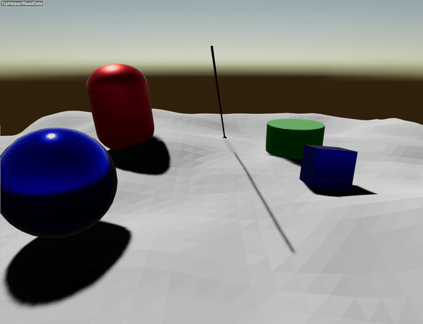

#############################
Ray Test
#############################

A ray test is a collision check between the world and a ray.
Users specify the starting point, direction, and length. It returns the closest hit
along the ray (if any).

Arguments
=========
Single-ray test (:code:`rayTest`)
---------------------------------
Signature (C++):

.. code-block:: cpp

    const RayCollisionList& rayTest(const Vec<3>& start,
                                    const Vec<3>& direction,
                                    double length,
                                    size_t objectId = size_t(-10),
                                    size_t localId = size_t(-10),
                                    CollisionGroup collisionMask = CollisionGroup(-1));

* :code:`start`: ray origin in world frame.
* :code:`direction`: ray direction in world frame. It does not need to be normalized.
* :code:`length`: ray length in meters. Only hits within [0, length] are returned.
* :code:`objectId` / :code:`localId`: optional self-filter. Collisions with the given
  object and local body id pair are ignored (useful for sensors attached to robots).
  The defaults disable this filter.
* :code:`collisionMask`: collision mask to filter which groups the ray can hit.
  The default (-1) allows all groups.

The returned :code:`RayCollisionList` stores only the closest hit (0 or 1 item).

Example
========================================

Only the following line

.. code-block:: cpp

    auto& col = world.rayTest({0,0,5}, direction, 50.);

performs the ray test. The rest of the code is for demonstration only. The ray test stores only the closest hit.

Getting the hit object (example)
--------------------------------
To identify what was hit, check the returned :code:`RayCollisionList`.

.. code-block:: cpp

    const auto& hits = world.rayTest({0, 0, 5}, direction, 50.0);
    if (hits.size() == 0) {
      std::cout << "No hit\n";
    } else {
      const auto& hit = hits[0];
      const auto* obj = hit.getObject();
      if (obj) {
        std::cout << "Hit object: " << obj->getName()
                  << " (id=" << obj->getIndexInWorld() << ")\n";
      }
      std::cout << "Hit position: " << hit.getPosition().transpose() << "\n";
      const auto body = hit.getCollisionBody();
      if (body) {
        std::cout << "Collision body: " << body->name << "\n";
      }
    }

Batch ray tests (lidar)
=======================
For spinning lidar-style scans, :code:`World::rayTestLidar(...)` generates a
rectangular yaw/pitch sampling pattern and performs the scan in one call.

Signature (C++):

.. code-block:: cpp

    void rayTestLidar(
        const Mat<3, 3>& rot,
        const Vec<3>& pos,
        double yawStartAngle,
        double yawIncrement,
        size_t yawCount,
        double pitchStartAngle,
        double pitchIncrement,
        size_t pitchCount,
        double rangeMin,
        double rangeMax,
        size_t objectId,
        size_t localId,
        CollisionGroup collisionMask,
        std::vector<Vec<3>, AlignedAllocator<Vec<3>, 32>>& scan);

Both angular axes use the same :code:`start angle, increment, count` convention.
For sample indices :math:`y` and :math:`p`, the angles are

.. math::

    \mathrm{yaw}(y) = \mathrm{yawStartAngle} + y\,\mathrm{yawIncrement}

.. math::

    \mathrm{pitch}(p) = \mathrm{pitchStartAngle} + p\,\mathrm{pitchIncrement}

where :math:`0 \le y < \mathrm{yawCount}` and
:math:`0 \le p < \mathrm{pitchCount}`. Increments are signed: use a negative
increment to scan an axis in the decreasing-angle direction. A single-sample
axis normally uses an increment of zero. If either count is zero, :code:`scan`
is cleared and no rays are cast.

Minimal example for a complete yaw revolution with 16 pitch channels:

.. code-block:: cpp

    constexpr double pi = 3.14159265358979323846;
    constexpr size_t yawCount = 1024;
    constexpr size_t pitchCount = 16;
    constexpr double yawStartAngle = -pi;
    constexpr double yawIncrement = 2.0 * pi / double(yawCount);
    constexpr double pitchStartAngle = -15.0 * pi / 180.0;
    constexpr double pitchEndAngle = 15.0 * pi / 180.0;
    constexpr double pitchIncrement =
        (pitchEndAngle - pitchStartAngle) / double(pitchCount - 1);

    std::vector<raisim::Vec<3>, raisim::AlignedAllocator<raisim::Vec<3>, 32>> scan;
    world.rayTestLidar(rot, pos,
                       yawStartAngle, yawIncrement, yawCount,
                       pitchStartAngle, pitchIncrement, pitchCount,
                       rangeMin, rangeMax,
                       objectId, localId, collisionMask,
                       scan);

Yaw is the outer loop and pitch is the inner loop. Consequently, rays are
generated in this order:

.. code-block:: text

    (yaw[0], pitch[0]), (yaw[0], pitch[1]), ...,
    (yaw[1], pitch[0]), (yaw[1], pitch[1]), ...

The output :code:`scan` contains hit points in the sensor frame. It is compact:
only rays that hit contribute a point, so a miss does not create a placeholder
entry and indices after a miss no longer map directly to angular sample indices.

Arguments (batched lidar scan)
------------------------------
* :code:`rot`: sensor orientation (sensor frame to world frame).
* :code:`pos`: sensor position in world frame.
* :code:`yawStartAngle`, :code:`yawIncrement`, :code:`yawCount`: first yaw angle,
  signed yaw step, and number of yaw samples.
* :code:`pitchStartAngle`, :code:`pitchIncrement`, :code:`pitchCount`: first pitch
  angle, signed pitch step, and number of pitch samples.
* :code:`rangeMin`, :code:`rangeMax`: minimum and maximum sensor-relative range
  in meters. Each collision ray starts at :code:`rangeMin` and has length
  :code:`rangeMax - rangeMin`.
* :code:`objectId` / :code:`localId`: optional self-filter (same as :code:`rayTest`).
* :code:`collisionMask`: collision mask to filter which groups the rays can hit.
* :code:`scan`: output hit positions in the sensor frame.

Performance notes
-----------------
:code:`rayTestLidar` is optimized for repeated structured scans. It caches the
sensor-frame directions and their normalized forms for an unchanged yaw/pitch
pattern. In a sufficiently large, spatially sparse scene it also builds
conservative angular candidate buckets, so each ray normally checks only nearby
bodies. The buckets are reused while the scene, sensor pose, ranges, self-filter,
and collision mask are unchanged; changes to any of those inputs invalidate the
relevant cache. Bucket bounds are conservative and every retained candidate
still goes through an exact shape intersection. Sphere candidates use the same
quadratic roots and range rules as the contact engine but omit the unused
contact-normal calculation. No path approximates hit positions.

Dense or unsupported angular configurations automatically use the exact ray
BVH instead. Small scenes use a scan-wide conservative cull and a compact flat
candidate list. These fallbacks preserve the same closest-hit and compact-output
semantics.

The source-tree :code:`ray_lidar_comparison` benchmark compares both APIs using
identical rays in a 100%-hit scan and verifies every hit position plus a timed
checksum. Its default 256-by-16 configuration is also a performance regression
check: :code:`rayTestLidar` must be faster than repeated :code:`rayTest` calls.
Run it single-threaded with:

.. code-block:: bash

    OMP_NUM_THREADS=1 ./build-benchmark/benchmark/benchmarks \
      --bench ray_lidar_comparison --raisim --repeat=5

The relative speed still depends on scene layout, motion, filters, and scan
shape, so benchmark the application workload when making performance decisions.

Details
=======
RayCollisionItem summary
------------------------
Each hit entry stores:

* :code:`getObject()`: pointer to the hit :code:`raisim::Object` (or nullptr if none).
* :code:`getPosition()`: world-frame hit position (contact point).
* :code:`getCollisionBody()`: collision body handle for the hit (may be null for some objects).

RayCollisionList summary
------------------------
Container semantics:

* :code:`size()`: number of valid hits in the list.
* :code:`operator`: random access to the i-th hit.
* :code:`begin()`, :code:`end()`: iterators over valid hits.
* :code:`back()`: iterator to the last valid hit.
* :code:`setSize(n)`: updates the number of valid hits (used internally).
* :code:`resize(n)`, :code:`reserve(n)`: storage management.

Notes
=====
* :code:`RayCollisionList` is a lightweight container reused across calls. It is
  cleared and populated by :code:`rayTest(...)`.
* It contains **at most one item** because RaiSim keeps only the closest hit
  along the ray. Use :code:`list.size()` to check whether a hit occurred (0 or 1).

API
====

RayCollisionItem
----------------

.. doxygenclass:: raisim::RayCollisionItem
   :members:

RayCollisionList
----------------

.. doxygenclass:: raisim::RayCollisionList
   :members:
