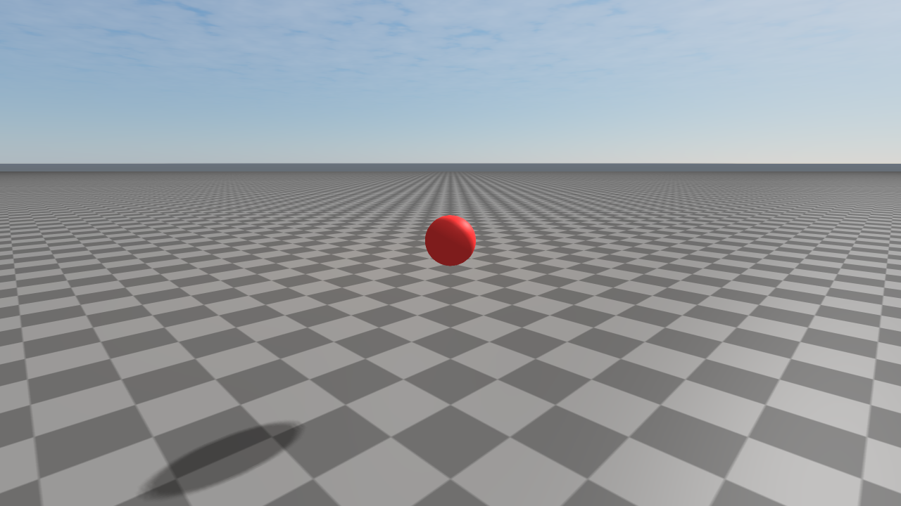
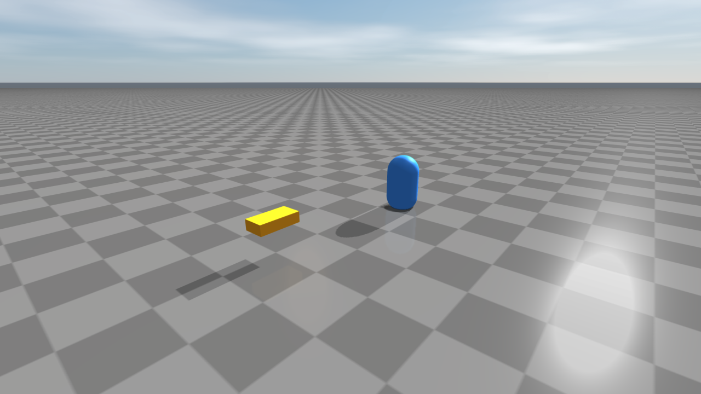

#############################
rayrai Visualizer
#############################

Overview
========
rayrai is an in-process C++ renderer for RaiSim. It renders into an offscreen OpenGL
texture and is designed to embed in custom UIs (ImGui, Qt, etc.) or headless pipelines.
RaisimUnity and RaisimUnreal are no longer supported; rayrai is the supported
visualization path. It runs inside the simulation process and exposes direct
access to render targets, picking, and custom visuals.

Key characteristics:

* In-process rendering with direct OpenGL texture access, plus the standalone TCP viewer for ``RaisimServer`` scenes
* ``Fast``/``Balanced``/``High``/``Ultra`` quality presets with explicit settings for shadows, post-process, render scale, and texture filtering
* glTF/GLB visual-scene import with PBR materials, normal maps, authored lights, HDR image-based lighting, reflection probes, and planar reflections
* Weather and scene effects: time-of-day sky, fog/local fog, rain, snow, lightning diagnostics, wet/snow material response, projected decals, and irradiance volumes
* Capture and diagnostics helpers for screenshots, debug passes, GPU pass timings, exposure/luminance analysis, and JSON reports
* Support for RGB/depth sensor alignment, GPU LiDAR slices, point clouds, coordinate frames, camera frustums, and picking
* Direct ImGui/SDL2 integration patterns and headless/offscreen workflows

The public API lives in the `raisin` namespace (note the spelling). The primary entry
point is ``raisin::RayraiWindow``.

.. toctree::
   :maxdepth: 1
   :caption: rayrai topics

   rayrai/RenderQuality
   rayrai/Lighting
   rayrai/Materials
   rayrai/Visuals
   rayrai/PostProcess
   rayrai/Weather
   rayrai/Capture
   rayrai/Sensors
   rayrai/Examples
   rayrai/Performance

Dependencies
============
rayrai depends on SDL2, OpenGL, glbinding, glm, assimp, stb, and imgui. The installed
package in ``rayrai/<OS>`` ships the headers and CMake config for these dependencies.

Included binary (recommended)
=============================
For most users, the easiest way to use rayrai is the included TCP viewer
binary at ``rayrai/<OS>/bin/rayrai_raisim_tcp_viewer``. It connects to a
running ``RaisimServer`` and provides full PBR rendering, scene inspection,
interactive pause / step / force application, screenshots, and session
recording.

.. code-block:: bash

    ./rayrai/<OS>/bin/rayrai_raisim_tcp_viewer

See :doc:`RayraiTcpViewer` for the full UI tour, command-line options,
the sim-control workflow, authentication setup, and the wire-format
reference for writing custom clients.

Build and link
==============
rayrai installs a CMake package under ``rayrai/<OS>``. Add it to
``CMAKE_PREFIX_PATH`` and link the ``rayrai`` target.

.. code-block:: cmake

    find_package(rayrai CONFIG REQUIRED)

    add_executable(my_app main.cpp)
    target_link_libraries(my_app PRIVATE rayrai)

In practice, you will also set the Raisim prefix (for example, ``-DCMAKE_PREFIX_PATH``)
to include both ``raisim/<OS>`` and ``rayrai/<OS>``.

Minimal usage
=============
The typical workflow is:

1. Create a RaiSim world.
2. Construct a ``raisin::RayraiWindow`` for that world.
3. Update the renderer each frame and consume the output texture.

.. code-block:: cpp

    #include <memory>

    #include <raisim/World.hpp>
    #include <rayrai/RayraiWindow.hpp>

    int main() {
      auto world = std::make_shared<raisim::World>();
      raisin::RayraiWindow viewer(world, 1280, 720);

      // glm::vec4 colour overload (preferred in new code).
      auto sphere = viewer.addVisualSphere("goal", 0.2, glm::vec4(0.9f, 0.2f, 0.2f, 1.0f));
      sphere->setPosition(0.0, 0.0, 1.0);

      while (true) {
        world->integrate();
        viewer.update(1280, 720, false, 0, 0, false);
        unsigned int tex = viewer.getImageTexture();
        (void)tex; // use the texture in your UI or pipeline
      }
    }

If you are integrating with an existing OpenGL context, see :doc:`rayrai/Capture` for
``RayraiWindow::createOffscreenGlContext`` / ``makeOffscreenContextCurrent`` and a
full headless capture-to-PNG example.

Threading contract
==================
``RayraiWindow`` is single-threaded by default. Construct it with the default
``RayraiWindow::ThreadingMode::SingleThread`` when the simulation and renderer
live on one thread, which is the normal RaiSim workflow.

``ThreadingMode::MultiThread`` is an explicit opt-in for batch/offscreen render
setups that create one ``RayraiWindow`` per worker thread, each with its own
OpenGL context. Do not mix threading modes inside one process; all windows must
use the same mode. A threading-mode mismatch at construction is treated as a
fatal error (``RSFATAL``).

Lifetime and error model
========================
``RayraiWindow`` does not own the ``raisim::World`` passed to its constructor.
The world must outlive the window. Either the ``raisim::World*`` or
``std::shared_ptr<raisim::World>`` constructor is acceptable; the shared-pointer
overload uses a non-owning deleter internally.

Mutation methods that target an entity by name — for example,
``removeVisualObject``, ``clearAdditionalLights``, ``clearLocalFogVolumes`` —
are silent no-ops when the target does not exist. They never throw and never
return a failure code, so callers can invoke them unconditionally without an
existence check.

Resource-creation methods signal failure with a zero GL handle, a null
``shared_ptr``, or an ``isComplete() == false`` ``PbrEnvironment`` and log an
error to stderr. The list includes ``loadColorTextureWithTiling``,
``loadDataTextureWithTiling``, ``loadHdrEquirectangularCubemap``,
``createHdrIrradianceCubemap``, ``createHdrPrefilteredEnvironmentCubemap``,
``createSplitSumBrdfLut``, ``PbrEnvironment::loadFromHdrFile``,
``addVisualMesh``, ``addVisualCustomMesh``, and ``importVisualScene``.

Built-in shader programs are registered during construction and compiled
lazily on first use. ``shaderWarmupDiagnostics`` reports the measured
compile/link cost and linked program count so both startup stalls and
first-use stalls (when an effect is enabled for the first time) can be
tracked.

Example: custom visuals + background color
==========================================
This example adds a custom box, renders an RGB texture each frame, and reads the
image texture handle for UI integration. New code should prefer explicit color-range
APIs such as ``setBackgroundColorRgb255`` or ``setBackgroundColorLinear``.

.. code-block:: cpp

    #include <memory>

    #include <raisim/World.hpp>
    #include <rayrai/RayraiWindow.hpp>

    int main() {
      auto world = std::make_shared<raisim::World>();
      world->addGround();

      raisin::RayraiWindow viewer(world, 1280, 720);
      viewer.setBackgroundColorRgb255({40, 45, 55, 255});

      auto box = viewer.addVisualBox("marker", 0.4, 0.2, 0.1,
        glm::vec4(0.9f, 0.6f, 0.1f, 1.0f));
      box->setPosition(1.0, 0.0, 0.3);

      while (true) {
        world->integrate();
        viewer.update(1280, 720, false, 0, 0, false);
        unsigned int colorTex = viewer.getImageTexture();
        (void)colorTex; // feed into your UI or pipeline
      }
    }

Where to go next
================
* Choose a render preset and tone curve — :doc:`rayrai/RenderQuality`
* Light the scene and set up HDR/IBL reflections — :doc:`rayrai/Lighting`
* Apply PBR materials and authored asset imports — :doc:`rayrai/Materials`
* Add visual primitives, instanced visuals, and overlays — :doc:`rayrai/Visuals`
* Enable cinematic post-process / SSR / SSAO / DoF — :doc:`rayrai/PostProcess`
* Drive weather and atmospherics — :doc:`rayrai/Weather`
* Run headlessly, capture screenshots, and run diagnostics — :doc:`rayrai/Capture`
* Align to RGB/depth/LiDAR sensors and pick objects — :doc:`rayrai/Sensors`
* Write a custom TCP client — :doc:`RayraiTcpViewer`
* List of shipped example targets — :doc:`rayrai/Examples`
* Performance notes and the full C++ API reference — :doc:`rayrai/Performance`
