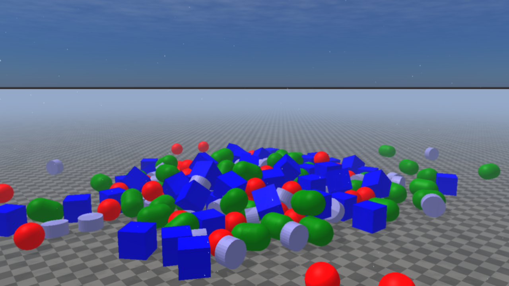
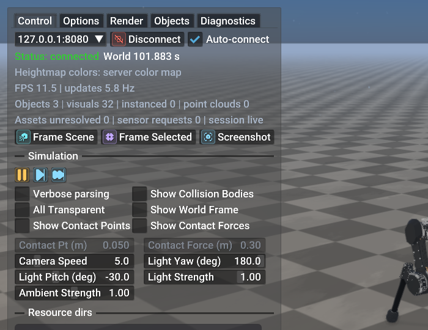
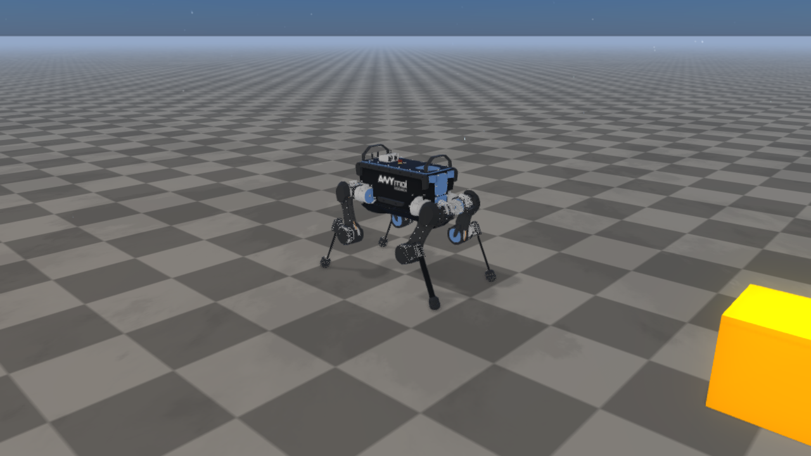

#################
Rayrai TCP Viewer
#################

The ``rayrai_raisim_tcp_viewer`` binary is the recommended visualizer for
``RaisimServer`` simulations. It connects to a running server over TCP, renders
the world with the full rayrai pipeline (PBR + IBL + post-process), and lets
you interactively pause, step, force-poke, and reposition objects without
touching the simulation code.

This page covers the viewer application — its panels, controls, command-line
options — plus the underlying wire format for writing custom clients. For
applications that embed the renderer directly with
``raisin::RayraiWindow``, this binary is not used; see :doc:`Rayrai`
for the in-process path. For the server-side API the viewer talks to,
see :doc:`RaisimServer`.

   The viewer connected to the ``primitive_grid`` example. The same rayrai
   PBR pipeline is used as the in-process ``RayraiWindow``: procedural sky,
   directional shadows, reflective ground for the High and Ultra presets.

.. contents::
   :local:
   :depth: 2

Quick start
===========
1. Start any ``RaisimServer`` example. The server listens on ``127.0.0.1:8080``
   by default.
2. Launch the viewer:

   .. code-block:: bash

       ./rayrai/<OS>/bin/rayrai_raisim_tcp_viewer

3. The viewer auto-connects to ``localhost:8080``. To point it at a different
   endpoint, pass ``--connect host:port`` or type into the host / port fields
   under the **Control** tab.

Run ``rayrai_raisim_tcp_viewer --help`` for the full option list. On Windows
use the ``.exe`` binary.

Command-line options
====================
.. list-table::
   :header-rows: 1
   :widths: 28 72

   * - Option
     - Effect
   * - ``--connect HOST:PORT``
     - Override the default ``127.0.0.1:8080`` endpoint.
   * - ``--auto-connect`` / ``--no-auto-connect``
     - Whether to dial the server on launch. Also controlled by env var
       ``RAYRAI_TCP_VIEWER_AUTO_CONNECT``.
   * - ``--minimize-panels``
     - Start with both side panels collapsed (full-screen scene). Also via
       ``RAYRAI_TCP_VIEWER_MINIMIZE_PANELS``.
   * - ``--auto-frame``
     - Automatically frame the scene after the first state update.
   * - ``--screenshot PATH``
     - Save a single PNG to ``PATH`` and exit. Useful for headless rendering.
   * - ``--screenshot-dir PATH``
     - Directory used by the F12 hotkey and PNG sequence recording.
   * - ``--record-session PATH.rrtcs``
     - Record the raw TCP stream to a session file for later replay.
   * - ``--replay-session PATH.rrtcs``
     - Replay a recorded session instead of opening a TCP connection.
   * - ``--replay-speed N``
     - Playback rate multiplier (1.0 = real time).
   * - ``--export-scene PATH.json``
     - Dump the parsed scene graph as JSON and exit.

UI layout
=========
.. figure:: ../image/rayrai/tcp_viewer/tcp_viewer_overview.png
   :width: 100%
   :alt: rayrai TCP viewer with the Control tab expanded

   The viewer's left overlay opened on the **Control** tab while attached to
   ``sim_control_demo``. The right side of the window is the rayrai-rendered
   scene; the overlay floats above it with translucent background so the
   scene stays visible. The overlay auto-collapses to a small icon after
   5 s without hover — pass ``--keep-overlay-open`` to disable that
   behaviour for screenshots or demos.

The viewer overlay has two compact panels:

* **Left panel** — tabbed UI: **Control / Options / Render / Objects /
  Diagnostics**. This is where every TCP-client setting lives.
* **Right panel — Selected object inspector**. Appears when you click an
  object in the scene or in the **Objects** tab. Shows pose, body type,
  per-joint angles for articulated systems, and a per-object collision-shape
  toggle.

Both panels are independently collapsible. Click the small chevron in the
header, or pass ``--minimize-panels`` to start with both panels minimized.

Control tab — widget reference
------------------------------

   Detail crop of the Control tab. Widget walkthrough below mirrors the
   layout top-to-bottom.

**Connection row.**

* **Host / port field** — type ``host:port`` directly, or pick a recent
  entry from the dropdown chevron. Persisted in
  ``$XDG_CONFIG_HOME/raisim/rayrai_tcp_viewer.json``.
* **Connect / Disconnect** button — toggles the TCP socket. Greyed out
  while a session is replaying (``--replay-session``).
* **Auto-connect** checkbox — when on, the viewer dials the server on
  launch and re-dials after a clean disconnect. Off means *manual connect*
  only, which is the right default for offline scene inspection.

**Status block (read-only).** Coloured text — green ``Connected``, amber
``Connecting…``, red ``Disconnected: <reason>`` — followed by:

* ``World <t> s`` — the server-side ``world.getWorldTime()`` snapshot from
  the most recent frame.
* ``Heightmap colors: server color map`` — confirms heightmap streaming is
  using the server-side colour table rather than a viewer override.
* ``FPS X | updates Y Hz`` — renderer FPS and incoming TCP update rate
  respectively. If FPS drops while updates stay high, the renderer is the
  bottleneck (lower the quality preset on the **Render** tab). If updates
  drop while FPS is fine, the server or network is the bottleneck.
* ``Objects N | visuals N | instanced N | point clouds N`` — current scene
  counts as parsed from the latest frame.
* ``Assets unresolved N | sensor requests N | session live|recording|replay``
  — ``unresolved`` is the number of mesh paths that could not be found; fix
  by passing ``--resource-dir PATH`` (or the **Options** tab field). The
  session marker reflects ``--record-session`` / ``--replay-session``.

**Camera helpers.**

* **Frame Scene** — fit every selectable object in the camera frustum.
  Same as the keyboard shortcut ``F``.
* **Frame Selected** — fit the currently-selected object only.
* **Screenshot** — write a PNG to ``--screenshot-dir`` (see the **Options**
  tab to change the directory).

**Simulation row.** Only enabled when the server has negotiated
``PROTOCOL_FEATURE_SIM_CONTROL``. The viewer greys the icons out
automatically against a legacy ``RaisimServer`` build; see
``TcpClient::serverSupportsSimControl()`` for the same flag from the client
side.

* **Pause / Resume** (orange ⏸ when running, green ▶ when paused) — sends
  ``CR_PAUSE`` / ``CR_RESUME``. The server skips ``world_->integrate()``
  but state streaming keeps running, so the camera, panels, and inspector
  stay responsive while time is frozen.
* **Step** — sends ``CR_STEP_N`` with ``stepCount = 1``. Advances one
  ``world_->integrate()`` tick.
* **Step 10** — same but ``stepCount = 10``. Hold the button to scrub.

**Debug toggles.** Two-column grid of boolean toggles:

* **Verbose parsing** — logs every received TCP frame to stderr with field
  offsets. Use when chasing wire-format issues, then turn back off (heavy
  log volume).
* **Show Collision Bodies** — draw the collision shapes the contact solver
  actually sees, instead of the visual meshes. Distinguishes "the visual
  mesh I authored is huge" from "the collision body is right".
* **All Transparent** — alpha-blend every opaque object so you can see
  through the scene. Useful for inspecting nested articulated systems or
  hidden constraints.
* **Show World Frame** — draw the X/Y/Z triad at the world origin.
* **Show Contact Points** — render small spheres at every active contact
  point reported by ``world.getContacts()``.
* **Show Contact Forces** — render arrows scaled by the contact impulse
  magnitude at every contact point. Pair with **Contact Pt** and **Contact
  Force** sliders below to scale them so they're visible.

**Light and camera sliders.** Direct overrides of the renderer's main
directional light and camera, equivalent to the C++ ``Light::setRotation``,
``Light::setStrength``, and the ``RenderQualitySettings.mainLightAmbient``
fields:

* **Camera Speed** — WASD movement multiplier.
* **Light Yaw / Light Pitch** — direction of the main directional light, in
  degrees. ``-30°`` pitch is the default afternoon sun angle.
* **Light Strength** — scalar multiplier on the directional light's PBR
  intensity.
* **Ambient Strength** — multiplier on the IBL ambient contribution
  (sky-driven fill). Lowering this darkens shaded sides without dimming the
  sun.
* **Contact Pt** / **Contact Force** — size sliders for the contact debug
  spheres / arrows above.

**Resource dirs.** Text field + ``Add`` button. Each added directory is
inserted into the renderer's mesh-search path, applied immediately to the
next frame's asset resolution. Use this to fix ``Assets unresolved`` for
URDFs whose mesh paths assume a workspace root that isn't on the default
search list. The same list can be passed up-front via ``--resource-dir
PATH`` (repeatable).

Options tab
-----------
The **Options** tab houses *viewer-local* preferences — they don't go over
the TCP socket, so they apply to every connection:

* **UI Scale** — global ImGui font / control scale. Persists across runs.
* **Reset Scale** — restore the auto-detected DPI-derived default.
* **Show collapsed logo** — toggle the small raisim badge that appears in
  the panel header when minimized. Off for a more compact corner.
* **Hover the collapsed header to open the panel** vs the legacy
  click-to-expand behaviour.
* **Screenshot directory** — path used by F12 and the **Screenshot**
  button. Defaults to the current working directory unless
  ``--screenshot-dir`` overrides it.
* **PNG-sequence record every N frames** — paired with the F11 hotkey, this
  records a frame-numbered PNG sequence at the chosen stride. Output goes
  into the screenshot directory.

Render tab
----------
The **Render** tab is the rayrai pipeline configuration mirror — every knob
documented in :doc:`rayrai/RenderQuality`, :doc:`rayrai/Lighting`,
:doc:`rayrai/PostProcess`, and :doc:`rayrai/Weather`:

* **Quality preset** — Fast / Balanced / High / Ultra. Picks one of the
  defaults documented in
  ``RenderQualitySettings::defaultRenderQualitySettings``.
* **Custom overrides** — once you tweak any subfield, the preset row
  reads ``Custom``; click **Reset to preset** to return to the canonical
  values.
* **FXAA / TAA** — antialiasing mode.
* **Bloom** — enable/disable, with threshold and intensity sliders that
  match ``RenderQualitySettings.bloomThreshold`` /
  ``bloomIntensity``.
* **SSAO** — screen-space ambient occlusion strength + radius.
* **Depth of field** — toggle + aperture / focus-distance / focus-range
  sliders.
* **Tone mapping** — dropdown over ``ViewerColorMode`` (FastLinear / ACES /
  UnrealPreview / Filmic / AgX).
* **Color grade preset** — dropdown over ``ColorGradePreset``.
* **Procedural sky** — toggle + sun-strength + cloud-quality dropdown.
* **Weather** — dropdown over ``WeatherPreset`` (Clear / Overcast / Rain /
  Storm / Snow) plus rain / fog / wetness sliders. The renderer applies
  these in addition to whatever the server may have authored — set the
  server-side weather to None if you want viewer-only authoring.
* **Reflective ground** + **Planar reflection strength** — match the
  ``RenderQualitySettings.reflectiveGround*`` fields. On for High and Ultra
  by default.

Objects tab
-----------
The **Objects** tab lists every selectable object the server has sent so
far, with:

* **Filter** field — case-insensitive substring match on the object name.
* **Group by type** — fold the list into per-type sections
  (single-body / articulated / heightmap / instanced visuals / point cloud).
* **Hide collision shapes for all** — global toggle that propagates the
  per-object **Show collision bodies** state across every entry. Useful when
  you want a uniform x-ray view without ticking every object.
* **Per-row click** — selects the object (same as clicking it in the scene).
* **Per-row eye icon** — toggle visibility without removing the object.

Diagnostics tab
---------------
The **Diagnostics** tab is the field for *debugging* a connection rather
than driving one:

* **Packet history** — circular buffer of recent TCP frames with sizes,
  feature bits, and parse status.
* **Asset resolution log** — every mesh / texture path the renderer asked
  for, with the directory it was found in or the error if not. Mirror of
  the ``Assets unresolved`` count on the Control tab.
* **Parse error log** — last N parse-error messages from
  ``raisin_tcp_window``, including the byte offset where the parser gave up
  and the message size in flight. Pair with **Verbose parsing** to
  reproduce.
* **Cache stats** — shader binary cache hits / misses / stores for the
  current process. See :doc:`rayrai/Performance` for the underlying
  ``Shader::binaryCacheStats()`` API.

Right-side inspector
--------------------
The right-side panel only appears when an object is selected. Top-to-bottom:

* **Object name and stable id** (``Object::Id`` from the world).
* **Body type** — Static / Kinematic / Dynamic.
* **Position / Orientation** — drag-to-edit widgets. Edits send
  ``CR_SET_POSE`` (single-body) or set the floating-base portion of the
  generalized coordinate vector (articulated).
* **Joint angles** (articulated systems only) — one slider per actuated
  joint, bounded by the URDF/MJCF joint limits when those are set, free
  range otherwise. Edits send ``CR_SET_GC`` with the updated vector.
* **Show collision shape** — per-object toggle that overrides the global
  **All Transparent** / **Show Collision Bodies** state for this object.

Sim control workflow
====================

   The viewer attached to the ``sim_control_demo`` example. Clicking
   *Pause* in the Control tab sends a ``CR_PAUSE`` request to the server;
   the next ``world_->integrate()`` is skipped while state streaming keeps
   running. *Step* and *Step 10* push one or ten single-tick advances.

The Pause / Step buttons send ``CR_PAUSE`` / ``CR_RESUME`` / ``CR_STEP_N``
messages over the existing update channel. The server consumes them inside
``integrateWorldThreadSafe()``: paused means ``world_->integrate()`` is
skipped, but state streaming, sensor reads, and the scene mutex all keep
working — you can still pan the camera, screenshot, and inspect objects
while time is frozen.

Stepping while paused enqueues ``N`` single-step integrations that drain one
per tick. This means you can hold *Step* (or click *Step 10*) to advance the
simulation deterministically, frame by frame, with the camera tracking what
just happened.

For programmatic control without the UI, the same messages can be sent by
any client that speaks ``PROTOCOL_FEATURE_SIM_CONTROL`` — see
``raisin::tcp_viewer::sendUpdateRequest`` and the ``SimControlRequest`` struct
in ``rayrai/RaisimTcpCommon.hpp``.

Force / pose application
========================
Right-click drag on an object in the scene sends ``CR_APPLY_FORCE`` /
``CR_APPLY_TORQUE`` for the duration of the drag. The right-side inspector's
*Pose* widgets emit ``CR_SET_POSE`` (single-body) and ``CR_SET_GC``
(articulated systems). All four are drained by the server inside
``integrateWorldThreadSafe()`` just before the next ``world.integrate()``,
so the force lands on exactly the tick the viewer requested.

Access control
==============
There is no authentication or capability handshake — if the TCP connection
is open, the client can issue any sim-control request the server supports.
The bind address is the only access control: ``RaisimServer`` binds to
``127.0.0.1`` by default. Call ``server.setBindLoopbackOnly(false)`` only on
trusted networks (see :doc:`RaisimServer` for details).

Screenshots and recording
=========================
* **F12** — capture a PNG to the configured screenshot directory.
* **F11** — toggle a PNG sequence recorder (every N-th frame, configurable).
* **Camera bookmarks F1–F4** — save the current view; press the same key to
  restore. The bookmarks panel shows the four slots and a one-click overwrite
  button.
* **Session recording** — see ``--record-session`` / ``--replay-session``.
  Recorded sessions store the raw TCP frames, so you can re-render a run
  later at any quality preset.

Articulated-system inspector mode
=================================
While the viewer is *not* connected to a server, you can drag a URDF (``.urdf``)
or MuJoCo XML (``.xml``/``.mjcf``) file from your file manager onto the viewer
window. The file content is sniffed for a ``<mujoco`` root marker; if present
the model is loaded through the MJCF path (``World::loadMjcfFile``), otherwise
it goes through the URDF path (``World::addArticulatedSystem``). MJCF loads
may bring in extras declared in the ``<worldbody>`` (ground plane, lights,
mocap bodies) — they're tracked and removed together with the robot when you
close the inspector.

The viewer then opens a **Joint Inspector** panel:

* Per-joint sliders for revolute and prismatic joints (bounded by the URDF's
  ``<limit lower="..." upper="...">`` when present, free-form otherwise).
* ``DragFloat3``/``DragFloat4`` widgets for spherical joints and floating
  bases.
* **Reset pose** sets all joint values to zero (identity quaternions).
* **Close inspector** removes the local robot and returns the viewer to
  normal TCP-client mode (Connect / Auto-connect become re-enabled).

The inspector is kinematic-only — there is no integration, no contact
resolution, no physics. It's intended for quickly inspecting URDF / MJCF
authoring (joint axes, limits, mesh paths) before plugging the model into a
running ``raisim::World``. Drops are ignored while a server connection is
active so that the streamed scene and the local robot don't fight over the
same renderer; disconnect first if you want to inspect a file.

Objects and selection
=====================
Click any object in the scene or in the **Objects** tab list to select it.
The right-side inspector shows:

* Object name, tag, body type
* World-space position and orientation
* For articulated systems: joint names and current joint angles
* Toggleable collision-body visibility per-object

The **Objects** tab supports group-by-type, name filtering, and a
collision-hide toggle that propagates to every selectable object at once.

Rendering settings
==================
The **Render** tab exposes the rayrai pipeline controls covered in detail in
:doc:`rayrai/RenderQuality`, :doc:`rayrai/Lighting`,
:doc:`rayrai/PostProcess`, and :doc:`rayrai/Weather`: quality preset, FXAA,
bloom, screen-space AO, depth of field, OIT, sky + weather,
reflection-probe / planar-reflection toggles, and PBR material/tone-mapping
options.

Diagnostics
===========
The **Diagnostics** tab shows live packet history, asset resolution status
(useful when meshes can't be found), and per-frame parse-error logs. Useful
when developing custom clients or chasing mesh-path issues.

Wire format
===========
The Rayrai TCP viewer protocol is explicitly versioned. The current viewer
sends a protocol header with feature bits before each request, and the
server replies with the negotiated feature set. A viewer rejects newer
unsupported protocol versions with a clear error instead of attempting to
parse an incompatible stream.

Current feature bits cover the explicit header and deformable delta
streaming. Deformable objects send mesh topology during initialization or
topology changes; ordinary update frames send vertex positions only. This
keeps dynamic cloth/cube streaming cheaper while avoiding binary compression
until network bandwidth is measured as a bottleneck.

The protocol constants live in ``rayrai/RaisimTcpCommon.hpp`` (namespace
``raisin::tcp_viewer``):

* ``kDefaultPort`` — default ``RaisimServer`` port the viewer connects to.
* ``kProtocolVersion`` — the current wire version. Mismatched versions cause
  the viewer to disconnect with a versioned-protocol error.
* ``kProtocolFeatureExplicitHeader`` and ``kProtocolFeatureDeformableDelta`` —
  the two currently-negotiated feature bits; ``kProtocolFeaturesSupported``
  is the OR of all bits this build understands.
* ``kMaxMessageBytes`` — maximum accepted message size (default 64 MiB),
  overridable at build time via the
  ``RAISIM_TCP_VIEWER_MAX_MESSAGE_BYTES`` preprocessor define when very large
  scenes need a larger frame budget.

The wire format is a native-endian binary stream. Each TCP frame begins with
an ``int32_t`` total-frame-size header (including the 4-byte header itself).
Scene strings use ``int32_t`` lengths; sensor-response names use ``uint64_t``
lengths to remain ABI-compatible with the legacy ``RaisimServer`` protocol.

Headless screenshot recipe
==========================
The same binary runs without a window manager when invoked with
``--screenshot``. The viewer connects, waits for the first valid scene
update, captures one PNG, and exits — useful for CI smoke tests, doc
builds, and dataset preview generation:

.. code-block:: bash

    # 1) Start any RaisimServer example in the background.
    LD_LIBRARY_PATH=$RAISIM_DIR/lib ./primitive_grid &

    # 2) Capture a 1280x720 PNG framed on the scene, then exit.
    LD_LIBRARY_PATH=$RAYRAI_DIR/lib:$RAISIM_DIR/lib \\
      ./rayrai_raisim_tcp_viewer \\
        --connect 127.0.0.1:8080 \\
        --camera-lookat 14,-14,6,-1,-1,3 \\
        --screenshot out.png \\
        --window-size 1280x720 \\
        --wait-for-server 8 \\
        --exit-after 5

The two screenshots on this page were generated exactly this way. Combine
``--minimize-panels`` for clean shots, or omit it to capture the overlay
panels.

Embedding the server in your application
========================================
Wire the server up on the simulation side with three lines and a tick
callback that runs under the world mutex:

.. code-block:: cpp

    #include "raisim/RaisimServer.hpp"
    #include "raisim/World.hpp"

    int main() {
      raisim::World world;
      world.setTimeStep(0.005);
      world.addGround();
      auto* ball = world.addSphere(0.1, 1.0);
      ball->setPosition(0, 0, 1.0);

      raisim::RaisimServer server(&world);
      // Default bind is 127.0.0.1. Only open the bind on trusted networks.
      // server.setBindLoopbackOnly(false);
      server.launchServer(8080);

      // Optional: drive your own work inside the locked region, after
      // any client requests are applied and before world.integrate().
      for (size_t i = 0;; ++i) {
        server.integrateWorldThreadSafe([&] {
          if (i % 600 == 0) ball->setLinearVelocity({0, 0, 4.0});
        });
      }
    }

The callback overload preserves the full pause / step / force / pose
behaviour of the no-arg version, so the viewer can still pause time even
while the example mutates the world every tick. See ``examples/src/server/``
for a runnable showcase (``sim_control_demo`` exercises the sim-control
surface end-to-end).

Writing a custom client
=======================
The header ``rayrai/RaisimTcpCommon.hpp`` exposes everything a custom client
needs: the ``TcpClient`` socket helper, ``BufferReader`` for parsing, the
``ClientRequestType`` enum (CR_PAUSE / CR_RESUME / CR_STEP_N / CR_APPLY_FORCE
/ CR_APPLY_TORQUE / CR_SET_POSE / CR_SET_GC), and ``sendUpdateRequest`` for
batching sim-control requests onto an ordinary update.

A minimal frame-pulling loop:

.. code-block:: cpp

    #include "rayrai/RaisimTcpCommon.hpp"
    using namespace raisin::tcp_viewer;

    TcpClient client;
    if (!client.connectTo("127.0.0.1", 8080, /*verbose=*/true)) {
      std::fprintf(stderr, "connect failed: %s\\n", client.lastError().c_str());
      return 1;
    }

    std::vector<char> payload;
    while (client.isConnected()) {
      // Ask for one fresh state frame. objectId=0 means "all objects".
      if (!sendUpdateRequest(client, /*objectId=*/0, /*controlRequests=*/{})) break;
      if (!client.recvMessage(payload)) {
        if (client.lastIoWouldBlock()) continue;
        break;
      }
      BufferReader reader(payload);
      // First two values in every server frame are the negotiated
      // protocol version and feature bits — see kProtocolFeature*.
      const auto protocolVersion = reader.read<int32_t>();
      const auto featureBits      = reader.read<uint64_t>();
      // …decode the rest using BufferReader::read<T>() / readString() /
      // readVector<T>() until reader.ok flips false.
    }

Each read advances ``reader.offset()`` and sets ``reader.ok = false`` if
there is not enough data left, so callers can decode an entire frame and
check ``ok`` at the end rather than after every field. Mismatched protocol
versions or unsupported feature bits are reported via ``reader.ok`` plus
the bytes at offset 0; the server will not send a payload it knows the
client cannot parse.

Driving the simulation from a custom client
-------------------------------------------
Pause / step / force / pose are batched onto the same update frame the
viewer normally pulls. Each ``SimControlRequest`` is a tagged union — only
the fields relevant to ``type`` are read by the encoder:

.. code-block:: cpp

    using R = raisin::tcp_viewer::SimControlRequest;

    std::vector<R> requests;

    // Pause the integrator on the server.
    requests.push_back({.type = ClientRequestType::CR_PAUSE});

    // Advance 10 ticks while paused.
    requests.push_back({.type = ClientRequestType::CR_STEP_N, .stepCount = 10});

    // Push a 30 N force on object with visual tag 42, at the body's COM.
    R force;
    force.type = ClientRequestType::CR_APPLY_FORCE;
    force.visTag = 42;
    force.localBodyIdx = 0;
    force.vec3a = glm::vec3(0.0f);        // application point (world)
    force.vec3b = glm::vec3(0, 0, 30.0f); // force vector (world)
    requests.push_back(force);

    // Teleport a single-body object to a new pose.
    R pose;
    pose.type = ClientRequestType::CR_SET_POSE;
    pose.visTag = 42;
    pose.vec3a = glm::vec3(1.0f, 0.5f, 0.8f);   // position
    pose.quat  = glm::vec4(1.0f, 0.0f, 0.0f, 0.0f); // (w, x, y, z)
    requests.push_back(pose);

    // Set an articulated system's generalized coordinate.
    R gc;
    gc.type = ClientRequestType::CR_SET_GC;
    gc.visTag = 99;
    gc.gc = {0, 0, 0.54f,  /*quat*/1, 0, 0, 0,
             0.03f, 0.4f, -0.8f, -0.03f, 0.4f, -0.8f,
             0.03f, -0.4f, 0.8f, -0.03f, -0.4f, 0.8f};
    requests.push_back(gc);

    sendUpdateRequest(client, /*objectId=*/0, requests);
    // The server applies all requests inside integrateWorldThreadSafe()
    // before the next world.integrate(), so external forces land on
    // exactly the next tick.

The same enum and ``SimControlRequest`` struct are what the viewer's UI
populates internally, so a custom Python or C# client built on top of
``BufferReader`` and these request structs has feature parity with the
shipped viewer's Pause / Step / force / pose surface.

Feature negotiation
-------------------
After connecting, the first server frame carries the negotiated feature
bits. A custom client should AND those bits with ``kProtocolFeatureSimControl``
once at startup, and grey out sim-control surfaces if the bit is not set —
exactly what ``rayrai_raisim_tcp_viewer`` does internally via
``TcpClient::serverSupportsSimControl()``.

See also
========
* :doc:`Rayrai` — in-process rayrai renderer and visualization APIs.
* :doc:`RaisimServer` — server-side API including the sim-control surface.
* :doc:`rayrai/Capture` — programmatic screenshot / capture APIs from
  in-process rayrai.
* :doc:`rayrai/Examples` — rayrai example matrix.

API
===

.. doxygenstruct:: raisin::tcp_viewer::BufferReader
   :members:
