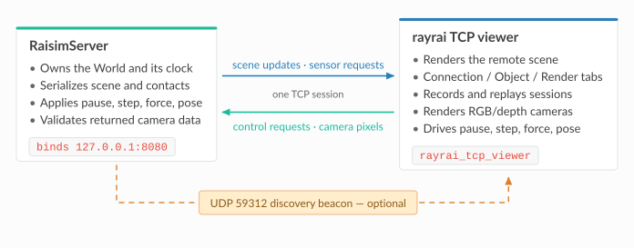
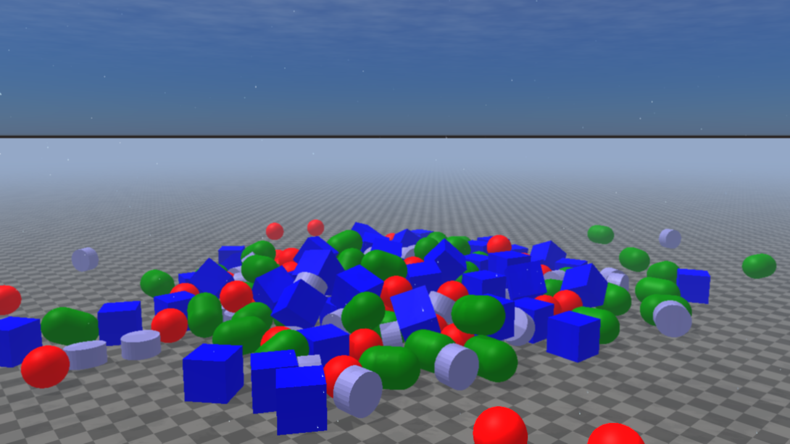
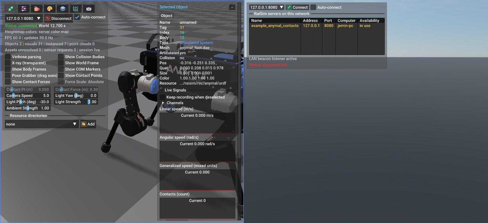
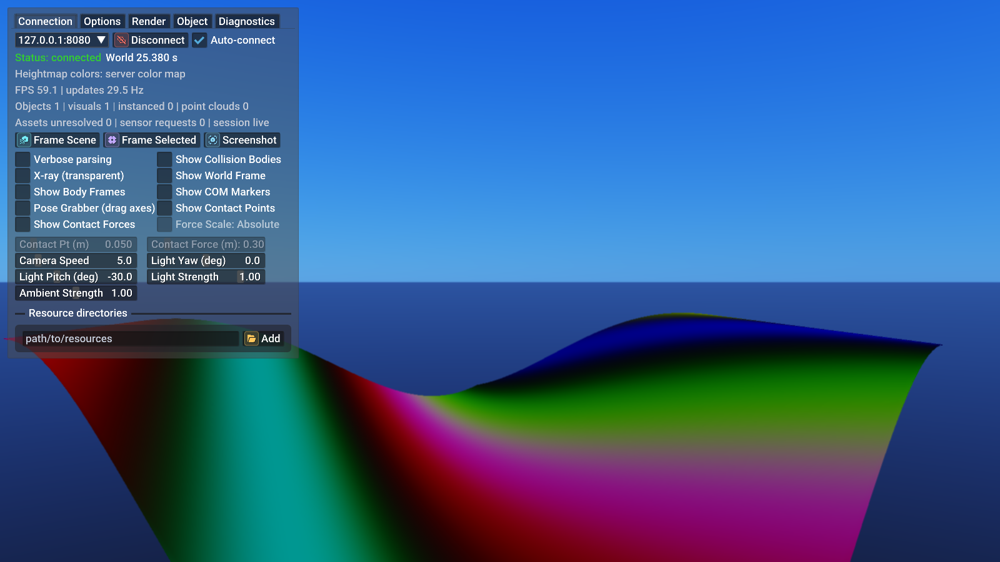
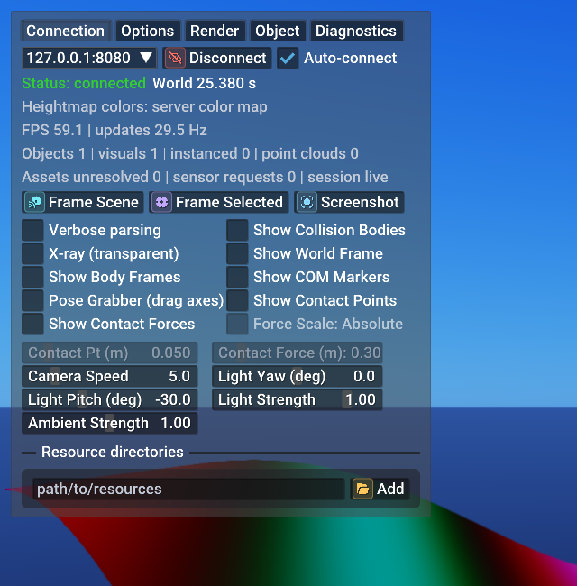
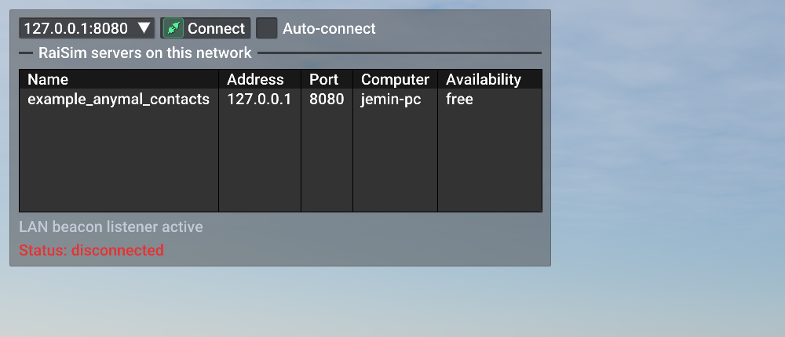
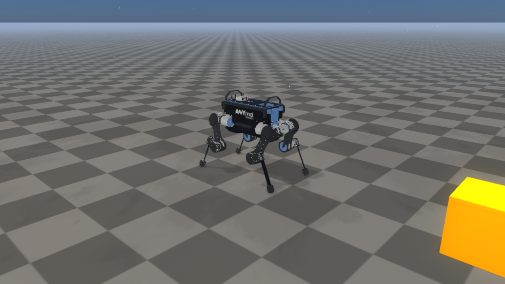
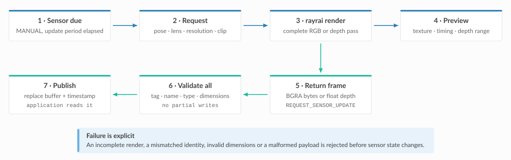

#################
Rayrai TCP Viewer
#################

The source-built ``rayrai_tcp_viewer`` target is the recommended visualizer
for ``RaisimServer`` simulations. The release package provides the rayrai
library, while this repository owns and builds the viewer application from its
checked-in sources. The viewer connects to a running server
over TCP, renders the world with the full rayrai pipeline (PBR + IBL +
post-process), and lets you interactively pause, step, force-poke, and
reposition objects without touching the simulation code.

This page covers the viewer application — its panels, controls, command-line
options — plus the underlying wire format for writing custom clients. For
applications that embed the renderer directly with
``raisin::RayraiWindow``, this binary is not used; see :doc:`Rayrai`
for the in-process path. For the server-side API the viewer talks to,
see :doc:`RaisimServer`.

The viewer executable is not installed into either binary package. Its
maintained sources live under ``examples/src/rayrai/tools`` and it is built by
the examples CMake project. Running ``linux_install.sh``, ``mac_install.sh``,
or ``win_install.ps1`` refreshes those sources from the matching release; build
the ``rayrai_tcp_viewer`` target again afterward.

   One TCP connection carries scene updates, interactive control requests, and
   RGB/depth sensor requests. UDP beacons are only used to discover compatible
   servers; a direct host and port always works without discovery.

   The viewer connected to the ``primitive_grid`` example. The same rayrai
   PBR pipeline is used as the in-process ``RayraiWindow``: procedural sky,
   directional shadows, and the reflective checker ground used by the
   Balanced, High, and Ultra presets.

.. contents::
   :local:
   :depth: 2

Quick start
===========
1. Start any ``RaisimServer`` example. The server listens on ``127.0.0.1:8080``
   by default.
2. Launch the viewer:

   .. code-block:: bash

       ./build-examples/examples/rayrai_tcp_viewer

3. On first launch the viewer connects to ``127.0.0.1:8080``. Later launches
   reconnect each pane to the endpoint it last used (see `Persistence`_)
   unless ``--host``, ``--port`` or ``--connect host:port`` names one. To change
   the endpoint, type into the host / port fields in the **Connection** tab's
   endpoint popup.

To run a RaiSim world file without writing a server program, drop the world XML
onto the viewer or pass ``--simulate world.xml``; see `Local world simulation`_.

Run ``./build-examples/examples/rayrai_tcp_viewer --help`` for the full option
list. On Windows use ``.\build-examples\bin\rayrai_tcp_viewer.exe``; the same
TCP client and discovery paths are supported on Windows, Linux, and macOS.

Desktop launcher (Linux)
========================
``scripts/install_rayrai_viewer_launcher.sh`` registers the viewer as a regular
desktop application, so it can be started from the Activities overview or pinned
to the GNOME / Ubuntu dock instead of a terminal:

.. code-block:: bash

   scripts/install_rayrai_viewer_launcher.sh              # install and pin
   scripts/install_rayrai_viewer_launcher.sh --no-pin     # install only
   scripts/install_rayrai_viewer_launcher.sh --uninstall  # remove everything

It writes three things, all under the invoking user's ``~/.local`` — no root and
no system-wide state — and re-running it is idempotent:

.. list-table::
   :header-rows: 1
   :widths: 42 58

   * - Path
     - Purpose
   * - ``~/.local/bin/rayrai-tcp-viewer``
     - Wrapper that sources ``raisim_env.sh`` before exec'ing the viewer. The
       dock launches applications with a bare environment, so without it
       ``raisim/lib`` and ``rayrai/lib`` are missing from ``LD_LIBRARY_PATH``
       and the viewer exits immediately.
   * - ``~/.local/share/applications/rayrai-tcp-viewer.desktop``
     - The desktop entry. Its ``StartupWMClass`` matches the ``WM_CLASS`` the
       wrapper sets, so a running viewer groups under the pinned icon rather
       than appearing as a second dock entry.
   * - ``~/.local/share/icons/hicolor/<size>/apps/rayrai-tcp-viewer.png``
     - The RaiSim logo, centred on a rounded light-grey plate and written at
       each icon size. Icon themes match a PNG to the directory it is stored in, so
       the icon is rendered at exact sizes rather than copied as-is. The plate
       is what makes the icon read as an application icon: the logo's lower
       third is a transparent wordmark, so drawing it directly on the canvas
       leaves the coloured mark sitting high with hard edges, and the dark
       wordmark disappears against a dark dock. Without ImageMagick the script
       falls back to an absolute ``Icon=`` path pointing at the raw logo.

Useful options:

.. list-table::
   :header-rows: 1
   :widths: 28 72

   * - Option
     - Effect
   * - ``--viewer PATH``
     - Executable to launch. Defaults to
       ``<repo>/build-examples/examples/rayrai_tcp_viewer``.
   * - ``--repo PATH``
     - Repository root, used to find ``raisim_env.sh`` and the logo.
   * - ``--config CFG``
     - Skip unless ``CFG`` is ``Release``. Used by the CMake hook below.
   * - ``--icon-shape SHAPE``
     - Plate shape behind the logo: ``rounded`` (default), ``circle`` or
       ``square``.
   * - ``--icon-background COLOR``
     - Plate fill, as any colour ImageMagick accepts. Defaults to ``#dedede``;
       pure white reads as a hard slab in the dock and gives the logo's own
       white ribbon nothing to separate from.
   * - ``--pin`` / ``--no-pin``
     - Add the launcher to the dock favourites (the default), or install it
       without touching them.
   * - ``--quiet``
     - Only report failures.
   * - ``--uninstall``
     - Remove the wrapper, desktop entry, icons and dock entry.

The desktop entry also sets ``Path=`` to the directory holding the executable,
and the wrapper steps out of any directory that contains a ``.raisim``
directory. Both work around the same startup crash: the activation key is read
from the relative path ``.raisim`` rather than ``$HOME/.raisim``, so starting
the viewer with ``$HOME`` as the working directory — which is what a dock launch
inherits — reads a directory as a file and aborts before the window appears.

The launcher points at the build-tree executable, so re-run the script if the
repository moves or the build directory is deleted.

Installing it from the build
----------------------------
Configuring the examples with ``RAISIM_EXAMPLE_DESKTOP_LAUNCHER`` adds a
post-build step that runs the script after every Release build of the
``rayrai_tcp_viewer`` target, keeping the launcher pointed at the current
executable:

.. code-block:: bash

   cmake -S . -B build-examples -DCMAKE_BUILD_TYPE=Release \
     -DRAISIM_EXAMPLE_DESKTOP_LAUNCHER=ON

The option is cached, so it stays enabled for that build tree until it is set
back to ``OFF``. It defaults to ``OFF``: a build should not rearrange the dock
of everyone who compiles the examples. The post-build step never fails a build —
it exits quietly on non-Linux hosts, on non-Release configurations, and on
machines with no graphical session, which keeps continuous integration
unaffected.

Server discovery
================
While running, ``RaisimServer`` sends a UDP discovery beacon once per second to
port ``59312``. With the default loopback bind, the beacon is sent to
``127.0.0.1``. After ``server.setBindLoopbackOnly(false)``, the beacon is
broadcast on the local network.

The viewer listens on the same UDP port and removes stale entries after roughly
eight seconds without another beacon. One listener serves every pane. Beacons
whose protocol version equals the viewer's own (``kProtocolVersion``) are
compatible; the others are hidden, and the endpoint popup says which version it
is showing. Compatible beacons appear in the server table a pane shows while it
has no session, and in
the **Connection** tab endpoint dropdown while it has one; both re-list at least
every two seconds, so there is no rescan button. Discovery only fills those
lists; direct ``--connect host:port`` and manually typed endpoints still work
when UDP broadcast is blocked.

The beacon carries the server's ``exe`` name, hostname, bind mode and whether
its single client seat is taken, which is what fills the table's **Name**,
**Computer** and **Availability** columns.

For cross-machine connections on Windows, allow both the TCP server port
(default ``8080``) and UDP discovery port ``59312`` through the firewall.

Local world simulation
======================
Drop a RaiSim world XML (root element ``<raisim>``) onto a pane, or start the
viewer with ``--simulate world.xml``, and the viewer runs that world itself:

- **Child process.** The world is loaded and stepped in a child process, the
  same executable started in an internal worker mode. A long model import does
  not block the UI, and a world that fails does not take the viewer down.
- **Connection.** The child serves the world with a ``RaisimServer`` bound to
  ``127.0.0.1`` only, on port ``20000 + (process id mod 20000)`` or the next
  free port, and the pane connects to it automatically. From then on the pane
  behaves like any other connection: simulation control, sensors, recording.
- **Timing.**

  - The world stays at its initial state until the viewer first connects.
  - It then steps in real time at the XML's own time step.
  - If it falls more than 100 ms behind, it drops the backlog instead of
    fast-forwarding.

- **Mesh paths.** Meshes resolve from the XML's folder and its ``assets``
  subfolder, in addition to the resource directories.
- **Stopping.**

  - The Connection tab shows ``Local world: <file>`` next to a
    **Stop simulation** button.
  - Stopping, disconnecting, dropping another file, closing the pane or
    quitting the viewer ends the child: ``SIGTERM``, then ``SIGKILL`` after
    200 ms.
  - The child also exits on its own when the viewer's end of their pipe
    closes, so it does not outlive a crashed viewer. On Windows a job object
    does the same.

- **Activation key.** ``--activation-key`` is passed on to the child.
- **Failures.** If the world does not load, the status line reads
  ``Simulation stopped:`` followed by RaiSim's error and the end of the
  child's log. Startup gives up after five minutes. The log and the endpoint
  file live in a temporary ``rayrai-simulation-*`` folder that is removed when
  the simulation stops.

Dropping another world replaces the running one. Dropping a URDF (``<robot>``)
or MJCF (``<mujoco>``) file opens the model inspector instead (see
`Articulated-system inspector mode`_). That also stops a local world. While the
pane is connected to an external server, disconnect first.

Command-line options
====================
.. list-table::
   :header-rows: 1
   :widths: 28 72

   * - Option
     - Effect
   * - ``--host HOST`` / ``--port PORT``
     - Set the endpoint fields independently. Defaults are ``127.0.0.1`` and
       ``8080``.
   * - ``--connect HOST:PORT``
     - Set the endpoint; IPv6 addresses use ``[addr]:port``. An endpoint named
       on the command line replaces the saved endpoint of the first pane only.
   * - ``--auto-connect`` / ``--no-auto-connect``
     - Whether to dial the server on launch. This also governs panes restored
       from the saved layout. Also controlled by env var
       ``RAYRAI_TCP_VIEWER_AUTO_CONNECT``.
   * - ``--simulate FILE``
     - Run a RaiSim world XML in a simulation process owned by the viewer and
       connect to it (see `Local world simulation`_). The viewer exits with code
       1 if the file is not a world or the simulation stops before the first
       connection.
   * - ``--activation-key FILE``
     - RaiSim activation key for the viewer and any local simulation it starts.
   * - ``--no-save-settings``
     - Do not write ``settings.yaml`` during this session: layout and
       preferences stay temporary.
   * - ``--inspect FILE``
     - Open a URDF or MJCF file in the articulated-system inspector at launch
       (see `Articulated-system inspector mode`_). Disables auto-connect.
   * - ``--no-pre-warm``
     - Skip the targeted shader prewarm pass. Startup is shorter, but the
       first content frame may pay shader compile cost.
   * - ``--warm-at-startup``
     - Also run the heavier renderer content-frame warmup at startup. This is
       intended for demos or drag/drop inspection where the first loaded model
       should appear immediately.
   * - ``--resource-dir PATH``
     - Add a mesh/resource search directory. Repeat the option for multiple
       directories.
   * - ``--window-size WxH`` / ``--fullscreen``
     - Set the initial window dimensions (``WxH`` or ``W,H``, from 320x240 to
       16384x16384) or start fullscreen desktop.
   * - ``--minimize-panels``
     - Start with both side panels collapsed (full-screen scene). Also via
       ``RAYRAI_TCP_VIEWER_MINIMIZE_PANELS``.
   * - ``--keep-overlay-open``
     - Disable auto-collapse of the left overlay. Useful for documentation
       screenshots and recorded demos.
   * - ``--auto-frame``
     - Automatically frame the scene after the first state update.
   * - ``--camera-lookat px,py,pz,tx,ty,tz``
     - Set an explicit camera position and target.
   * - ``--camera-offset x,y,z``
     - Set the follow-camera offset from its target.
   * - ``--force-camera-lookat``
     - Reapply ``--camera-lookat`` every frame instead of only at startup.
   * - ``--screenshot PATH``
     - Save the rendered scene texture to ``PATH`` after the first valid scene
       frame, then exit. The PNG excludes ImGui panels and window decorations.
   * - ``--screenshot-dir PATH``
     - Initial **Output folder** of the **Record** tab: screenshots (F12), PNG
       sequences, videos, session logs, signal CSV exports and recordings
       requested by the server. Defaults to the working directory.
   * - ``--record-session PATH.rrtcs``
     - Record the raw TCP stream to a session file for later replay.
   * - ``--update-rate HZ``
     - Target TCP scene-update request rate, 15-120 Hz (default 60 Hz). Values
       outside that range are rejected and the viewer exits with code 2.
   * - ``--replay-session PATH.rrtcs``
     - Replay a recorded session instead of opening a TCP connection.
   * - ``--replay-speed N``
     - Playback rate multiplier (1.0 = real time), greater than 0 and at most
       100.
   * - ``--replay-loop``
     - Loop the recorded session when replay reaches the end.
   * - ``--export-scene PATH.json``
     - Write the parsed scene graph as JSON once the first scene with objects
       arrives. The viewer keeps running; combine with ``--exit-after`` for
       batch use.
   * - ``--trajectory-csv PATH``
     - Log object poses to CSV while updates arrive.
   * - ``--server-list PATH``
     - Load additional ``host:port`` endpoints from a text file.
   * - ``--wait-for-server SECONDS``
     - In batch runs, exit if the initial connection does not succeed within
       this wall-clock limit.
   * - ``--exit-after SECONDS``
     - Exit after the given wall-clock duration.
   * - ``--help`` / ``-h``
     - Print the authoritative option list for this build.

Environment variables
---------------------
.. list-table::
   :header-rows: 1
   :widths: 40 60

   * - Variable
     - Effect
   * - ``RAYRAI_TCP_VIEWER_AUTO_CONNECT``
     - Boolean; ``0``, ``false``, ``off`` or ``no`` turn auto-connect off.
   * - ``RAYRAI_TCP_VIEWER_MINIMIZE_PANELS``
     - Same as ``--minimize-panels``. Only its presence is checked, so any
       value, including ``0``, enables it.
   * - ``RAYRAI_TCP_VIEWER_AUTO_FRAME``
     - Same as ``--auto-frame`` (presence only).
   * - ``RAYRAI_TCP_VIEWER_FORCE_CAMERA_LOOKAT``
     - Same as ``--force-camera-lookat`` (presence only).
   * - ``RAYRAI_TCP_VIEWER_CAMERA_LOOKAT``
     - ``px,py,pz,tx,ty,tz``, as ``--camera-lookat``.
   * - ``RAYRAI_TCP_VIEWER_CAMERA_OFFSET_FROM_TARGET``
     - ``x,y,z``, as ``--camera-offset``.
   * - ``RAYRAI_TCP_VIEWER_FONT``
     - Path to a TrueType font for the UI.
   * - ``RAYRAI_TCP_VIEWER_FONT_DENSITY``
     - Font rasterization density, 1.0-3.0 (default 1.75).
   * - ``RAYRAI_TCP_VIEWER_SHOW_COM_MARKERS``
     - Boolean; start with **Show COM Markers** on.
   * - ``RAYRAI_TCP_VIEWER_LOG_EXIT_FPS``
     - Boolean; print the average frame rate on exit.
   * - ``RAYRAI_FFMPEG``
     - Path to the ``ffmpeg`` executable used for video recording.

.. _split-panes:

Split panes
===========
The viewer window can be divided into independent panes, the way terminator
divides a terminal. Each pane is a complete viewer session — its own renderer,
camera, TCP connection and control panels — so one window can watch several
simulations at once, or the same simulation from several angles.

   A vertical split. The left pane is attached to ``example_anymal_contacts``
   and shows the usual tabbed overlay; the right pane has no session yet, so it
   shows only the connect prompt. The blue outline marks the focused pane. The
   server row is amber and reads ``in use`` because the left pane is holding
   that server's single client seat.

Right-click a pane's 3D view to open the pane menu:

.. list-table::
   :header-rows: 1
   :widths: 26 22 52

   * - Action
     - Shortcut
     - Result
   * - **Split Horizontally**
     - ``Ctrl+Shift+O``
     - Horizontal divider; the new pane goes below
   * - **Split Vertically**
     - ``Ctrl+Shift+E``
     - Vertical divider; the new pane goes to the right
   * - **Close Pane**
     - ``Ctrl+Shift+W``
     - Closes that pane's connection and gives its space to the neighbour

The menu header names the pane by its endpoint and status, so two panes are
easy to tell apart. Right-clicking over a panel opens that panel's own
behaviour instead — the pane menu only appears over the rendered image. The
last remaining pane cannot be closed.

Drag a divider to change the split. A divider can be dragged to 5 % of its
region but no further, so a pane never collapses to a width you cannot grab
back. The grab band is wider than the 2 px line it draws.

Per pane and shared
-------------------
.. list-table::
   :header-rows: 1
   :widths: 30 70

   * - Per pane
     - Shared by every pane
   * - Host and port, auto-connect, the connection itself
     - Render quality, lighting, sky and weather, background, post-processing
   * - Camera, selection, object list
     - UI scale
   * - Measuring, force, wire-drag and pose tools
     - The recent-connection list and saved endpoints
   * - Articulated-system inspector
     - Resource search directories
   * - Screenshots, video, session record and replay
     - Server discovery (one UDP listener serves all panes)

Render settings are edited from whichever pane's panel is in front and take
effect everywhere on the next frame, including in a pane created afterwards.

A new pane starts disconnected with auto-connect off, on the camera of the pane
it was split from. Splitting never opens a second connection to the server you
were already watching; pick that pane's server from its own connect prompt.

Focus
-----
Clicking or scrolling in a pane focuses it. The focused pane is outlined, and it
is the one that keyboard shortcuts (``F``, ``C``, ``R``, ``M``, ``G``, ``F12``,
``Esc``) and a dropped file act on. Camera drags and picking always follow the
pointer, so a pane can be orbited without focusing it first.

Resolution and cost
-------------------
A pane renders into its own texture at its own size, so a four-way split renders
four quarter-sized frames rather than four full-sized ones. Mesh data is shared
process-wide: two panes showing the same robot upload its geometry to the GPU
once. Each pane does keep its own render targets and shadow maps, which is the
main per-pane memory cost, and each runs its own TCP session at the configured
update rate.

Panels are sized for a full window, so a pane much narrower than about 900
points is tight for both of them at once. The object inspector gives way to the
left overlay rather than overlapping it, and disappears when even its minimised
width no longer fits. It comes back when the left overlay collapses, 3.5 s
after the pointer leaves it.

Persistence
-----------
The split arrangement, the divider positions and each pane's last endpoint are
written to the settings file (see `Settings file`_) as ``pane_layout`` and
``pane_endpoint`` keys, and restored on the next launch:

.. code-block:: yaml

   pane_layout: V0.5000(L1,H0.5000(L2,L3))
   pane_endpoint: 1 127.0.0.1:8080
   pane_endpoint: 2 10.0.0.7:8080
   pane_endpoint: 3 10.0.0.9:8080

``pane_layout`` is a binary tree: ``L<id>`` is a pane, ``V``/``H`` is a vertical
or horizontal split with its ratio and two children. ``--no-save-settings``
keeps the layout, like every other preference, temporary for that session. A
settings file written before split panes existed has no layout in it and opens
a single pane; an unreadable layout is reported on stderr and ignored.

Each restored pane reconnects to its saved endpoint on its own, retrying until
the server appears. ``--no-auto-connect`` or ``RAYRAI_TCP_VIEWER_AUTO_CONNECT=0``
turns that off. Command-line options that name a session — ``--connect``,
``--simulate``, ``--screenshot``, ``--replay-session``, ``--record-session``,
``--trajectory-csv``, ``--inspect`` — apply to the first pane only; an endpoint
given on the command line replaces only the first pane's saved endpoint. A pane
created by splitting starts idle.

Settings file
-------------
Preferences are stored in ``$HOME/.rayrai/settings.yaml``. When ``HOME`` is not
set, which is common in a Windows console, the file is
``.rayrai/settings.yaml`` in the working directory. The file has one
``key: value`` per line, ``#`` starts a comment, and ``recent_connection``,
``pane_endpoint`` and ``resource_dir`` may repeat. Values are clamped to their
valid ranges when read. The viewer writes the file 750 ms after a change and at
exit; ``--no-save-settings`` disables every write.

Every key is shared by all panes except ``pane_endpoint``. The keys cover render
quality and lighting (``render_quality``, ``light_strength``, ``light_yaw_deg``,
…), camera (``camera_speed``, ``camera_fov_deg``, ``camera_near``,
``camera_far``), shadows (``shadow_*``, ``shadowed_light_budget``, …),
post-processing (``color_mode``, ``bloom_*``, ``screen_space_ao_*``,
``depth_of_field_*``, …), PBR (``high_fidelity_pbr``, ``pbr_exposure``, …), sky
and weather (``sky_*``), ground (``reflective_ground*``), the UI (``ui_scale``,
``show_collapsed_logo``), ``tcp_update_rate_hz``, and the lists above.
``color_mode`` accepts ``fast_linear``, ``aces_approx``, ``unreal_preview``,
``filmic_approx`` and ``agx_approx`` (or ``0``-``4``).

While ``render_quality_user_set`` is false — until you change a render setting
yourself — the viewer picks a render preset from the GPU at every launch and
logs ``INFO: Auto render quality selected …``. Software rasterizers get Fast;
other GPUs are scored by name, maximum texture size, MSAA samples and texture
units. **Reset Rendering Settings** on the **Render** tab returns to that
automatic choice.

The following are not saved: the Record tab's output folder and video settings,
camera bookmarks, debug toggles, contact marker sizes, the Objects tab filter and
sort, the spawn form, signal channel choices, force and wire settings, and the
window size.

UI layout
=========

   The viewer's left overlay opened on the **Connection** tab while attached to
   ``dynamic_heightmap``. The right side of the window is the rayrai-rendered
   scene; the overlay floats above it with translucent background so the
   scene stays visible. The overlay auto-collapses to a small icon after
   3.5 s without hover — pass ``--keep-overlay-open`` to disable that
   behaviour for screenshots or demos.

Every pane carries its own copy of this overlay, positioned inside that pane
(see :ref:`split-panes`). With a single pane — the default — the overlay fills
the window as shown above.

The viewer overlay has two compact panels:

* **Left panel** — seven icon tabs, each named by its tooltip:
  **Connection**, **Options**, **Record**, **Render**, **Objects**,
  **Diagnostics** and **Help**. This is where every TCP-client setting lives.
* **Right panel — Selected object inspector**. Appears when you click an
  object in the scene or in the **Objects** tab. Shows the object's streamed
  properties, live signal plots, joint angles for articulated systems, and its
  sensors (see `Right-side inspector`_). Editing controls live in the
  **Objects** tab's selected-control section.

The left panel opens when the pointer is over it and collapses to the logo after
3.5 s without hover or interaction; ``--keep-overlay-open`` disables that. The
inspector has a ``-`` / ``+`` button that folds it to a narrow strip. Pass
``--minimize-panels`` to start with both panels minimized.

Connection tab — widget reference
---------------------------------

   Detail crop of the Connection tab. Widget walkthrough below mirrors the
   layout top-to-bottom.

**Connection row.**

* **Endpoint dropdown** — enter host and port in the popup, save the endpoint,
  or pick a recent one. While a session is live the popup also lists compatible
  ``RaisimServer`` beacons with host, executable, bind mode and connection
  status; beacons with any other protocol version are hidden and the popup
  says which version it shows. In a pane with no session the beacons are in the
  server table instead, so the popup does not repeat them — see
  `Connect prompt — a pane with no session`_. Saved endpoints persist in the
  settings file.
* **Connect / Disconnect** button — toggles the TCP socket. Greyed out while
  the articulated-system inspector is open.
* **Auto-connect** checkbox — when on, the viewer dials the server on
  launch and re-dials after a clean disconnect. Off means *manual connect*
  only, which is the right default for offline scene inspection.

**Local world.** While the pane runs a world file (see
`Local world simulation`_), a ``Local world: <file>`` line and a
**Stop simulation** button appear here.

**Status block (read-only).** ``Status: <text>``, green while the TCP
connection is up and red otherwise, followed by:

* ``World <t> s`` — the server-side ``world.getWorldTime()`` snapshot from
  the most recent frame.
* ``Heightmap colors: server color map`` — confirms heightmap streaming is
  using the server-side colour table rather than a viewer override.
* ``FPS X | updates Y Hz`` — renderer FPS and incoming TCP update rate
  respectively. If FPS drops while updates stay high, the renderer is the
  bottleneck (lower the quality preset on the **Render** tab). If updates
  drop while FPS is fine, the server or network is the bottleneck.
* ``Objects N | visuals N | instanced N | point clouds N`` — current scene
  counts as parsed from the latest frame. ``instanced`` includes ordinary
  streamed instanced visuals plus synthesized TCP mesh batches for repeated
  articulated meshes.
* ``Assets unresolved N | sensor requests N | session live|recording|replay``
  — ``unresolved`` is the number of mesh paths that could not be found; fix
  by passing ``--resource-dir PATH`` (or **Resource directories** below). The
  session marker reflects ``--record-session`` / ``--replay-session``.

Framing uses the keyboard: ``F`` fits the scene and ``C`` the selected object.
Screenshots are taken from the **Record** tab or with ``F12``.

**Debug toggles.** Two-column grid of boolean toggles:

* **Verbose parsing** — logs every received TCP frame to stderr with field
  offsets. Use when chasing wire-format issues, then turn back off (heavy
  log volume).
* **Show Collision Bodies** — draw the collision shapes the contact solver
  actually sees, instead of the visual meshes. Distinguishes "the visual
  mesh I authored is huge" from "the collision body is right".
* **X-ray (transparent)** — alpha-blend every opaque object so you can see
  through the scene. Useful for inspecting nested articulated systems or
  hidden constraints.
* **Show World Frame** — draw the X/Y/Z triad at the world origin.
* **Show Body Frames** — draw body-frame axes for selectable streamed bodies.
* **Show COM Markers** — draw markers at streamed center-of-mass positions.
* **Pose Grabber (drag axes)** — show a world-axis pose gizmo on the selected
  single body; the dragged pose is sent when the grabber is turned off or the
  selection changes (see `Force / pose application`_).
* **Show Contact Points** — render small spheres at every active contact
  point reported by ``world.getContacts()``.
* **Show Contact Forces** — render arrows scaled by the contact impulse
  magnitude at every contact point. Pair with **Contact Pt** and **Contact
  Force** sliders below to scale them so they're visible.
* **Force Scale: Absolute** — interpret contact-force arrows in absolute
  units instead of normalizing them to the current frame's largest force.

**Light and camera sliders.** Direct overrides of the renderer's main
directional light and camera. In C++, the corresponding state is
``viewer.getLight().direction``, the light's ``diffuse``/``specular`` color
terms, and ``RenderQualitySettings::mainLightAmbient``:

* **Camera Speed** — WASD movement multiplier.
* **Light Yaw / Light Pitch** — direction of the main directional light, in
  degrees. ``-30°`` pitch is the default afternoon sun angle.
* **Light Strength** — multiplier on the main light's diffuse and specular
  color, 0-2; 0 turns direct light off. With the Render tab's weather model on,
  it scales the weather-driven sun instead.
* **Ambient Strength** — multiplier on the IBL ambient contribution
  (sky-driven fill). Lowering this darkens shaded sides without dimming the
  sun.
* **Contact Pt** / **Contact Force** — size sliders for the contact debug
  spheres / arrows above.

**Resource directories.** A dropdown lists the current directories, each with
an ``x`` button to remove it; **Add** opens a folder browser. Each added
directory is inserted into the renderer's mesh-search path and applies to the
next frame's asset resolution. Use this to fix ``Assets unresolved`` for URDFs
whose mesh paths assume a workspace root that isn't on the default search
list. The same list can be passed up-front via ``--resource-dir PATH``
(repeatable). Every path field in the viewer uses the same built-in file and
folder browser on all platforms.

Connect prompt — a pane with no session
---------------------------------------

   A pane with no session shows the endpoint row and the live server table, and
   nothing else. Clicking a row connects that pane to that server.

Until a pane has a scene it shows no tab bar — one tab would be a title with
extra steps — and only the connection controls:

* **Endpoint row** — the ``host:port`` editor, **Connect**, and
  **Auto-connect**, exactly as described above.
* **Server table** — one row per ``RaisimServer`` beacon on the network, with
  the columns **Name** (the server executable), **Address**, **Port**,
  **Computer** (the beacon's hostname) and **Availability**. Clicking anywhere
  on a row fills the endpoint fields and connects in the same click.
* **Status line** — amber while a connect is in flight, red once idle or
  failed.

Only verified beacons are listed. A saved endpoint is an address someone typed
at some point, with nothing to say that anything is listening on it now, so
those stay in the endpoint editor's dropdown rather than appearing as live
servers. The table refreshes itself — beacons are drained every frame and the
list is rebuilt at least every two seconds — so servers appear and disappear on
their own and there is nothing to rescan.

A server whose client seat is already taken reads ``in use`` and is drawn in
amber. The row stays clickable, because a beacon is a second or two old and the
seat may have been given up since it was sent. ``RaisimServer`` serves one
client at a time and only calls ``accept()`` while it has none, so connecting to
a server that is already taken completes the TCP handshake in the kernel backlog
and is then ignored — at the socket it looks exactly like a slow server. After
five seconds without a first reply the pane drops the connection and reports
either ``server already occupied``, when the beacon says the seat is taken, or
``no reply from server``. An established session that goes quiet is given the
same five seconds before it is called lost.

The tabs and the viewer controls appear as soon as the pane has a scene. A
replay (``--replay-session``) or a world file running locally counts as a
session too.

Options tab
-----------
The **Options** tab houses *viewer-local* preferences — they don't go over
the TCP socket, so they apply to every connection:

* **Interface** — the UI scale slider (persists across runs) and **Show
  collapsed logo**, which shows the opaque RaiSim badge while the left panel is
  collapsed.
* **Camera** — **Reset Camera** (same as ``R``) and orthographic views that snap
  to **Top** / **Bottom** / **Front** / **Back** / **Left** / **Right**
  projections of the current scene bounds, or return to perspective.
* **Bookmarks** — four camera slots, each with a set and a restore button.
* **Window** — **Toggle Fullscreen**, same as ``F11``.

Record tab
----------
Everything that writes a file lives in the **Record** tab. All outputs go to the
**Output folder** unless a path is given; it starts at ``--screenshot-dir`` or
the working directory, and has a **Browse** button.

* **Screenshot** — writes ``rayrai_tcp_viewer_<YYYYmmdd_HHMMSS>.png``, same as
  ``F12``.
* **Video** — records the scene texture to MP4, MOV or MKV through ``ffmpeg``:
  a path field with **Browse**, **Frame rate (fps)** 1-240 (default 30),
  **CRF (lower = better)** 0-51 (default 20), **Start Recording** /
  **Stop Recording**, and a live frame / size counter. Encoding uses libx264 and
  yuv420p at a constant frame rate, cropped to even dimensions. Resizing the
  window stops a recording. The viewer looks for ``$RAYRAI_FFMPEG``, then
  ``PATH``, then ``/opt/homebrew/bin``, ``/usr/local/bin``, ``/usr/bin``, ``/bin``
  and ``/snap/bin``; without ffmpeg the video controls are disabled and explain
  why.
* **PNG sequence** — **Save every rendered frame** with an **Every N frames**
  stride (1-120) writes numbered PNGs; **Encode To Video** turns a finished
  sequence into a video.
* **Session Replay Log** — **Start Session Log** / **Stop Session Log** record the
  raw scene updates to a ``.rrtcs`` file for ``--replay-session``. It is not a
  video: a replay can be re-rendered later at any quality preset.
* **Replay** — while replaying a session: **Pause Replay** / **Resume Replay**,
  **Step**, **Restart Replay**, **Replay speed** 0.05-8x, a **Timeline** slider
  that seeks (and pauses), and a frame counter.

Render tab
----------
The **Render** tab is the rayrai pipeline configuration mirror — every knob
documented in :doc:`rayrai/RenderQuality`, :doc:`rayrai/Lighting`,
:doc:`rayrai/PostProcess`, and :doc:`rayrai/Weather`:

* **Quality** — a Fast / Balanced / High / Ultra / Custom slider. Picking a
  preset loads the defaults documented in
  ``RenderQualitySettings::defaultRenderQualitySettings``; changing any other
  control moves it to Custom. The viewer's Ultra also raises light strength to
  1.6, sets exposure 0.65 and uses the Unreal Preview curve.
* **Background** and **Sky** — background color, the procedural sky, and a
  **Weather model** checkbox (High, Ultra and Custom only) with a preset (Clear,
  Hazy, Overcast, Fog, Rain, Heavy Rain, Snow, Storm, Night Clear, Night Rain,
  Custom) and grouped controls: Time & Sun, Clouds, Atmosphere, Weather Effects
  (precipitation, snow, humidity, wetness accumulation, lightning, lens
  droplets) and Wind. Weather is viewer-side only: the TCP protocol carries no
  weather.
* **Camera** — move speed, FOV, near and far clip.
* **Light** — key strength, yaw, pitch, ambient, and **Fill/rim lights**.
* **Shadows** — bias, strength, PCF radius, the orthographic box and center
  offset, update every frame, the shadowed-light budget, point-light shadows,
  resolution scales, and automatic selection of an imported shadow light.
* **Post** — fog, gamma, the **Color mode** curve (Fast Linear, ACES Approx,
  Unreal Preview, Filmic Approx, AgX Approx), FXAA, bloom (threshold, strength,
  radius, knee, quality), screen-space AO (radius, strength, bias), the opaque
  depth prepass, and depth of field (focus distance, focus range, maximum blur
  radius).
* **PBR** — high fidelity, **Tone mapping**, exposure, environment LOD,
  environment and key intensities.
* **Ground** — **Reflective checkerboard** with roughness and metallic. It is
  on in the Balanced, High and Ultra presets.
* **Advanced** — transparent instance sorting, additional lights per frame and
  the minimum light influence.
* **Reset Rendering Settings** — return to the automatically chosen preset
  (see `Settings file`_).

Objects tab
-----------
The **Objects** tab lists every selectable object the server has sent so
far, with:

* **Filter** field — case-insensitive substring match on object name, type, or
  tag.
* **Sort** — Name, Type, Tag or Index. Type is the default, with name as the
  stable tie-breaker.
* **Group by type** — fold the type-sorted list into labelled sections.
* **Hide collisions** — exclude collision-only rows from the list.
* **Per-row icon and click** — shape/type-aware icons make rows scannable;
  clicking a row selects the same object as clicking it in the scene.
* **Ruler** — **Measure (M)**, **Set A** / **Set B** from selections, and
  **Clear**; shows the distance between the points.

**Simulation.** Icon buttons with tooltips — *Pause simulation*, *Resume
simulation*, *Step 1 frame*, *Step 10 frames* — are enabled when the server
negotiated sim control; otherwise a note says why. A step button pauses a
running simulation first. The buttons stay responsive while state streaming
continues.

**Scene editing.** Works with any server that speaks the same protocol
version, whether or not sim control was negotiated:

* **Add object** — spawn a Box, Sphere, Cylinder, Capsule, Mesh, Articulated
  system, Ground plane or Height map (PNG). The form takes a name, a file path
  (resolved **on the simulation host**) for meshes, robots and height maps, the
  dimensions, mass, body type (dynamic, kinematic or static), an appearance
  string, **Place at camera target** (on by default), and an optional initial
  state (velocities, quaternion in w, x, y, z order). The form checks the request
  before sending it and, when the server runs on this machine, reports
  ``file not found on this host`` for a missing file — the server closes the
  connection on a request it rejects (see `Writing a custom client`_).
* **Delete Selected** — remove the selected object.
* **Export world** — ask the server to write its world as XML to a path on the
  server (**Export World XML**); **Browse...** is offered only for a server on
  this machine.

**Selected control.** For the selected object: **Body follows selection**,
**Shift-drag force** with **Mouse accel** (m/s² per pixel) and a point offset,
**Apply Force** / **Apply Torque**, the interaction wire with **Wire
stiffness**, the pose editor (**Sync Pose** / **Set Pose**, single bodies) and
the generalized-coordinate editor (**Sync GC** / **Set GC**, articulated
systems). The sync buttons copy the streamed state into the editors.

Diagnostics tab
---------------
The **Diagnostics** tab is the field for *debugging* a connection rather
than driving one:

* **Data transfer and round-trip graphs** — recent receive bandwidth plus
  current/average/jitter/maximum request round-trip time. Presentation refresh
  is capped at 5 Hz so diagnostics do not dominate rendering.
* **Packet history** — recent live or replay frames with byte size, parse
  status, object/visual counts, pending sensor count, and missing asset count.
* **Assets** — every streamed mesh, marked *resolved* with the path it was
  found at or *missing* with the resource directory that was searched; the
  ``Assets unresolved`` count on the Connection tab summarizes it. **Refresh
  Assets** rescans, and **Export Scene JSON** writes the scene and this table to
  the ``--export-scene`` path or to
  ``rayrai_tcp_viewer_scene_<YYYYmmdd_HHMMSS>.json`` in the output folder.
* **Target update rate** — set the TCP update request rate between 15 and
  120 Hz. This is the runtime equivalent of ``--update-rate``.
* **Server metadata** — inspect executable, host, bind mode, and status from
  compatible discovery beacons.
* **Security note** — the viewer reminds you that TCP traffic is plain and
  unauthenticated; use loopback, SSH/VPN, or a trusted network.

Help tab
--------
**Keyboard and mouse** lists every shortcut: ``F`` frame the scene, ``C``
frame the selection, ``R`` reset the camera, ``M`` cycle the measure tool (off,
two-point ruler, three-point angle), ``G`` toggle the pose grabber, ``Esc``
cancel the measure tool or leave fullscreen, ``F11`` fullscreen, ``F12``
screenshot, ``WASD`` move, ``Space`` / ``Shift`` up and down, right-drag orbit,
middle-drag pan, scroll zoom, ``Shift`` + left-drag apply a force, and ``Ctrl``
+ left-drag (``Cmd`` on macOS) pull a body with the interaction wire.

Right-side inspector
--------------------
The right-side panel only appears when an object is selected. Its **Object** tab
shows, top to bottom:

* **Name**, **Tag** (the server's visual tag), **Index**, **Body** (local body
  index), **Type**, **Mesh** (the mesh file name, when there is one), and the
  **Articulated** and **Collision** flags.
* **Pos** / **Quat** (w, x, y, z) — current streamed pose in world coordinates,
  plus **Size** and **Color**.
* **Lin vel**, **Speed** and **Angular** — estimated from successive frames when
  enough samples are available.
* **Resource** — the resource directory of the mesh, when available.
* **Live Signals** — plots of the channels picked under **Channels**:
  ``speed.linear``, ``speed.angular``, ``pos.x/y/z``, ``vel.x/y/z``,
  ``contacts``, ``speed.generalized``, and ``joint.<name>.q`` / ``.qd`` for
  articulated systems (channels marked *selection only* stop when the object is
  deselected). **Keep recording when deselected** pins the object; its traces
  are labelled *(pinned)*. Each trace keeps the last 600 samples. **Export CSV**
  writes ``rayrai_signals_<name>_<YYYYmmdd_HHMMSS>.csv`` to the Record tab's
  output folder, with a ``time`` column and one column per channel. Contact
  counts require the negotiated contact-object-tags feature.
* **Joints** (articulated systems only) — read-only joint angles. Use the
  **Objects** tab's generalized-coordinate editor to send ``CR_SET_GC``.

A **Sensors (N)** tab lists RGB, depth, IMU, and spinning-LiDAR metadata.
RGB/depth entries show render timing and the latest preview; camera entries have
**Frustum** and **Frame** checkboxes, and depth entries show their near~far
range (see `RGB/depth sensor round trip`_).

Sim control workflow
====================

   The viewer attached to the ``sim_control_demo`` example. Clicking
   *Pause simulation* in the Objects tab sends a ``CR_PAUSE`` request to the
   server; the next ``world_->integrate()`` is skipped while state streaming
   keeps running. *Step 1 frame* and *Step 10 frames* push one or ten
   single-tick advances.

The Simulation buttons send ``CR_PAUSE`` / ``CR_RESUME`` / ``CR_STEP_N``
requests over the existing update channel. The server consumes them inside
``integrateWorldThreadSafe()``: paused means ``world_->integrate()`` is
skipped, but state streaming, sensor reads, and the scene mutex all keep
working — you can still pan the camera, screenshot, and inspect objects
while time is frozen.

A step button pauses a running simulation first, then queues ``N``
single-step integrations that drain one per ``integrateWorldThreadSafe()``
call, so the simulation advances deterministically, frame by frame. Each click
queues one batch; holding the button does not repeat it. *Resume simulation*
drops any steps still queued.

For programmatic control without the UI, the same requests can be sent by
any client that negotiates ``PROTOCOL_FEATURE_SIM_CONTROL`` — see
`Driving the simulation from a custom client`_.

Force / pose application
========================
Three gestures act on bodies in the 3D view. The force and wire gestures start
on the body under the pointer, which becomes the selection, or on the selected
body; all three need a server that negotiated sim control.

* **Shift + left-drag** sends ``CR_APPLY_FORCE`` for the duration of the drag.
  The force grows with the drag distance at **Mouse accel** (m/s² per pixel,
  0.01-5, default 0.10), and the server multiplies it by the body's mass, so a
  drag accelerates a light and a heavy body alike. The force is applied where
  the pointer hit the body; that point is kept in the body's local frame, so it
  follows the body as it moves. **Shift-drag force** turns the gesture off.
* **Ctrl + left-drag** (``Cmd`` on macOS) attaches the interaction wire where
  you grabbed the body (``CR_ATTACH_WIRE``) and pulls that point toward the
  pointer with a spring (``CR_DRAG_OBJECT``). **Wire stiffness** is per
  kilogram, 1-600 N/m/kg (default 60), so it pulls a marble and a quadruped
  alike. The body is pulled rather than teleported, so joints and contacts stay
  consistent; releasing the button lets it go. With both modifiers held, Shift
  wins. Neither gesture starts while the ruler or angle tool is active.
* **Pose grabber** (``G`` or **Pose Grabber (drag axes)**) shows world-axis
  translation and rotation handles on a selected single body. While it is on,
  the body is drawn at the dragged pose; one ``CR_SET_POSE`` with the final pose
  is sent when the grabber is turned off (``G``, ``Esc``) or the selection
  changes.

The **Selected control** section of the Objects tab sends the same requests
explicitly: ``CR_APPLY_FORCE`` at the body position plus **Point offset**,
``CR_APPLY_TORQUE``, ``CR_SET_POSE`` from the pose editor (single bodies), and
``CR_SET_GC`` from the generalized-coordinate editor (articulated systems).
**Set GC** normalizes the spherical and floating-base quaternions, in
(w, x, y, z) order, before sending.

Pose and generalized-coordinate edits are applied under the world mutex as soon
as the server drains client requests. Force and torque requests are converted
into active client forces with a short hold window (0.12 s of simulation time)
and are applied on each subsequent integration tick until they are refreshed or
expire; a mouse drag refreshes its force on every update. While the server is
paused, a queued force is refreshed but is not applied until a step or resume
tick actually integrates the world. The wire pulls only while updates keep
carrying ``CR_DRAG_OBJECT``.

Access control
==============
There is no authentication or per-client authorization. Once the TCP connection
is open, a client can issue any sim-control request negotiated by both ends, and
the scene-editing requests — spawn, remove, world export and the interaction
wire — need no negotiation at all. The bind address is the only access control:
``RaisimServer`` binds to ``127.0.0.1`` by default. Call
``server.setBindLoopbackOnly(false)`` only on trusted networks (see
:doc:`RaisimServer` for details). Files named in spawn and world-export requests
are read and written on the server host, with the server's permissions.

.. _tcp-viewer-sensor-round-trip:

RGB/depth sensor round trip
===========================
The TCP viewer can service ``MeasurementSource::MANUAL`` RGB and depth cameras
owned by an articulated system. This is a request/response path, not a passive
preview of a server-side image:

   ``RaisimServer`` requests a camera update when its update period elapses.
   The viewer renders the current streamed scene using that camera's pose,
   intrinsics, lens model, resolution, and clipping planes, then returns BGRA
   pixels or metric depth values. The server validates the entire response
   before atomically updating sensor buffers and timestamps.

The selected-object panel adds a **Sensors (N)** tab when the object declares
sensors. It reports source, resolution, clipping range, sample counts, render
time, and the latest RGB/depth preview. Depth previews map the clipping range
logarithmically from black (near) to white (far) and list the valid depth range
of the frame. Each camera entry has two checkboxes:

* **Frustum** — a non-detectable camera frustum in the main view, cyan for RGB
  and orange for depth. The depth frustum uses the configured far range, while
  the RGB display frustum is capped at 10 m for readability.
* **Frame** — a 0.3 m coordinate frame at the streamed camera pose.

Important details:

* Only manual RGB/depth cameras are rendered and returned by the viewer. IMU
  and spinning LiDAR measurements remain server/RaiSim-side, although their
  metadata appears in the sensor tab.
* The render uses the camera's streamed lens model, including fisheye
  intrinsics. RGB returns four bytes per pixel in the server-compatible BGRA
  layout; depth returns one metric ``float`` per pixel.
* Streamed world geometry, including spatial tendons, appears in these renders;
  viewer-only helpers such as frustums and contact markers do not.
* The server checks parent tag, full sensor name, type, dimensions, payload
  size, and trailing bytes before changing any sensor state.
* Keep the viewer running while application code consumes manual sensor
  buffers. Until the first response arrives, those buffers do not contain a
  current rendered measurement. The sensor entry reads *Rendering the first
  frame...* while the first render is pending, or *Waiting for a server request*
  when the server has not asked for one.
* A message such as ``Refusing RGB sensor update without a complete render``
  indicates that the viewer source and rayrai package are out of sync. Rerun
  the platform install script, rebuild ``rayrai_tcp_viewer`` from
  ``build-examples``, and launch that build-tree executable.

Screenshots and recording
=========================
Captures are made from the **Record** tab (see `Record tab`_):

* **F12** or **Screenshot** — a PNG in the Record tab's output folder.
* **Video** — MP4, MOV or MKV through ``ffmpeg``.
* **PNG sequence** — numbered frames at a chosen stride; **Encode To Video**
  turns them into a video later.
* **Session Replay Log** or ``--record-session`` — the raw scene updates.
  ``--replay-session`` plays them back, so a run can be re-rendered later at
  any quality preset.

The server can request the same captures and move the camera (see
:doc:`RaisimServer`):

* ``server.requestSaveScreenshot()`` saves a screenshot, as ``F12`` does.
* ``server.startRecordingVideo("run.mp4")`` records ``run.mp4`` in the output
  folder; a name without an extension gets ``.mp4``. Without ``ffmpeg`` the
  viewer writes numbered PNGs to ``run_frames/`` in the output folder instead.
  ``server.stopRecordingVideo()`` ends either kind of recording.
* ``server.setCameraPositionAndLookAt(pos, lookAt)`` places the camera at
  ``pos``, aimed at the point ``lookAt``; ``server.focusOn(object)`` frames that
  object and selects it.

Screenshot and recording requests stored in a session log are ignored when the
session is replayed.

F12, ``--screenshot``, PNG sequences and video capture the rayrai scene
texture. They intentionally exclude ImGui overlays and operating-system window
decorations. Capture the application window with a desktop capture tool when
documenting the viewer UI itself. Keyboard shortcuts are listed in the
**Help** tab (see `Help tab`_).

Articulated-system inspector mode
=================================
Drop a URDF (root element ``<robot>``) or MJCF (``<mujoco>``) file onto a pane,
or start the viewer with ``--inspect FILE``, to inspect a model without a
server. The model is loaded into a local world — MJCF through
``World::loadMjcfFile``, URDF through ``World::addArticulatedSystem`` — and the
left overlay is replaced by the **Articulated System Inspector** panel. MJCF
loads may bring in extras declared in the ``<worldbody>`` (ground plane, lights,
mocap bodies) — they're tracked and removed together with the robot when you
close the inspector.

The panel shows the DoF, GC and joint counts, and:

* Per-joint sliders for revolute and prismatic joints (bounded by the URDF's
  ``<limit lower="..." upper="...">`` when present, free-form otherwise).
* Drag fields for spherical joints and floating bases.
* **Reset pose** sets all joint values to zero (identity quaternions).
* **Close inspector** removes the local robot and returns the pane to normal
  TCP-client mode.

The inspector is kinematic-only — there is no integration, no contact
resolution, no physics. It's intended for quickly inspecting URDF / MJCF
authoring (joint axes, limits, mesh paths) before plugging the model into a
running ``raisim::World``. While the pane is connected to an external server a
model drop is refused with ``Disconnect before opening a robot inspector``, and
**Connect** stays disabled while the inspector is open. Opening a model stops a
local world; a RaiSim world XML is run rather than inspected (see
`Local world simulation`_).

Objects and selection
=====================
Click any object in the scene or in the **Objects** tab list to select it; the
right-side inspector then shows its streamed properties, live signals, joints
and sensors (see `Right-side inspector`_). An object whose appearance is
``"hidden"`` or ``"invisible"`` (case-insensitive) is not drawn, not listed and
not seen by viewer-rendered cameras.

Rendering settings
==================
The **Render** tab (see `Render tab`_) exposes the rayrai pipeline controls
covered in detail in :doc:`rayrai/RenderQuality`, :doc:`rayrai/Lighting`,
:doc:`rayrai/PostProcess`, and :doc:`rayrai/Weather`. Render settings stay in
the viewer and are shared by all panes; nothing is sent to the server.

Diagnostics
===========
The **Diagnostics** tab (see `Diagnostics tab`_) shows receive-rate and
round-trip graphs, packet parse status, asset resolution, server beacon
metadata, and the adjustable update target. Use **Verbose parsing** in the
Connection tab when developing custom clients or chasing malformed frames.

Wire format
===========
The Rayrai TCP viewer protocol is explicitly versioned, and both ends require
an exact version match. Every request starts with the protocol version and the
client's feature bits; ``RaisimServer`` logs a warning and closes the
connection when the version differs or a feature bit is unknown. The viewer
likewise rejects a server frame of another protocol version instead of
attempting to parse an incompatible stream.

Current feature bits cover the explicit header, deformable delta streaming,
sim control, and contact ownership tags. Deformable objects send mesh topology
during initialization or topology changes; ordinary update frames send vertex
positions only. This keeps dynamic cloth/cube streaming cheaper while avoiding
binary compression until network bandwidth is measured as a bottleneck.

The protocol constants are declared in ``rayrai/TcpProtocolReader.hpp`` and
included by ``rayrai/RaisimTcpCommon.hpp`` (namespace ``raisin::tcp_viewer``):

* ``kDefaultPort`` — default ``RaisimServer`` port the viewer connects to.
* ``kProtocolVersion`` — the current wire version; client and server must use
  the same one.
* ``kProtocolFeatureExplicitHeader``, ``kProtocolFeatureDeformableDelta``,
  ``kProtocolFeatureSimControl``, and ``kProtocolFeatureContactObjectTags`` —
  the currently-negotiated feature bits;
  ``kProtocolSupportedFeatures`` is the OR of all bits this build understands.
* ``kMaxMessageBytes`` — maximum accepted message size (default 64 MiB),
  overridable at build time via the
  ``RAISIM_TCP_VIEWER_MAX_MESSAGE_BYTES`` preprocessor define when very large
  scenes need a larger frame budget.

The wire format is a native-endian binary stream. Each TCP frame begins with
an ``int32_t`` total-frame-size header (including the 4-byte header itself).
Strings in both directions, scene strings and sensor-response names alike, use
an ``int32_t`` length prefix.

An update request carries, in order: the ``int32_t`` protocol version, the
``uint64_t`` feature bits, the ``int32_t`` message type (``REQUEST_UPDATE``,
``0``), a ``uint32_t`` object id, an ``int32_t`` request count (at most 4096),
and the encoded requests. Every reply streams the whole scene; the object id is
the visual tag of the one object whose detailed state (generalized coordinates
and velocities, joints) is appended, and ``0`` asks for none. The reply starts
with the server's protocol version and the negotiated feature bits.

Automated scene screenshot recipe
=================================
With a working OpenGL display (a desktop session or a virtual display such as
Xvfb), ``--screenshot`` connects, waits for the first valid scene update,
captures one scene-only PNG, and exits. The viewer still creates its SDL/OpenGL
window and is not a display-free renderer:

.. code-block:: bash

    source ./raisim_env.sh

    # 1) Start any RaisimServer example in the background.
    ./build-examples/examples/primitive_grid &

    # 2) Capture a 1280x720 PNG framed on the scene, then exit.
    ./build-examples/examples/rayrai_tcp_viewer \
        --connect 127.0.0.1:8080 \
        --camera-lookat 14,-14,6,-1,-1,3 \
        --screenshot out.png \
        --window-size 1280x720 \
        --wait-for-server 8 \
        --exit-after 5

``--minimize-panels`` affects the live window but not the scene-only PNG.
Use an operating-system window capture when the UI itself is the subject.

Embedding the server in your application
========================================
Wire the server up on the simulation side with three lines and a tick
callback that runs under the world mutex:

.. code-block:: cpp

    #include "raisim/RaisimServer.hpp"
    #include "raisim/World.hpp"

    int main() {
      raisim::World world;
      world.setTimeStep(0.005);
      world.addGround();
      auto* ball = world.addSphere(0.1, 1.0);
      ball->setPosition(0, 0, 1.0);

      raisim::RaisimServer server(&world);
      // Default bind is 127.0.0.1. Only open the bind on trusted networks.
      // server.setBindLoopbackOnly(false);
      server.launchServer(8080);

      // Optional: drive your own work inside the locked region, after
      // client requests are drained and before world.integrate() when
      // this tick is allowed to step.
      for (size_t i = 0;; ++i) {
        server.integrateWorldThreadSafe([&] {
          if (i % 600 == 0) ball->setLinearVelocity({0, 0, 4.0});
        });
      }
    }

The callback overload preserves the full pause / step / force / pose
behaviour of the no-arg version, so the viewer can still pause time even
while the example mutates the world every tick. See ``examples/src/server/``
for a runnable showcase (``sim_control_demo`` exercises the sim-control
surface end-to-end).

If port 8080 is taken, ``launchServer()`` binds the next free port, up to 63
ports higher, and logs a warning. ``server.getPort()`` returns the bound port as
soon as ``launchServer()`` returns, and the discovery beacon advertises it, so
the server still appears in the viewer's server list.

Writing a custom client
=======================
The header ``rayrai/RaisimTcpCommon.hpp`` exposes everything a custom client
needs: the ``TcpClient`` socket helper, ``BufferReader`` for parsing, the
``ClientRequest`` struct and ``ClientRequestType`` enum, and
``sendUpdateRequest`` for batching requests onto an ordinary update.
``BufferReader`` is a view over a buffer you own; it cannot be constructed from
a temporary vector.

A minimal frame-pulling loop:

.. code-block:: cpp

    #include "rayrai/RaisimTcpCommon.hpp"
    using namespace raisin::tcp_viewer;

    TcpClient client;
    if (!client.connectTo("127.0.0.1", 8080, /*verbose=*/true)) {
      std::fprintf(stderr, "connect failed: %s\n", client.lastError().c_str());
      return 1;
    }

    std::vector<char> payload;
    while (client.isConnected()) {
      // Ask for one fresh state frame. objectId 0: no per-object detail.
      if (!sendUpdateRequest(client, /*objectId=*/0, /*controlRequests=*/{})) break;
      if (!client.recvMessage(payload)) {
        if (client.lastIoWouldBlock()) continue;
        break;
      }
      BufferReader reader(payload);
      // First two values in every server frame are the negotiated
      // protocol version and feature bits — see kProtocolFeature*.
      const auto protocolVersion = reader.read<int32_t>();
      const auto featureBits      = reader.read<uint64_t>();
      // …decode the rest using BufferReader::read<T>() / readString() /
      // readVector<T>() until reader.ok flips false.
    }

Each read advances ``reader.offset()`` and sets ``reader.ok = false`` if
there is not enough data left, so callers can decode an entire frame and
check ``ok`` at the end rather than after every field. The server does not
reply to a request whose protocol version or feature bits it does not accept;
it closes the connection instead.

Driving the simulation from a custom client
-------------------------------------------
Requests are batched onto the same update frame the viewer normally pulls.
Each ``ClientRequest`` is a tagged union — only the fields relevant to ``type``
are encoded. ``ClientRequestType`` mirrors the server's values:

.. list-table::
   :header-rows: 1
   :widths: 36 64

   * - Request
     - Fields used
   * - ``CR_SPAWN_BOX``, ``CR_SPAWN_SPHERE``, ``CR_SPAWN_CYLINDER``,
       ``CR_SPAWN_CAPSULE``, ``CR_SPAWN_HEIGHT_MAP``, ``CR_SPAWN_MESH``,
       ``CR_SPAWN_PLANE``, ``CR_SPAWN_AS`` (0-7)
     - ``name``, ``appearance``, ``mass``, ``bodyType`` (``SpawnBodyType``),
       position ``vec3a``, ``linVel``, ``angVel``, ``quat``, ``size`` (box
       extents; sphere radius; cylinder or capsule radius and height; plane
       height; height-map center x/y, size x/y, height scale and offset), and
       ``file`` for meshes, URDF/XML robots and PNG height maps
   * - ``CR_ATTACH_WIRE`` (8)
     - ``visTag``, ``localBodyIdx``, world-space grab ``point``
   * - ``CR_DRAG_OBJECT`` (9)
     - ``stiffness`` (per kilogram) and target ``point``; resend it in every
       update or the wire goes slack
   * - ``CR_REMOVE_OBJECT`` (10)
     - ``visTag``
   * - ``CR_SAVE_THE_WORLD`` (11)
     - ``file``; must be the only request in its frame
   * - ``CR_PAUSE``, ``CR_RESUME`` (100, 101)
     - none; ``CR_RESUME`` also drops queued steps
   * - ``CR_STEP_N`` (102)
     - ``stepCount``, 1 to 1,000,000
   * - ``CR_APPLY_FORCE`` (103)
     - ``visTag``, ``localBodyIdx``, world-space point ``vec3a``, force command
       ``vec3b`` (the server multiplies it by the body's mass)
   * - ``CR_APPLY_TORQUE`` (104)
     - ``visTag``, ``localBodyIdx``, torque ``vec3a``
   * - ``CR_SET_POSE`` (105)
     - ``visTag``, position ``vec3a``, ``quat``; single bodies only
   * - ``CR_SET_GC`` (106)
     - ``visTag``, ``gc``; its size must match the articulated system

Requests 0-11 work with any server of the same protocol version; 100 and above
need ``PROTOCOL_FEATURE_SIM_CONTROL``. ``quat`` is a ``glm::vec4`` holding
(w, x, y, z) in that order — ``quat.x`` is w — and defaults to the identity
``(1, 0, 0, 0)``. Files are resolved on the server host.

.. code-block:: cpp

    std::vector<ClientRequest> requests;

    // Pause the integrator on the server.
    requests.push_back({.type = ClientRequestType::CR_PAUSE});

    // Advance 10 ticks while paused.
    requests.push_back({.type = ClientRequestType::CR_STEP_N, .stepCount = 10});

    // Accelerate the body with visual tag 42 upward at 30 m/s^2: the server
    // multiplies the command by the body's mass. vec3a is a world-space point,
    // here the body's streamed position.
    const glm::vec3 bodyPosition(0.0f, 0.0f, 0.5f);
    ClientRequest force;
    force.type = ClientRequestType::CR_APPLY_FORCE;
    force.visTag = 42;
    force.localBodyIdx = 0;
    force.vec3a = bodyPosition;             // application point (world)
    force.vec3b = glm::vec3(0, 0, 30.0f);   // force per unit mass (world)
    requests.push_back(force);

    // Teleport a single-body object to a new pose.
    ClientRequest pose;
    pose.type = ClientRequestType::CR_SET_POSE;
    pose.visTag = 42;
    pose.vec3a = glm::vec3(1.0f, 0.5f, 0.8f);         // position
    pose.quat  = glm::vec4(1.0f, 0.0f, 0.0f, 0.0f);   // (w, x, y, z): identity
    requests.push_back(pose);

    // Set an articulated system's generalized coordinate.
    ClientRequest gc;
    gc.type = ClientRequestType::CR_SET_GC;
    gc.visTag = 99;
    gc.gc = {0, 0, 0.54f,  /*quat*/1, 0, 0, 0,
             0.03f, 0.4f, -0.8f, -0.03f, 0.4f, -0.8f,
             0.03f, -0.4f, 0.8f, -0.03f, -0.4f, 0.8f};
    requests.push_back(gc);

    sendUpdateRequest(client, /*objectId=*/0, requests);
    // The server drains requests inside integrateWorldThreadSafe().
    // Pose/GC edits apply under the mutex; forces are held briefly and
    // applied on integration ticks until refreshed or expired.

    // Spawn a 0.4 m box one metre up. A world export travels alone.
    ClientRequest box;
    box.type = ClientRequestType::CR_SPAWN_BOX;
    box.name = "crate";
    box.mass = 2.0f;
    box.size = {0.4f, 0.4f, 0.4f};
    box.vec3a = glm::vec3(0.0f, 0.0f, 1.0f);
    sendUpdateRequest(client, /*objectId=*/0, {box});

    ClientRequest save;
    save.type = ClientRequestType::CR_SAVE_THE_WORLD;
    save.file = "exported_world.xml";  // written by the server process
    sendUpdateRequest(client, /*objectId=*/0, {save});

The server decodes and validates a whole frame before applying any of it. A
request with a non-finite value, a quaternion that is zero or not unit length,
a non-positive mass or dimension, a file missing on the server, an unknown
target or body index, or a size mismatch makes the server log
``Rejecting malformed client frame: <reason>`` and close the connection; see
:doc:`RaisimServer`.

The same enum and ``ClientRequest`` struct are what the viewer's UI
populates internally, so a custom Python or C# client built on top of
``BufferReader`` and these request structs has feature parity with the
shipped viewer's simulation-control, force, pose and scene-editing surface.

Feature negotiation
-------------------
After connecting, the first server frame carries the negotiated feature
bits. A custom client should AND those bits with ``kProtocolFeatureSimControl``
once at startup, and grey out sim-control surfaces if the bit is not set —
exactly what the TCP viewer does internally via
``RemoteScene::serverSupportsSimControl()``. Streamed contacts carry the tags of
both participating objects only when ``kProtocolFeatureContactObjectTags`` is
negotiated (``RemoteScene::serverSupportsContactObjectTags()``). Scene-editing
requests need no feature bit.

See also
========
* :doc:`Rayrai` — in-process rayrai renderer and visualization APIs.
* :doc:`RaisimServer` — server-side API including the sim-control surface.
* :doc:`rayrai/Capture` — programmatic screenshot / capture APIs from
  in-process rayrai.
* :doc:`rayrai/Examples` — rayrai example matrix.

API
===

.. doxygenstruct:: raisin::tcp_viewer::BufferReader
   :members:
