#################
.rscene File
#################

``.rscene`` is the on-disk text format used by :doc:`RaisimEngine2` to save and
load scenes. It is the canonical serialization of an Engine 2 ``Scene``: every
authoring resource the editor can manipulate — physics settings, the ``/World``
scene tree, materials, lights, cameras, objects, articulated systems, terrain
regions, sensors, decals, constraints, render-bake settings, and so on — is
round-tripped through it. The format is plain text, line-oriented, and diffs
cleanly under version control.

.. note::

   ``.rscene`` does **not** replace :doc:`the World Configuration XML
   <WorldConfigurationFile>`. The two formats are intended for different
   workflows and both stay supported going forward:

   * The XML world configuration file is the **human-editing** format.
     It is hand-written, supports ``include``, ``params``, ``array`` loops,
     and ``{...}`` expressions for parametric/templated worlds, and stays
     compact because it only describes the physics side.
   * ``.rscene`` is the **Engine 2** format. It is produced and consumed by
     ``raisim_engine2`` (the editor and the ``.re2`` scripting layer), and
     stores the full authoring document — the same physics records as XML
     **plus much richer visualization and editor state**: lights, cameras,
     environment, weather, reflection probes, decals, irradiance volumes,
     sensors, terrain layers, instanced visuals, render-quality presets,
     groups, snapping, prefab overrides, and so on.

   Pick the XML world configuration file when you are writing scenes by
   hand or generating them with templates. Pick ``.rscene`` when you are
   working through the Engine 2 editor or want the visualization,
   lighting, and sensor metadata to round-trip with the scene.

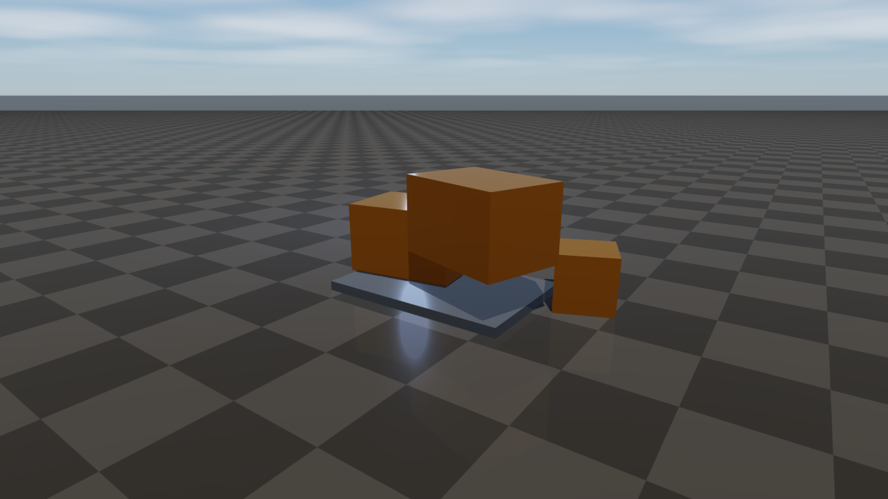
         a cool indirect fill, rendered from a warehouse-style .rscene
   :width: 100%

The image above is what the warehouse-style ``.rscene`` example used
throughout this page looks like once instantiated: a ground with a grey
``mat_floor`` material, two stacked crates and a smaller one in
safety-orange ``mat_safety``, a warm spot ``light`` as the key, a cool fill
point ``light``, and the procedural ``rayrai_sky`` background from the
``environment`` + ``weather`` records.

.rscene vs. the World Configuration XML
=======================================

RaiSim ships two text formats for describing scenes, and they coexist by
design:

* The **XML world configuration file** is the hand-edited format used
  directly with ``raisim::World``. It is small, parametric, and ideal when
  a human is writing or templating a scene.
* The **.rscene file** is the Engine 2 format produced by the editor and
  ``.re2`` scripts. It stores the same physics description plus the
  visualization and editor state that the editor needs to round-trip.

The table below maps how the two formats overlap and where ``.rscene``
adds capability that the XML format intentionally does not carry.

.. list-table::
   :header-rows: 1
   :widths: 18 41 41

   * -
     - World Configuration XML (``.xml``)
     - ``.rscene``
   * - Reader / writer
     - ``raisim::World`` (``World.loadFromXmlFile`` and the XML save path).
       See :doc:`WorldConfigurationFile`.
     - ``raisim_engine2::loadRsceneFile`` / ``saveRsceneFile`` in
       ``raisim_engine2/RSceneIO.hpp``.
   * - Scope
     - Pure physics world: gravity, time step, materials, bodies, constraints,
       and articulated systems. No rendering, lighting, or editor state.
     - Full authoring document: physics **plus** the rendering scene (lights,
       cameras, environment, weather, decals, probes, terrain layers, sensors,
       point clouds, instanced visuals) **plus** editor state (selection,
       snapping, prefab overrides, folder groups).
   * - Hierarchy
     - XML tree (``raisim`` ▸ ``objects`` ▸ ``sphere`` / ``box`` / …).
     - Flat record-per-line stream; tree structure is recovered from
       ``/World/...`` paths and ``parentGroupId`` references.
   * - Authoring style
     - Hand-written XML, with templates, ``include``, ``params``, ``array``
       loops, and ``{...}`` expressions for parametric worlds.
     - Produced by the Engine 2 editor or by ``.re2`` scripts. Plain text and
       diff-friendly, but normally machine-written rather than typed by hand.
   * - Round-trip with the editor
     - One-way: an XML file can be loaded into ``raisim::World``, but it
       was never meant to capture lights, cameras, or editor state.
     - Round-trip: open in ``raisim_engine2_editor``, modify, save back to the
       same file byte-stable for unchanged content.
   * - Runtime use
     - Loaded directly by the physics engine in production simulations and RL
       training (see :doc:`RaisimGymTorch`).
     - Loaded by Engine 2, then instantiated into a ``raisim::World`` through
       ``raisim_engine2::RaisimBridge`` and applied to a ``RayraiWindow`` via
       ``raisim_engine2::RayraiBridge``.
   * - When to use
     - You are writing the scene by hand, templating physics worlds, or
       wiring up a physics-only simulation / RL environment.
     - You are working through the Engine 2 editor or want the
       visualization, sensors, and render settings to round-trip with the
       scene.

The two formats are not interchangeable: Engine 2 does not currently emit
``.xml``, and the XML reader does not consume ``.rscene``. They are
complementary surfaces for the same underlying physics world — hand-editable
on one side, editor-driven on the other.

File Layout And Lexical Rules
=============================

A ``.rscene`` file is a sequence of newline-separated **records**. The first
non-blank, non-comment record must be the version header; every subsequent
record describes one scene resource or one tree node.

Comments And Blank Lines
------------------------

* Lines whose first character is ``#`` are comments and are ignored by the
  loader.
* Blank lines are ignored.
* The trailing ``\r`` of a CRLF line ending is stripped, so files written on
  Windows load identically.

.. code-block:: text

    # warehouse_scene.rscene
    # Authored 2026-05-31 by /home/jemin
    raisim_engine_scene 1
    time_step 0.0025

Token Encoding
--------------

Tokens within a line are separated by spaces or tabs. There is no quoting
mechanism. Instead, any byte that is a control character, space, ``%`` or
``=`` is percent-encoded as ``%HH`` (uppercase two-digit hex) when the saver
writes it, and the loader decodes it on the way back in. Bare ``-`` is the
canonical encoding of the empty string.

.. code-block:: text

    # "A label with spaces" → "A%20label%20with%20spaces"
    asset A%20label%20with%20spaces mesh meshes/crate.obj id=crate_a ...
    # An empty optional path is written as a single dash:
    material engine_default 0.55 0.62 0.72 1 0 0.55 0 0 0 0 false - - - - - - id=engine_default ...

Numbers, Booleans, And Packed Values
------------------------------------

* **Numbers** are serialized with ``std::to_chars`` so doubles round-trip
  exactly; the loader parses with ``std::from_chars``. Both decimal and
  scientific notation are accepted.
* **Booleans** accept ``true`` / ``1`` / ``yes`` / ``on`` and ``false`` /
  ``0`` / ``no`` / ``off``. The saver always emits ``true`` / ``false``.
* **Vec2 / Vec3** are packed as comma-separated CSV inside a single token:
  ``broadphaseWorldMin=-100,-100,-100``, ``uvScale=2,1``.
* **Quat** uses ``w,x,y,z`` ordering: ``quat=1,0,0,0`` is identity.
* **Color** is ``r,g,b`` (three components) or ``r,g,b,a`` (four components);
  the loader accepts either.
* **Lists of structs** use ``;`` between elements and ``,`` between fields.
  ``Transform`` lists pack 10 numbers per entry (position, quaternion, scale).
  ``Vec3`` lists pack 3 per entry. Quaternions in transform lists are
  re-normalised on load.
* **Dense scalar arrays** (heightmaps, vertex colors, splat weights, pinned
  vertices) are plain comma-separated CSV — they have only one level of
  delimiter, ``,``.
* **String lists** (module lists, material remaps, selection filters) are
  ``;``-separated lists where each element is itself a percent-encoded token.

.. code-block:: text

    # Vec3 inside one token:
    gravity 0 0 -9.81                        # three positional tokens
    broadphaseWorldMin=-100,-100,-100        # CSV-packed Vec3 as a key=value

    # Quaternion field on a `light` record:
    quat=1,0,0,0

    # Color with and without alpha:
    color=0.66,0.78,0.96         # rgb
    color=0.66,0.78,0.96,1       # rgba

    # Transform list (instanced_visual): two instances:
    instances=1.0,0.0,0.0,1,0,0,0,1,1,1;3.0,0.5,0.0,1,0,0,0,1,1,1

Record Anatomy
--------------

Each non-comment line is one record:

.. code-block:: text

    <tag> <positional_1> <positional_2> ... <key=value>=... <key=value>=...

The first token is the **tag** (record kind). Subsequent tokens are either
**positional** (parsed by index — the saver always writes the same number in
the same order) or **key=value pairs** parsed by name. The loader reads the
positional fields by index, then scans the rest for any ``=``-bearing tokens
and looks them up by name. **Unknown keys are silently ignored**, which is
what makes the format forward-compatible: a newer writer can add fields that
older readers will drop on load without erroring.

.. code-block:: text

    object /World/Props/CrateA box -0.6 0.2 0.6 0.998 0 0 0.0698 0.7 0.5 0.45 0.5 1 2.5 default mat_safety false true false - dynamic true 1 18446744073709551615 id=object_cratea parentGroupId=folder_props ...

In that one line: ``object`` is the tag; ``/World/Props/CrateA`` is the
scene-tree path; ``box`` is the primitive kind; the next 10 numbers are
position (3), quaternion w,x,y,z (4) and scale (3); then ``0.5 1 2.5`` is
``radius height mass``; then ``default mat_safety`` are contact material and
visual material names; the remaining positional flags are ``visualOnly``,
``visible``, ``locked``, mesh path (``-`` ⇒ empty), body mode, ``collidable``,
collision group, and collision mask. Everything after that is named
``key=value``.

Mandatory Header And Version
----------------------------

The first non-blank, non-comment line must be the version header.

.. code-block:: text

    raisim_engine_scene 1

The loader rejects the file with ``missing raisim_engine_scene header`` if it
is absent and with ``unsupported rscene version`` if the number does not
match the version this build of Engine 2 understands. The version is a single
integer; bumping it is a breaking change.

Section Order
-------------

The saver always emits records in a fixed, top-down order. The loader does
not require this order, but humans, reviewers, and diff tools benefit from
the convention, and Engine 2 produces a byte-stable round-trip for unchanged
scenes when the binary version matches.

#. Header: ``raisim_engine_scene 1``.
#. Physics: ``time_step``, ``gravity``, ``solver``.
#. Editor / authoring state: ``snapping``, ``asset_root``, ``scene_graph``,
   ``prefab_override`` (zero or more), ``editor_ux``, ``render_bake``.
#. Environment / rendering: ``environment``, ``weather``, ``rayrai_render``.
#. Resources: ``material`` (many), ``contact_material`` (many),
   ``terrain_texture`` (many), ``asset`` (many), ``articulated_resource``
   (many).
#. Scene tree: ``group`` records that lay out the folder hierarchy.
#. Terrain regions, with each region followed by its
   ``terrain_splat_layer`` and ``terrain_foliage_layer`` children.
#. ``light``, ``camera``, ``object``, ``compound`` (each followed by its
   ``compound_child`` records), ``deformable``, ``granular``, ``articulated``
   (each followed by its ``articulated_ik`` IK targets).
#. ``sensor``, ``wire``, ``reflection_probe``, ``local_fog``,
   ``projected_decal``, ``irradiance_volume``, ``point_cloud``,
   ``instanced_visual``.

Identity Model
==============

The scene tree is encoded redundantly: every node carries both a **path** and
an **id**.

* **Paths** are slash-separated and rooted at ``/World``, for example
  ``/World/Props/CrateA``. They are how the editor, ``.re2`` scripts, and
  selection refer to nodes. Paths are unique within a scene.
* **Ids** are stable string handles (``id=object_cratea``). Parent references
  use the parent's id, not its path. Ids are what survive renames and
  reparenting in the editor; if you rename ``/World/Props`` to
  ``/World/Crates`` the ids underneath stay the same.
* **Hierarchy** is established by ``group`` records that declare the folder
  layout (``/World``, ``/World/Props``, ``/World/Lights`` …) and by each
  leaf's ``parentGroupId`` (objects, lights, cameras, etc.) or ``parentId``
  (some non-physical nodes). The root ``/World`` group has ``parentId=-``,
  which decodes to the empty string.

Whole-Scene Records
===================

raisim_engine_scene
-------------------

Format version token. Currently fixed at ``1``.

.. code-block:: text

    raisim_engine_scene 1

time_step
---------

Default simulation time step in seconds. Used by both physics and any sensor
that publishes at the world's rate.

.. code-block:: text

    time_step 0.0025

gravity
-------

Gravity vector in m/s², written as three positional numbers.

.. code-block:: text

    gravity 0 0 -9.81

solver
------

Solver configuration: iteration count, tolerance, ERP, mode (``accurate``,
``fast``, …), followed by a long list of default material parameters,
contact-solver tunings, CCD settings, broadphase settings, and world time.
All non-positional fields are ``key=value`` so they can be omitted.

.. code-block:: text

    solver 80 1e-07 0.2 accurate erp2=0 defaultFriction=0.8 defaultRestitution=0 \
      defaultRestitutionThreshold=0.001 defaultStaticFriction=0.8 \
      defaultStaticFrictionVelocityThreshold=0.001 defaultRollingFriction=0 \
      defaultSpinningFriction=0 contactAlphaInit=1 contactAlphaMin=1 \
      contactAlphaDecay=1 contactMaxIterations=80 contactThreshold=1e-07 \
      contactGjkMaxIterations=32 contactGjkTolerance=1e-06 \
      contactEpaMaxIterations=64 contactEpaTolerance=0.0001 \
      maxContactsPerPair=8 sweptCcdEnabled=false sweptCcdMinSpeed=0 \
      sweptCcdSpeculativeMargin=0.0001 sleepingEnabled=true \
      sleepingLinearVelocityThreshold=0.002 sleepingAngularVelocityThreshold=0.01 \
      sleepingQuietSteps=2 broadphaseType=sap3_axis \
      broadphaseWorldMin=-100,-100,-100 broadphaseWorldMax=100,100,100 \
      broadphaseCellSize=1,1,1 broadphaseUseWorldBounds=false \
      broadphasePadding=0.5 broadphaseMaxCellsPerAxis=128 \
      broadphaseMaxCellsPerObject=64 worldTime=0 \
      fixedContactSolverIterationOrder=false

(The backslash continuations above are for legibility; a real ``.rscene``
keeps everything on a single line — there is no continuation syntax.)

The first four positional tokens are *required*: ``iterations``,
``tolerance``, ``erp``, ``mode``. Every other knob has a default and can be
omitted.

asset_root
----------

Relative path the scene resolves mesh and texture references against. ``.``
means "the directory of the scene file". This makes scenes saved under a
project portable as long as the assets travel with them.

.. code-block:: text

    asset_root .

snapping
--------

Editor snapping state — grid / angle / scale checkboxes, step sizes, and the
surface normal used by surface snap.

.. code-block:: text

    snapping true true false false false false false false 0.1 15 0.1 0 surfaceNormal=0,0,1

Positional layout: 8 booleans (``grid``, ``angle``, ``scale``, then 5 reserved
flags written as ``false``), then ``gridSize`` (m), ``angleDegrees``,
``scaleStep``, a reserved trailing 0, then the ``surfaceNormal`` key.

scene_graph, prefab_override
----------------------------

Global scene-tree behaviour, plus an optional list of per-node prefab property
overrides.

.. code-block:: text

    scene_graph inheritedTransforms=true keepWorldTransformOnReparent=true \
      dragReparenting=true packedSceneOverrides=true transformSpace=global

    prefab_override /World/Props/Pallet property=visible value=false

Each ``prefab_override`` carries a node path, the property name, and the value
the prefab instance should override. Zero or more are allowed.

editor_ux
---------

Per-user editor preferences — multi-select, copy/paste, duplicate, transform
local-space toggle, selection filters, undo grouping, and the selection
filter kind list (a ``;``-separated string list).

.. code-block:: text

    editor_ux multiSelect=true copyPaste=true duplicate=true \
      transformLocalSpace=false selectionFilters=true strongUndoGrouping=true \
      selectionFilterKinds=object;light;camera

render_bake
-----------

Settings for offline bakes invoked from the editor — probe/lightmap/irradiance
captures and rayrai's debug reports.

.. code-block:: text

    render_bake probeCaptureOnSave=false lightmapBakeEnabled=false \
      irradianceBakeEnabled=false renderDiagnostics=false \
      lightmapResolution=1024 probeCubemapSize=256 outputDirectory=bakes

environment
-----------

Sky/background, ambient, fog, post processing, and PBR environment lookup.
Positional layout is ``backgroundR backgroundG backgroundB ambientR ambientG
ambientB fogDensity shadows true 10 envMapPath`` followed by many named
fields.

.. code-block:: text

    environment 0.08 0.10 0.13 0.24 0.25 0.29 0 true true 10 - \
      fogColor=0.66,0.78,0.96 exposure=1.05 gamma=2.2 \
      bloomIntensity=0.12 bloomThreshold=0.82 bloomRadius=4 \
      shadowMapSize=2048 shadowedLightBudget=1 backgroundMode=rayrai_sky \
      colorMode=unreal_preview pbrEnvironmentIntensity=1 fxaa=true ssao=true \
      heightFogEnabled=false heightFogDensity=0 heightFogBaseHeight=0 \
      heightFogFalloff=0.35

The 11th positional token is the environment-map texture path; ``-`` means
"no HDR, use the procedural sky from ``weather``". ``backgroundMode``
accepts ``rayrai_sky``, ``hdr``, or ``plain_color``.

weather
-------

Rayrai sky / time-of-day / cloud / precipitation / lightning settings. The
first positional token is the master ``enabled`` boolean; everything else is
named.

.. code-block:: text

    weather true preset=clear quality=high seed=1 timeOfDay=14 \
      latitude=37 longitude=127 year=2026 month=7 day=15 \
      windDirection=1,0.25,0 windSpeed=1.2 transitionSeconds=0 \
      affectSensors=false cloudCoverage=0.03 cloudDensity=0.04 \
      precipitationRate=0 rainOcclusionStrength=0 fogDensity=0 \
      visibilityMeters=20000 fogColor=0.66,0.78,0.96 humidity=0.22 \
      wetness=0 snowCoverage=0 lightningRate=0 \
      useExplicitSunAngles=true sunAzimuthDegrees=210 sunElevationDegrees=58

``preset`` is one of the rayrai presets (``clear``, ``overcast``, ``storm``,
…). ``quality`` selects sample counts for the procedural sky. Setting
``useExplicitSunAngles=true`` lets you override the date/time astronomical
solver with explicit azimuth/elevation.

rayrai_render
-------------

Render-quality preset and post-processing toggles. ``preset`` is the named
preset (``fast`` / ``balanced`` / ``high`` / ``ultra``); ``custom=true``
means the named fields override the preset's defaults.

.. code-block:: text

    rayrai_render preset=ultra custom=false colorMode=unreal_preview \
      shadowResolution=2048 shadowBias=0.0008 shadowStrength=0.6 \
      shadowPcfRadius=1.25 highFidelityPbr=false pbrToneMapping=false \
      pbrExposure=1 autoExposure=false autoExposureKey=0.18 \
      autoExposureSpeed=0.05 volumetricFog=false volumetricFogDensity=0 \
      volumetricLightStrength=0 contactShadows=false contactShadowsLength=0.12 \
      contactShadowsStrength=0.7 screenSpaceReflections=false \
      screenSpaceReflectionStrength=0 motionBlur=false motionBlurDirection=0,0 \
      motionBlurStrength=0 depthOfField=false depthOfFieldFocusDistance=5 \
      depthOfFieldAperture=0 diagnostics=false

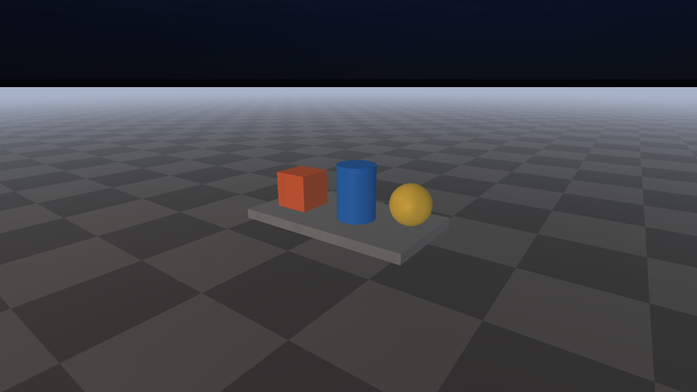
         post-processing, illustrating environment, weather, and rayrai_render
         records
   :width: 100%

The image shows the whole-scene records working together: ``environment``
sets sky/fog/post-processing defaults, ``weather`` drives the procedural
overcast sky and time of day, and ``rayrai_render`` selects the render-quality
preset used for the capture.

Resources
=========

These records define named, scene-global resources that scene-tree nodes
reference by id or name. They are written before any ``group`` / object
record.

material
--------

A material record names a PBR-style material and is referenced from objects,
compounds, instanced visuals, terrain regions, etc. The positional fields are
the legacy compact form (``name r g b a metallic roughness eR eG eB
emissiveStrength doubleSided albedoTex normalTex metallicTex roughnessTex
aoTex emissiveTex``); the named fields cover every other slot (UV transform,
alpha mode, anisotropy, clearcoat, sheen, foliage, weather response,
stencil/depth state, detail maps, lightmaps, and three texture transforms for
albedo / normal / metallic-roughness).

.. code-block:: text

    material mat_floor 0.45 0.46 0.48 1 0 0.82 0 0 0 0 false - - - - - - \
      id=mat_floor type=pbr uvScale=2,2 uvOffset=0,0 uvRotation=0 \
      alphaMode=opaque alphaCutoff=0.5 normalStrength=1 normalConvention=opengl \
      ior=1.5 transmission=0 cullMode=back \
      albedoTransformAuthored=false albedoTransformScale=1,1 \
      albedoTransformOffset=0,0 albedoTransformRotation=0

The trailing ``albedoTransform*``, ``normalTransform*`` and
``metallicRoughnessTransform*`` blocks are emitted by ``writeTextureTransform``
for each texture slot so per-texture UV authoring round-trips. Any unused
texture slot is written as ``-`` (empty).

contact_material
----------------

Pairwise contact-material override — looked up by material A × material B.

.. code-block:: text

    contact_material default rubber 0.95 0.03 0.001 0.8 0.001 0.01 0.01 \
      id=default_rubber

Positional layout: ``materialA materialB friction restitution
restitutionThreshold staticFriction staticFrictionVelocityThreshold
rollingFriction spinningFriction``.

terrain_texture
---------------

A texture slot for terrain layer painting. The slot index is referenced by
``terrain_region.baseTexture`` and by ``terrain_splat_layer.slot``.

.. code-block:: text

    terrain_texture 0 terrain_grass Grass color=0.28,0.43,0.2,1 albedo=- \
      normal=- uvScale=4 normalDepth=1 aoStrength=1 roughness=0.82 \
      detile=0,0 displacement=0,1

Positional layout: ``slot id name``. The optional ``displacementTexture`` key
is written only when set.

asset
-----

An imported mesh asset (gltf, glb, obj, fbx, etc.) plus its import-time
options and generated-collision settings. Assets are referenced by id from
``object.renderMeshPath`` (when the object is a mesh primitive) and by
imported scene tooling.

.. code-block:: text

    asset Crate mesh meshes/crate.glb id=asset_crate defaultMaterial=mat_crate \
      contactMaterial=default collisionPath=meshes/crate_col.obj bodyMode=dynamic \
      mass=2.0 scale=1,1,1 quat=1,0,0,0 collidable=true collisionMode=convex_hull \
      importSource=meshes/crate.glb importer=assimp autoReimport=true \
      generateCollision=true generatedCollision=convex_hull \
      remapMaterials=true importScale=1 importUpAxis=z importFlipWinding=false \
      importRecenter=false importApplyRootScale=false \
      materialRemaps=metal;mat_crate_metal;rubber;mat_crate_rubber \
      importWarnings= sourceTimestamp=0 sidecarTimestamp=0 \
      meshCollision=convex_hull customInertia=false inertiaDiagonal=0,0,0 \
      centerOfMass=0,0,0 coacdThreshold=0.08 coacdMaxConvexHull=8 \
      coacdPreprocess=off coacdSampleResolution=800

Positional layout: ``label primitiveKind path``. The trailing
``meshCollision`` / ``coacd*`` block is emitted by ``writeMeshCollision`` and
covers the COACD convex-decomposition parameters used when the asset
generates its own collision.

articulated_resource
--------------------

URDF/MJCF resource declaration. ``articulated`` scene nodes refer back to it
by ``resourceId``.

.. code-block:: text

    articulated_resource cassie_resource Cassie urdf/cassie/robot.urdf \
      resourceDirectory=urdf/cassie modules=actuator_pd;gait_planner \
      jointOrder=hip_yaw;hip_pitch;knee;ankle \
      doNotCollideWithParent=true convexifyCollisionMeshes=true

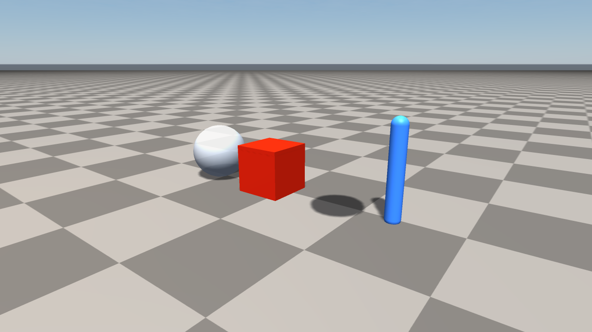
         asset, and an articulated-resource marker
   :width: 100%

The resource records are scene-global definitions. In the image, the material
samples represent ``material`` records, the imported marker represents an
``asset`` record, and the upright blue marker stands in for an
``articulated_resource`` that later ``articulated`` records instantiate.

Scene Tree Containers
=====================

group
-----

A folder inside the scene tree. Groups have a path, an id, optional parent
id, and editor flags. The root ``/World`` group has ``parentId=-``.

.. code-block:: text

    group /World id=folder_world parentId=- visible=true locked=false expanded=true
    group /World/Props id=folder_props parentId=folder_world visible=true \
      locked=false expanded=true
    group /World/Lights id=folder_lights parentId=folder_world visible=true \
      locked=false expanded=true

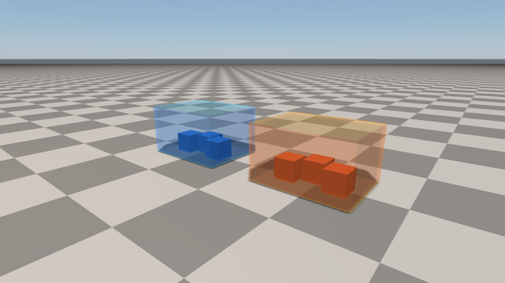
         illustrating group records and grouped editor organization
   :width: 100%

Groups are editor/scene-tree containers, not physics bodies. The translucent
volumes in the image show how child objects are organised under separate
``group`` paths while remaining ordinary world objects.

Bodies And Constraints
======================

light
-----

A scene light. The first 5 positional tokens are the legacy
``direction(x,y,z)`` and ``intensity``; everything else is named, including
``type`` (``directional``, ``point``, ``spot``, ``area``), full attenuation
constants, projector cookie, color temperature, distance fade, and shadow
parameters.

.. code-block:: text

    light /World/Lights/Key -0.4 0.5 -1 4 id=light_key type=spot \
      position=2,-3,4 color=1,0.86,0.64 ambientColor=0,0,0 \
      specularColor=1,1,1 specularIntensity=1 \
      attenuationConstant=1 attenuationLinear=0.04 attenuationQuadratic=0.012 \
      range=14 coneAngle=30 innerConeAngle=18 radius=0 \
      areaSize=1,1,0 areaRight=1,0,0 areaUp=0,1,0 \
      projectorTexture=- projectorStrength=0 projectorUvScale=1,1 \
      projectorUvOffset=0,0 negative=false temperatureEnabled=false \
      shadows=true colorTemperature=6500 distanceFadeEnabled=false \
      distanceFadeBegin=40 distanceFadeShadow=50 distanceFadeLength=10 \
      shadowResolution=2048 shadowBias=0.0008 shadowStrength=0.85 \
      shadowPcfRadius=1.25 shadowOrthoHalfSize=5 shadowNear=0.1 shadowFar=30 \
      shadowCenter=0,0,0 shadowPosition=0,0,0 shadowUseCustomPosition=false

camera
------

A scene-graph camera. Positional fields are
``path pos(x,y,z) rot(w,x,y,z) verticalFov nearPlane farPlane width height
renderMode enabled``. ``renderMode`` is one of ``rgb``, ``depth``,
``segmentation``, ``rgb_depth``, etc. The remaining keys configure preview
post-processing and an optional output path for headless captures.

.. code-block:: text

    camera /World/Cameras/Editor 3 -5 2.2 0.488 -0.116 0.066 0.862 52 0.05 100 \
      1280 720 rgb true id=camera_editor projection=perspective horizontalFov=0 \
      orthoScale=10 previewPostProcessing=true previewExposure=1 \
      previewGamma=2.2 previewDepthOfField=false previewFocusDistance=5 \
      previewAperture=0 outputPath=-

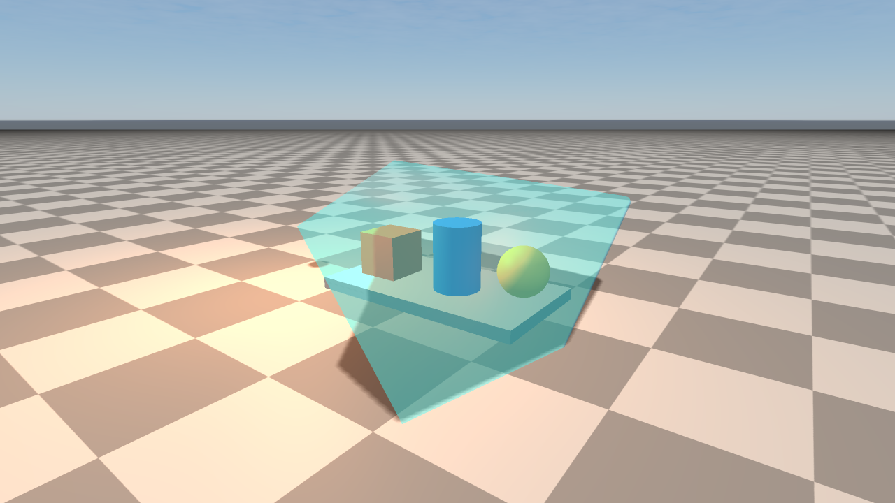
         illustrating light and camera records
   :width: 100%

The warm marker shows the authored ``light`` position and influence, while the
cyan frustum visualises the ``camera`` projection, near/far planes, and field
of view that are stored in the record.

object
------

The most common body record: ground, primitives, single meshes, and
single-body imports all become ``object`` records.

Positional layout (in order):

#. ``path`` — scene-tree path.
#. ``primitive`` — ``ground``, ``box``, ``sphere``, ``cylinder``,
   ``capsule``, ``mesh``, ``half_space``, …
#. ``position`` (3 numbers).
#. ``rotation`` (4 numbers, ``w,x,y,z``).
#. ``scale`` (3 numbers).
#. ``radius`` and ``height`` — used by sphere/capsule/cylinder; ignored
   otherwise.
#. ``mass``.
#. ``contactMaterial`` name.
#. ``material`` name (visual).
#. ``visualOnly`` boolean — convenience alias for body mode ``visual_only``.
#. ``visible`` boolean.
#. ``locked`` boolean — convenience alias for body mode ``static``.
#. ``meshPath`` — ``-`` for primitives.
#. ``bodyMode`` — ``dynamic``, ``static``, ``kinematic``, ``visual_only``.
#. ``collidable`` boolean.
#. ``collisionGroup`` (uint64).
#. ``collisionMask`` (uint64).

Then a large key=value block covering identity, semantic-segmentation
metadata, optional separate render/collision meshes, rayrai per-visual
parameters (transparency, visibility range, mesh LOD, custom bounds,
per-object PBR environment override), per-object raisim solver overrides,
collision groups and masks, and the same ``writeMeshCollision`` COACD block
as ``asset``.

.. code-block:: text

    object /World/Ground ground 0 0 0 1 0 0 0 18 18 1 1 0 0 \
      default mat_floor false true true - static true 1 18446744073709551615 \
      id=object_ground parentGroupId=folder_world semanticClass=- \
      instanceId=-1 segmentationColor=1,1,1 materialRemaps= \
      renderMeshPath=- collisionMeshPath=- collisionMode=primitive \
      castShadow=true visualUseMeshColor=false ...

    object /World/Props/CrateA box -0.6 0.2 0.6 0.998 0 0 0.0698 0.7 0.5 0.45 \
      0.5 1 2.5 default mat_safety false true false - dynamic true 1 \
      18446744073709551615 id=object_cratea parentGroupId=folder_props ...

``parentGroupId=folder_props`` ties the crate to the ``/World/Props`` folder
declared earlier.

compound, compound_child
------------------------

A compound rigid body — a single physics body composed of several primitive
shapes. The ``compound`` record carries the body's transform, mass, inertia,
center of mass, and collision masks. Each child shape is emitted on a
following ``compound_child`` line with the parent compound's path repeated
as a back-reference.

.. code-block:: text

    compound /World/Props/Forklift 1 -2 0.5 1 0 0 0 1 1 1 12.0 dynamic true true \
      id=compound_forklift parentGroupId=folder_props \
      centerOfMass=0.0,0.0,0.3 inertiaDiagonal=2,2,1.2 \
      collisionGroup=1 collisionMask=18446744073709551615 \
      semanticClass=vehicle

    compound_child /World/Props/Forklift box 0 0 0 1 0 0 0 1 1 1 \
      size=1.2,0.8,0.4 radius=0 height=0 contactMaterial=default material=mat_safety

    compound_child /World/Props/Forklift cylinder 0.3 0 -0.2 1 0 0 0 1 1 1 \
      size=0,0,0 radius=0.15 height=0.1 contactMaterial=default material=mat_metal

Children's positions, rotations, and scales are expressed in the compound's
local frame. ``size``/``radius``/``height`` are interpreted per primitive
kind.

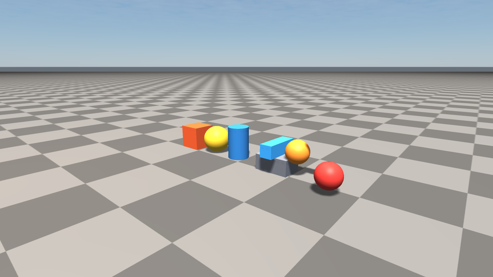
         vertical wire constraint with a suspended bob
   :width: 100%

This image groups the rigid-body records: standalone ``object`` primitives on
the left, a ``compound`` with several ``compound_child`` shapes in the middle,
and a ``wire`` constraint visualised as a taut segment on the right.

deformable
----------

A soft body (cloth, mass-spring, or FEM volume). Positional layout:
``path kind meshPath pos(x,y,z) rot(w,x,y,z) scale(x,y,z)``. ``kind`` is one
of ``cloth``, ``mass_spring``, ``fem`` (and any future kinds).

.. code-block:: text

    deformable /World/Props/Flag cloth meshes/flag.obj 2 0 1.8 1 0 0 0 1 1 1 \
      id=deformable_flag parentGroupId=folder_props \
      pinnedVertices=0,1,2,3 scale=1 totalMass=0.2 \
      distanceCompliance=0 distanceStiffness=1000 bendCompliance=0 \
      bendStiffness=100 youngsModulus=0 poissonRatio=0.3 thickness=0.002 \
      damping=0.01 collisionRadius=0.01 iterations=20 substeps=1 \
      solverMode=xpbd particleMode=skinned particleSpacing=0.05 \
      contactMaterial=default material=mat_fabric visible=true collidable=true \
      collisionGroup=1 collisionMask=18446744073709551615

``pinnedVertices`` is a comma-separated list of vertex indices that are held
in place.

granular
--------

A particle system (sand, gravel, fluid-ish particles). Positions and radii
can be specified per-particle, or a ``boxMin``/``boxMax`` + ``spacing`` lets
the engine fill a box at load time.

.. code-block:: text

    granular /World/Sandbox/Sand particles 0 0 0 1 0 0 0 1 1 1 \
      id=granular_sand parentGroupId=folder_sandbox \
      positions= radii= boxMin=-0.5,-0.5,0.0 boxMax=0.5,0.5,0.3 \
      radius=0.01 spacing=0.025 maxParticles=20000 velocity=0,0,0 \
      angularVelocity=0,0,0 materialId=0 fixed=false density=1600 \
      normalStiffness=1e6 normalDamping=200 tangentialStiffness=1e5 \
      tangentialDamping=20 friction=0.6 rollingFriction=0.05 \
      cohesionStiffness=0 cohesionMaxDistance=0 normalContactModel=hertz \
      substeps=2 visible=true

When ``positions`` is non-empty it overrides the box fill; ``radii`` is the
matching per-particle radius list (``;``- or ``,``-CSV depending on whether
each entry is a Vec3 or a scalar).

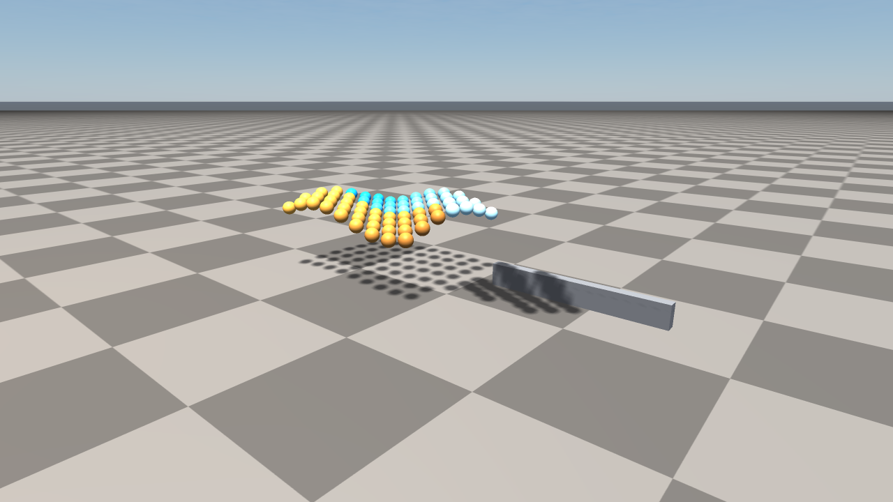
         particles, illustrating deformable and granular records
   :width: 100%

The left cluster sketches a ``deformable`` node with particle/mesh state, and
the right pile sketches a ``granular`` record filled from a box plus spacing.

articulated, articulated_ik
---------------------------

An articulated system instance, by reference to an
``articulated_resource``. The positional layout is ``path resourceId
pos(x,y,z) rot(w,x,y,z) visible collidable``.

.. code-block:: text

    articulated /World/Robots/Cassie cassie_resource 0 0 1.0 1 0 0 0 true true \
      id=articulated_cassie parentGroupId=folder_robots \
      sourcePath=urdf/cassie/robot.urdf resourceDirectory=urdf/cassie \
      modules=actuator_pd;gait_planner \
      jointOrder=hip_yaw;hip_pitch;knee;ankle \
      scale=1,1,1 doNotCollideWithParent=true convexifyCollisionMeshes=true \
      collisionGroup=1 collisionMask=18446744073709551615 \
      generalizedCoordinate=0,0,1.0,1,0,0,0,0,-0.6,1.2,-0.6 \
      generalizedVelocity=0,0,0,0,0,0,0,0,0,0,0 \
      semanticClass=robot

    articulated_ik /World/Robots/Cassie left_foot_link 0.0,0.15,0.05 \
      enabled=true useOrientation=true orientation=1,0,0,0 \
      maxIterations=80 positionTolerance=0.001 orientationTolerance=0.01 \
      orientationWeight=0.5 damping=0.05 stepSize=0.5 maxStep=0.1 \
      svdTolerance=1e-6 finiteDifferenceStep=1e-4 \
      applyBestOnFailure=true enforceJointLimits=true \
      inverseMethod=damped_least_squares transposeGain=0

``generalizedCoordinate``/``generalizedVelocity`` are CSV lists of doubles —
the floating-base pose + per-joint configuration.

``articulated_ik`` lines belong to the most recent ``articulated`` record:
each defines a frame target (frame name, target position, optional target
orientation) and the IK solver knobs used to drive that frame.

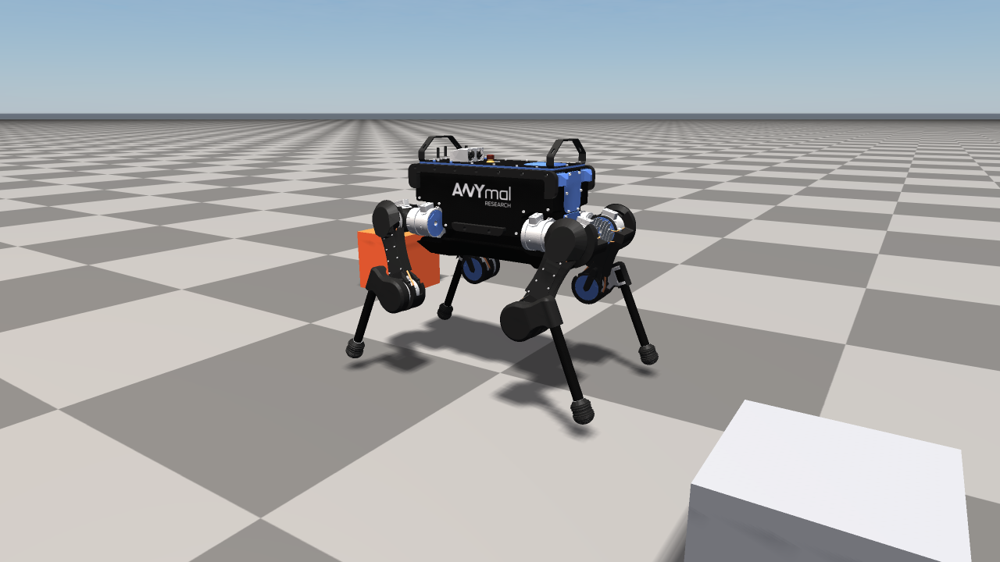
         the checkered ground, illustrating the articulated record
   :width: 100%

The image renders the equivalent of an ``articulated_resource`` + ``articulated``
pair: a URDF-loaded ANYmal quadruped placed at world origin with the
standing pose ``generalizedCoordinate=0,0,0.54,1,0,0,0,0.03,0.4,-0.8,...``
encoded into the record. The orange box on the left and the grey box on the
right are ordinary ``object`` records (``object /World/Props/...``) included
to give the robot a sense of scale.

wire
----

A length constraint between two bodies. Positional layout:
``path kind bodyA bodyB length``.

.. code-block:: text

    wire /World/Constraints/Hoist stiff object_crateb compound_forklift 2.5 \
      id=wire_hoist localIndexA=0 localIndexB=0 \
      localPositionA=0,0,0.225 localPositionB=0.3,0,0.4 \
      stiffness=1000 damping=10 compliance=0 \
      visualizationWidth=0.01 enabled=true

``kind`` is one of ``stiff``, ``compliant``, ``custom``. ``localIndexA/B`` and
``localPositionA/B`` describe the attachment points on each body's local
frame.

Terrain
=======

terrain_region
--------------

A heightfield region. The first set of positional tokens describes the grid:
``path xSamples ySamples xSize ySize center(x,y,z)``. The rest of the line
holds per-cell arrays — the heightmap itself plus optional texture splatting,
wetness, holes, and per-vertex colours.

.. code-block:: text

    terrain_region /World/Terrain/SculptedField 17 17 8 5.5 0 3.2 0 \
      id=terrain_sculptedfield parentGroupId=folder_terrain location=0,0 \
      material=mat_terrain contactMaterial=default baseTexture=2 \
      visible=true collidable=true castShadow=true receiveShadow=true \
      sourceKind=samples sourcePath=- cloneSource=- \
      pngHeightScale=1 pngHeightOffset=0 \
      proceduralFrequency=0.1 proceduralZScale=2 proceduralOctaves=5 \
      proceduralLacunarity=2 proceduralGain=0.5 proceduralStepSize=0 \
      proceduralHeightOffset=0 proceduralSeed=5489 \
      lodLevels=7 collisionShapeSize=64 textureSplattingEnabled=true \
      heights=0.02,0.02,0.0365,0.0640,... \
      texturePrimary=0,0,0,0,3,3,3,... \
      textureSecondary=0,0,3,3,3,3,3,... \
      textureBlend=0,0,0.04,0.13,0.20,... \
      wetness=0,0,0,0,... holes=0,0,0,0,... \
      vertexColors=1,1,1,1;1,1,1,1;1,1,1,1;...

``sourceKind`` selects whether heights are explicit samples
(``heights=...``), generated from a PNG (``sourcePath=heightmap.png`` plus
``pngHeightScale``/``pngHeightOffset``), generated procedurally
(``procedural*`` keys), or cloned from another region.

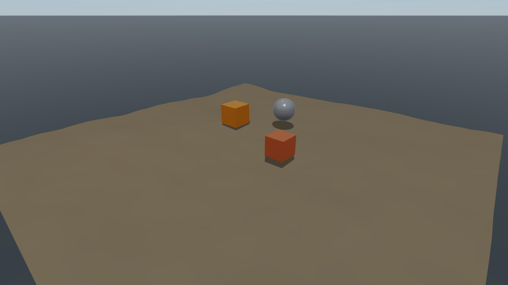
         boulder resting on top, illustrating the terrain_region record
   :width: 100%

The image is what a procedural ``terrain_region`` record looks like when
loaded: a 41×41 sample heightmap covering a 12 m × 12 m patch, driven by the
Perlin parameters ``proceduralFrequency=0.18 proceduralZScale=0.9
proceduralOctaves=5 proceduralLacunarity=2 proceduralGain=0.5
proceduralSeed=5489``. The crates and boulder on top are independent
``object`` records, included so the terrain's relief reads against
recognisable shapes.

terrain_splat_layer, terrain_foliage_layer
------------------------------------------

Per-region splatting layers and foliage scattering layers. Each line repeats
the parent region's path as a back-reference.

.. code-block:: text

    terrain_splat_layer /World/Terrain/SculptedField slot=2 enabled=true \
      strength=1 weights=1,1,1,1,1,0.999,0.987,...

    terrain_foliage_layer /World/Terrain/SculptedField id=foliage_grass \
      name=Grass enabled=true primitive=grass_blade meshPath=meshes/grass.obj \
      size=0.06,0.06,0.30 colorA=0.30,0.55,0.20,1 colorB=0.45,0.65,0.25,1 \
      density=1,1,1,1,... densityPerSquareMeter=120 maxInstances=200000 \
      minScale=0.7 maxScale=1.3 randomYawDegrees=180 \
      randomPitchDegrees=0 randomRollDegrees=0 alignToNormal=false \
      minHeight=0 maxHeight=10 minSlopeDegrees=0 maxSlopeDegrees=30 \
      castShadows=false detectable=false automaticMeshLod=true \
      maxRenderedInstances=80000 renderedInstanceStride=1 \
      projectedLod=true projectedLodMinRadiusPixels=2 projectedLodMaxStride=8 \
      doubleBufferedInstanceUploads=true sortTransparentInstances=false \
      seed=1234

Splat-layer ``weights`` is a per-cell CSV. Foliage ``density`` is a per-cell
CSV of normalised density values (0..1) that scales the global
``densityPerSquareMeter``.

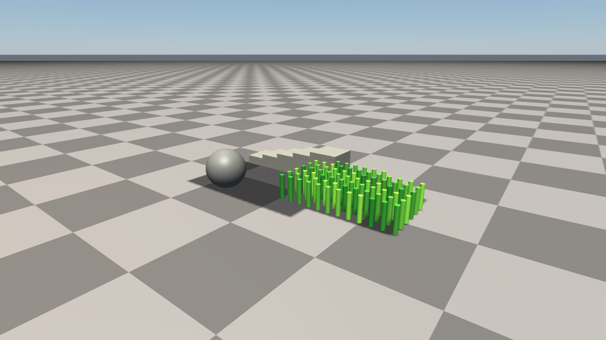
         instances, and a boulder on a terrain region
   :width: 100%

The coloured patches correspond to ``terrain_splat_layer`` weights, while the
repeated grass-like instances correspond to a ``terrain_foliage_layer`` bound
to a parent ``terrain_region``.

Sensors And Visual Aids
=======================

sensor
------

A simulated sensor — RGB, depth, segmentation, IMU, lidar, force/torque, …
Positional layout: ``path kind parentObject pos(x,y,z) rot(w,x,y,z)``.

.. code-block:: text

    sensor /World/Robots/Cassie/Head/RgbCam rgb articulated_cassie \
      0.05 0.0 0.18 1 0 0 0 \
      id=sensor_head_rgb parentGroupId=folder_robots \
      parentLink=head width=1280 height=720 updateRate=30 \
      verticalFov=45 horizontalFov=70 nearPlane=0.05 farPlane=80 \
      lidarChannels=0 lidarSamples=0 lidarMinRange=0 lidarMaxRange=0 \
      lidarVerticalFov=0 segmentation=false \
      calibrationFx=900 calibrationFy=900 calibrationCx=640 calibrationCy=360 \
      noiseMean=0 noiseStddev=0 noiseSeed=0 enabled=true outputPath=-

    sensor /World/Robots/Cassie/Body/Imu imu articulated_cassie \
      0 0 0 1 0 0 0 \
      id=sensor_body_imu parentLink=pelvis updateRate=200 \
      noiseMean=0 noiseStddev=0.01 noiseSeed=42 enabled=true outputPath=-

``parentObject`` is the *id* of the body the sensor is attached to;
``parentLink`` is the link name within an articulated system.

reflection_probe
----------------

A static reflection capture with optional box projection. Positional layout:
``path pos(x,y,z) radius``.

.. code-block:: text

    reflection_probe /World/Probes/Hallway 0.0 0.0 1.6 6.0 \
      id=probe_hallway parentGroupId=folder_probes strength=1.0 \
      boxProjection=true boxMin=-3,-3,0 boxMax=3,3,3 \
      captureOnApply=true captureCached=true captureFiltered=true \
      cubemapSize=256 captureDrawVisualizationObjects=false \
      captureDrawCoordinateFrames=false captureDrawPointClouds=false \
      captureShadows=true captureEnvironmentBackground=true \
      captureEnvironmentExposure=1.0 \
      irradianceResolution=32 irradianceSamples=64 \
      prefilteredResolution=128 prefilteredMipLevels=5 prefilteredSamples=64 \
      brdfLutSize=128 brdfLutSamples=512 enabled=true

local_fog
---------

A spherical local fog volume. Positional layout: ``path center(x,y,z) radius``.

.. code-block:: text

    local_fog /World/Effects/CellarFog 2 -1 0.5 3.0 \
      id=fog_cellar parentGroupId=folder_effects \
      color=0.45,0.55,0.65 density=0.6 edgeFade=0.3 \
      noiseScale=0.25 noiseStrength=0.4 enabled=true

projected_decal
---------------

A decal projected from a textured box onto every surface inside the box.
Positional layout: ``path pos(x,y,z) rot(w,x,y,z) scale(x,y,z)``.

.. code-block:: text

    projected_decal /World/Decals/PosterA 2 0 1.6 0.707 0 0 0.707 1 1 1 \
      id=decal_posterA parentGroupId=folder_decals \
      halfExtents=0.6,0.05,0.3 color=1,1,1,1 \
      edgeFade=0.05 normalFade=0.5 upperFade=0.1 lowerFade=0.1 \
      albedoTexture=textures/poster_a_albedo.png \
      emissionTexture=- normalTexture=- ormTexture=- \
      uvScale=1,1 uvOffset=0,0 albedoMix=1.0 emissionEnergy=0 \
      normalStrength=1 ormStrength=1 \
      distanceFadeEnabled=true distanceFadeBegin=12 distanceFadeLength=4 \
      enabled=true

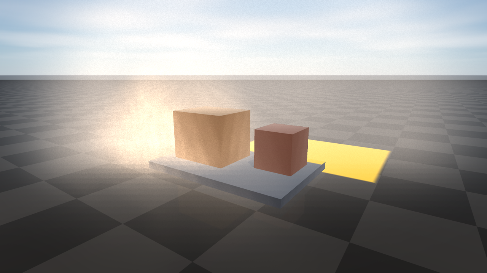
         glowing yellow warning decal lights the floor in front, illustrating
         the local_fog and projected_decal records
   :width: 100%

The image combines two atmospheric records on top of the warehouse scene: a
large bluish ``local_fog`` volume covering the upper area plus a denser warm
``local_fog`` puff hugging the left side of the crates, and an emissive
warning-yellow ``projected_decal`` painted onto the floor in front of the
pallet. Both records ship in the same ``.rscene`` file as the ``object``
records they decorate, so the atmospheric look round-trips with the
scene.

irradiance_volume
-----------------

A box of constant indirect light. Positional layout: ``path pos(x,y,z)
rot(w,x,y,z) scale(x,y,z)``.

.. code-block:: text

    irradiance_volume /World/Volumes/Lobby 0 0 1.5 1 0 0 0 1 1 1 \
      id=ivol_lobby parentGroupId=folder_volumes \
      halfExtents=4,4,1.7 color=0.32,0.30,0.28,1 \
      strength=0.85 edgeFade=0.22 normalBias=0.02 enabled=true

point_cloud
-----------

A static point cloud, e.g. for visualising captures or ROS bag data. Points
and colours are stored in packed lists; ``maxRenderedPoints`` and
``renderedPointStride`` bound the visible subset without losing data on
round-trip.

.. code-block:: text

    point_cloud /World/Sensing/MapCloud id=pointcloud_map \
      parentGroupId=folder_sensing \
      points=1.0,0.0,0.0;1.1,0.0,0.0;1.2,0.0,0.0 \
      colors=1,0,0,1;1,0.5,0,1;1,1,0,1 \
      pointSize=2.5 maxRenderedPoints=100000 renderedPointStride=1 \
      detectable=false enabled=true

instanced_visual
----------------

A GPU-instanced batch of one primitive or mesh. Positional layout:
``path primitive``. ``instances`` is a ``;``-separated list of transforms (10
numbers each); ``colorWeights`` is a parallel float CSV that blends
``colorA``/``colorB`` per instance.

.. code-block:: text

    instanced_visual /World/Foliage/Pebbles sphere id=instanced_pebbles \
      parentGroupId=folder_foliage \
      meshPath=meshes/pebble.obj size=0.04,0.04,0.04 \
      colorA=0.40,0.36,0.30,1 colorB=0.50,0.45,0.40,1 \
      instances=1.0,0.0,0.0,1,0,0,0,1,1,1;1.5,0.0,0.0,1,0,0,0,1,1,1;2.0,0.3,0.0,1,0,0,0,0.8,0.8,0.8 \
      colorWeights=0.1,0.5,0.9 \
      castShadows=true detectable=false automaticMeshLod=true \
      maxRenderedInstances=20000 renderedInstanceStride=1 \
      projectedLod=true projectedLodMinRadiusPixels=2 projectedLodMaxStride=8 \
      doubleBufferedInstanceUploads=true sortTransparentInstances=false \
      grassPatch=false terrainBinding=- terrainFoliageLayer=-1 \
      densityPreview=false enabled=true

Instanced visuals can also act as a *grass patch* (``grassPatch=true`` with
grass-specific parameters) or be bound to a parent terrain region's foliage
layer (``terrainBinding=<terrain id>``, ``terrainFoliageLayer=<slot>``); the
terrain authoring keys live in the same record so they round-trip cleanly.

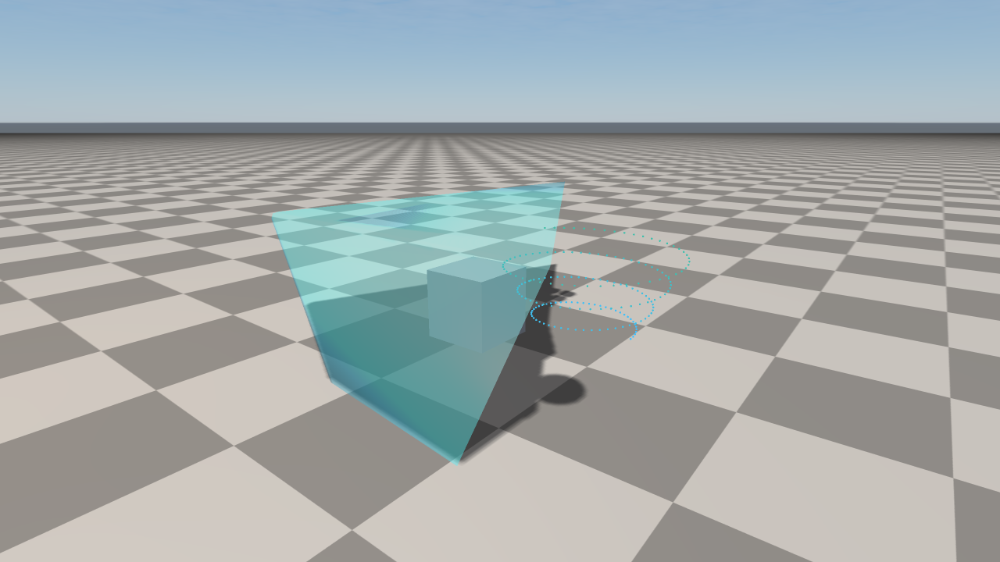
         probe marker, and irradiance volume marker around a target object
   :width: 100%

The sensor and visual-aid records are shown together: the cyan frustum is a
``sensor``/camera helper, the blue spiral is a ``point_cloud``, the small
orange boxes are an ``instanced_visual``, the cyan sphere marks a
``reflection_probe``, and the translucent blue box marks an
``irradiance_volume``.

A Minimal Example, Top To Bottom
================================

Putting it together, this is roughly the smallest valid scene with one
folder, one material, one camera, one light, and one dynamic box:

.. code-block:: text

    raisim_engine_scene 1
    time_step 0.0025
    gravity 0 0 -9.81
    solver 80 1e-07 0.2 accurate defaultFriction=0.8 defaultRestitution=0
    snapping true true false false false false false false 0.1 15 0.1 0 surfaceNormal=0,0,1
    asset_root .
    scene_graph inheritedTransforms=true keepWorldTransformOnReparent=true \
      dragReparenting=true packedSceneOverrides=true transformSpace=global
    editor_ux multiSelect=true copyPaste=true duplicate=true \
      transformLocalSpace=false selectionFilters=true strongUndoGrouping=true \
      selectionFilterKinds=
    render_bake probeCaptureOnSave=false lightmapBakeEnabled=false \
      irradianceBakeEnabled=false renderDiagnostics=false \
      lightmapResolution=1024 probeCubemapSize=256 outputDirectory=bakes
    environment 0.08 0.10 0.13 0.24 0.25 0.29 0 true true 10 - \
      backgroundMode=rayrai_sky pbrEnvironmentIntensity=1
    weather true preset=clear quality=balanced timeOfDay=12
    rayrai_render preset=balanced custom=false colorMode=unreal_preview
    material mat_box 0.7 0.3 0.2 1 0 0.6 0 0 0 0 false - - - - - - id=mat_box
    group /World id=folder_world parentId=- visible=true locked=false expanded=true
    group /World/Props id=folder_props parentId=folder_world visible=true \
      locked=false expanded=true
    light /World/MainLight -0.3 0.4 -1.0 3.5 id=light_main type=directional \
      position=0,0,5 color=1,0.97,0.92 shadows=true shadowResolution=2048
    camera /World/Cam 3 -5 2 0.92 0 0 0.39 52 0.05 100 1280 720 rgb true \
      id=camera_main
    object /World/Ground ground 0 0 0 1 0 0 0 20 20 1 1 0 0 default mat_box \
      false true true - static true 1 18446744073709551615 id=object_ground \
      parentGroupId=folder_world
    object /World/Props/CrateA box 0 0 0.5 1 0 0 0 1 1 1 0.5 1 1.0 default mat_box \
      false true false - dynamic true 1 18446744073709551615 id=object_cratea \
      parentGroupId=folder_props

When the scene above is loaded by ``raisim_engine2``, instantiated through
``raisim_engine2::RaisimBridge``, and rendered through
``raisim_engine2::RayraiBridge``, it looks like this:

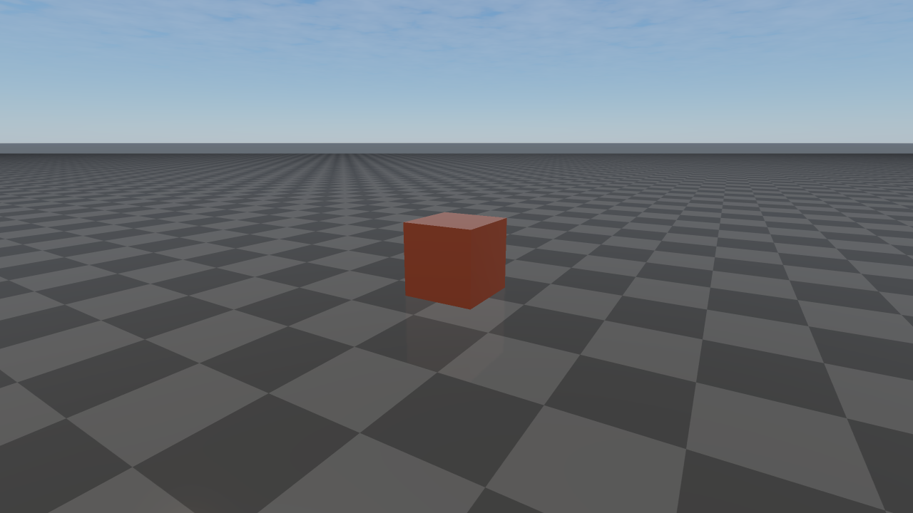
         the procedural rayrai sky, lit by a single warm directional light
   :width: 100%

The single warm directional light comes from the ``light /World/MainLight``
record, the orange tint is the ``mat_box`` material's albedo
(``0.7 0.3 0.2 1``), the camera frame matches the ``camera /World/Cam``
record's eye point and 52° FOV, and the procedural sky comes from
``environment backgroundMode=rayrai_sky`` + ``weather preset=clear``.

Loading And Saving Programmatically
===================================

The C++ entry points are in ``raisim_engine2/RSceneIO.hpp``:

.. code-block:: cpp

    #include "raisim_engine2/RSceneIO.hpp"

    raisim_engine2::Scene scene;
    std::string error;
    if (!raisim_engine2::loadRsceneFile("warehouse.rscene", scene, &error)) {
      // error contains "line N: ..." diagnostic
    }

    // Mutate scene...

    if (!raisim_engine2::saveRsceneFile(scene, "out.rscene", &error)) {
      // ...
    }

    // String/stream overloads are also available:
    std::string text = raisim_engine2::saveRsceneString(scene);
    raisim_engine2::loadRsceneString(text, scene, &error);

Errors are returned via the optional ``std::string*`` argument as
``line <N>: <message>``, where ``<N>`` is the 1-based source line. The
``Scene`` instance is left in a partially populated state on failure, so the
caller should discard it or load into a fresh ``Scene`` and only swap on
success.

To instantiate a loaded scene into a live ``raisim::World``, use
``raisim_engine2::RaisimBridge`` (header:
``raisim_engine2/RaisimBridge.hpp``). For rendering it through rayrai, use
``raisim_engine2::RayraiBridge``. Neither bridge depends on the ``.rscene``
text — they consume the in-memory ``Scene`` — so the file format is decoupled
from the runtime systems it feeds.

Relationship To Projects And Scripts
====================================

A ``.rscene`` is self-contained but is normally edited inside a *project*
directory. A project root holds a ``raisim_engine2_project`` text file plus
``assets/``, ``examples/`` (or another ``scene_directory``), and a
``default_scene`` ``.rscene``:

.. code-block:: text

    raisim_engine2_project 1
    name RaiSim Engine 2 Built-in Project
    asset_directory assets
    scene_directory examples
    default_scene examples/warehouse_scene.rscene
    description Built-in scenes and assets shipped with raisim_engine2.

The ``asset_root`` record inside a scene records the path the scene resolves
mesh/texture references against, so a scene saved under a project remains
portable as long as the referenced assets travel with it.

``.re2`` scripts are a parallel authoring surface: they are a tiny imperative
language whose commands map one-to-one onto ``Scene`` mutations. Running
``raisim_engine2 --script foo.re2 --save foo.rscene`` is equivalent to
opening the editor, executing the commands, and saving the resulting
document. The ``.re2`` form is what version-controlled authoring tests use;
the ``.rscene`` form is what runtime tools load.
