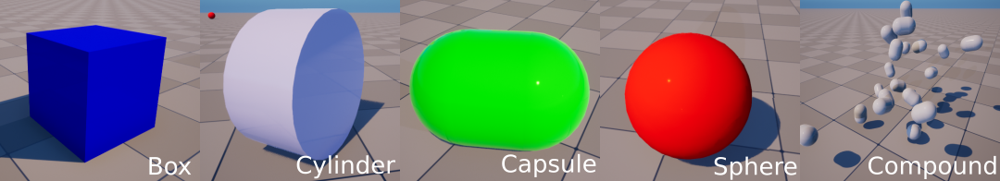
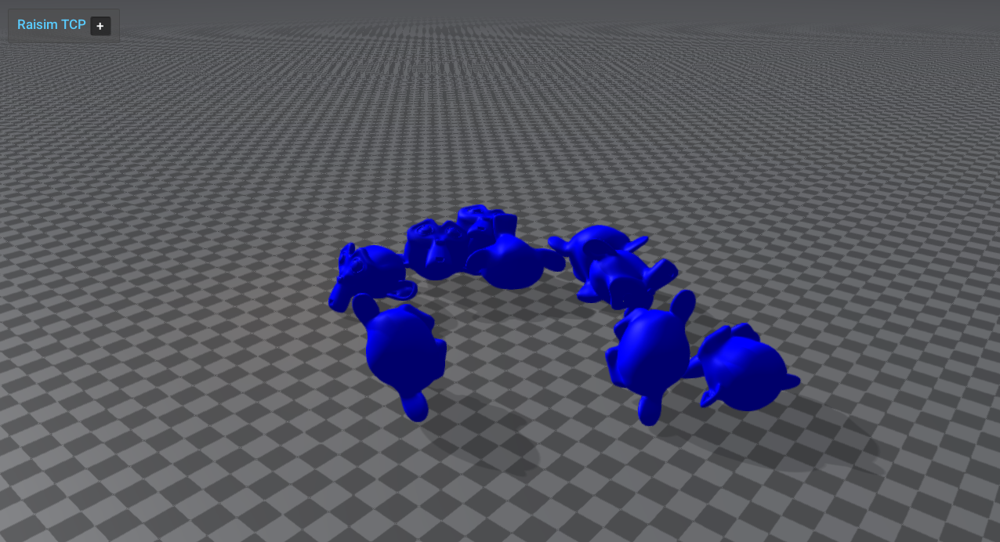

#############################
Single-Body Objects
#############################

``raisim::SingleBodyObject`` is an object with only one rigid body.
``raisim::Compound`` is also a SingleBodyObject because its components move together as one rigid body.
All SingleBodyObjects have **6 degrees of freedom**: 3 for position and 3 for orientation.

Primitives
=========================
The following five primitive shapes are supported in RaiSim.

Compound
===================================
Legacy RaisimUnity examples are no longer supported; use rayrai for current
visualization examples.

``raisim::Compound`` has multiple primitive shapes that are rigidly attached to each other to form a single rigid body.
The shapes do not have to overlap to stay attached.

A compound object can be added to the world using the method ``raisim::World::addCompound``.
This method takes a vector of children, which have their own shape, material, position, and orientation.
The shape can be specified by a geometric type (i.e., ``raisim::ObjectType``) and its size parameters (``objectParam``).
The ``objectParam`` follows a standard way to represent the size of a primitive in RaiSim:

*  Sphere: radius, 0, 0, 0
*  Box: x, y, z, 0
*  Capsule and cylinder: radius, height, 0, 0

The ``objectParam`` is an instance of ``raisim::Vec<4>``.
All shapes require fewer than four parameters and the unused elements (i.e., the zeroes above) are ignored.

The ``trans`` member defines the position and orientation of the child in the body frame.
It is a ``struct`` with public ``rot`` and ``pos`` members.

The ``mass``, ``COM``, and ``inertia`` arguments specify the dynamical properties of the combined body.

Mesh
===================================

``raisim::Mesh`` represents a single-body object defined by a triangle mesh.
It is commonly used for props, scanned objects, and imported object models.
Meshes are added via ``raisim::World::addMesh``.

Public mesh collision modes
---------------------------
The public ``addMesh`` API exposes three collision representations:

* ``MeshCollisionMode::CONVEX_APPROXIMATION``: CoACD convex decomposition. This creates multiple convex collision parts from one mesh. This is the default for ``addMesh``.
* ``MeshCollisionMode::CONVEX_HULL``: one convex hull built from the mesh.
* ``MeshCollisionMode::ORIGINAL_MESH``: the original non-convex triangle mesh.

``MeshCollisionMode::CONVEXIFY`` remains accepted as a legacy alias for
``CONVEX_APPROXIMATION``. New code and documentation should use
``CONVEX_APPROXIMATION``.

Original non-convex triangle mesh collision is useful for imported visual meshes that are invalid
CoACD input, but it is usually slower and less robust than convex collision geometry.

Default convex approximation
------------------------------
The shortest overload uses CoACD convex decomposition by default and estimates inertia/COM from the
scaled axis-aligned bounding box. If CoACD cannot process the mesh, RaiSim warns and falls back to
a single convex hull built from the mesh:

.. code-block:: cpp

    auto* mesh = world.addMesh(meshFile, mass, scale);

The explicit-inertia overload is also convex-approximated by default:

.. code-block:: cpp

    auto* mesh = world.addMesh(meshFile, mass, inertia, com, scale);

Explicit collision modes
------------------------
Use ``MeshCollisionMode::CONVEX_HULL`` for the cheapest convex mesh collider:

.. code-block:: cpp

    auto* mesh = world.addMesh(meshFile, mass, scale, "",
                               raisim::MeshCollisionMode::CONVEX_HULL);

Use ``MeshCollisionMode::ORIGINAL_MESH`` when you intentionally want the non-convex triangle mesh:

.. code-block:: cpp

    auto* mesh = world.addMesh(meshFile, mass, scale, "",
                               raisim::MeshCollisionMode::ORIGINAL_MESH);

You can still pass ``MeshCollisionMode::CONVEX_APPROXIMATION`` explicitly when you want to make the default
choice visible at the call site:

.. code-block:: cpp

    auto* mesh = world.addMesh(meshFile, mass, scale, "",
                               raisim::MeshCollisionMode::CONVEX_APPROXIMATION);

Custom CoACD options
--------------------
Tune ``CoacdOptions`` when you need more or fewer convex parts. Lower thresholds and larger
``maxConvexHull`` values can preserve more shape detail, but they increase build time and can
make contact processing slower.

.. code-block:: cpp

    raisim::CoacdOptions options;
    options.threshold = 0.08;
    options.maxConvexHull = 8;
    options.sampleResolution = 1200;
    options.mctsIteration = 80;

    auto* mesh = world.addMesh(meshFile, mass, scale, "",
                               raisim::MeshCollisionMode::CONVEX_APPROXIMATION,
                               raisim::CollisionGroup(1),
                               raisim::CollisionGroup(-1),
                               options);

You can also pass options directly:

.. code-block:: cpp

    auto* mesh = world.addMesh(meshFile, mass, scale, "", options);

CoACD input requirements
------------------------
The bundled CoACD integration is intentionally small and does not include heavy preprocessing
dependencies. It works best with closed, reasonably manifold meshes.

If ``MeshCollisionMode::CONVEX_APPROXIMATION`` fails (for example, the mesh is not 2-manifold),
RaiSim prints a warning and falls back to a single convex hull (``MeshCollisionMode::CONVEX_HULL``)
built from the same vertices. This keeps imported visual meshes such as robot body panels usable
when they are not valid CoACD input, and avoids the deep-penetration and performance pathologies
of non-convex triangle-mesh collision. If you intentionally want the original non-convex triangle
mesh, request ``MeshCollisionMode::ORIGINAL_MESH`` explicitly.

CoACD cache files
-----------------
Successful ``MeshCollisionMode::CONVEX_APPROXIMATION`` calls (including the legacy ``CONVEXIFY`` alias) write an OBJ cache beside the source mesh. This
keeps repeated runs cheap: the first call pays the CoACD decomposition cost, while later calls with
the same parameters load the saved convex parts directly.

The file name starts with ``raisim_coacd_`` and includes the source mesh stem, a content hash,
scale, and CoACD option values, for example:

.. code-block:: text

    raisim_coacd_model_hash_0123456789abcdef_scale_1_threshold_0_08_maxhull_8_..._realmetric_0.obj

The cache stores each convex part as a separate OBJ group named ``raisim_coacd_part_N``. On later
``addMesh`` calls with the same source mesh contents and CoACD parameters, RaiSim loads these groups
instead of running CoACD again. The loaded convex parts are expected to match the generated parts
exactly.

Changing the source mesh contents changes the hash and therefore produces a different cache file.
Different CoACD settings also produce different cache file names, so changing options such as
``threshold``, ``maxConvexHull``, ``sampleResolution``, or ``mctsIteration`` does not reuse an
incompatible cache.

For a 16k-triangle YCB apple mesh using the default CoACD options, a local timing run took about
4.3 seconds on the first uncached call and about 49 ms on the second cached call. Exact timings are
machine- and mesh-dependent, but large meshes should see the largest benefit.

These files are generated artifacts and are ignored by the repository ``.gitignore`` rules via
``raisim_coacd_*``. Delete the corresponding ``raisim_coacd_*`` file manually if you want to force a
fresh decomposition without editing the source mesh.

Inspection helpers
------------------
``raisim::Mesh`` exposes the generated convex parts for debugging and visualization:

.. code-block:: cpp

    const auto& parts = mesh->getCoacdConvexParts();
    std::cout << mesh->getCollisionBodyCount() << std::endl;

When CoACD falls back to original non-convex mesh collision, ``getCoacdConvexParts()`` is empty and
``getCollisionBodyCount()`` returns ``1``.

The rayrai example ``rayrai_coacd_mesh_approximation`` displays original meshes next to colored
convex decomposition parts.

Model preprocessing and export
------------------------------
``raisim::Mesh::preprocessMesh`` loads any Assimp-supported mesh format, applies a scale, triangulates
it, and writes a normalized OBJ cache. The output name includes a content hash and scale so repeated
runs can reuse the cached OBJ safely.

.. code-block:: cpp

    raisim::Mesh::PreprocessOptions options;
    options.scale = 1.0;
    options.cacheDirectory = "/tmp/raisim_mesh_cache";
    auto result = raisim::Mesh::preprocessMesh("asset.glb", options);

    auto* mesh = world.addMesh(result.outputPath,
                               1.0,
                               1.0,
                               "default",
                               raisim::MeshCollisionMode::CONVEX_HULL);

Use ``World::exportMeshAssetsToObj(directory, prefix)`` to export mesh objects already in a world as
normalized OBJ files. The function returns the generated paths in world-object order.

.. code-block:: cpp

    std::vector<std::string> exported = world.exportMeshAssetsToObj("/tmp/raisim_export", "scene");

Visual assets and collision assets should remain separate unless you explicitly want to reuse the
same mesh for both. A high-detail textured glTF visual mesh is often unsuitable as a collision mesh;
use a simplified convex hull, CoACD decomposition, or authored collision asset for simulation.

OpenUSD mesh loading
--------------------
USD/USDA/USDC/USDZ files are loaded through RaiSim's bundled OpenUSD runtime, not through
Assimp's USD importer. OpenUSD support is included in supported RaiSim builds, so
``World::addMesh`` accepts USD files directly:

.. code-block:: cpp

    auto* mesh = world.addMesh("asset.usd",
                               1.0,
                               1.0,
                               "default",
                               raisim::MeshCollisionMode::ORIGINAL_MESH);

The importer reads ``UsdGeomMesh`` geometry, applies parent transforms, triangulates faces,
and merges mesh prims into one RaiSim mesh object. It does not instantiate USD physics,
articulations, variants, skeletons, lights, or full material graphs. Keep collision meshes
reasonably sized, and use simplified collision assets, convex hulls, or CoACD when a USD
visual mesh is too detailed for contact.

See :doc:`OpenUSD` for runtime layout, examples, and troubleshooting.

SingleBodyObject API (Parent class)
======================================

.. doxygenclass:: raisim::SingleBodyObject
   :members:

Compound API
=========================

.. doxygenclass:: raisim::Compound
   :members:

Sphere API
=========================

.. doxygenclass:: raisim::Sphere
   :members:

Box API
=========================

.. doxygenclass:: raisim::Box
   :members:

Capsule API
=========================

.. doxygenclass:: raisim::Capsule
   :members:

Cylinder API
=========================

.. doxygenclass:: raisim::Cylinder
   :members:

Ground API
=========================

.. doxygenclass:: raisim::Ground
   :members:

Mesh API
=========================

.. doxygenclass:: raisim::Mesh
   :members:
