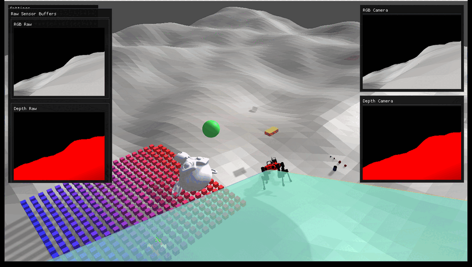
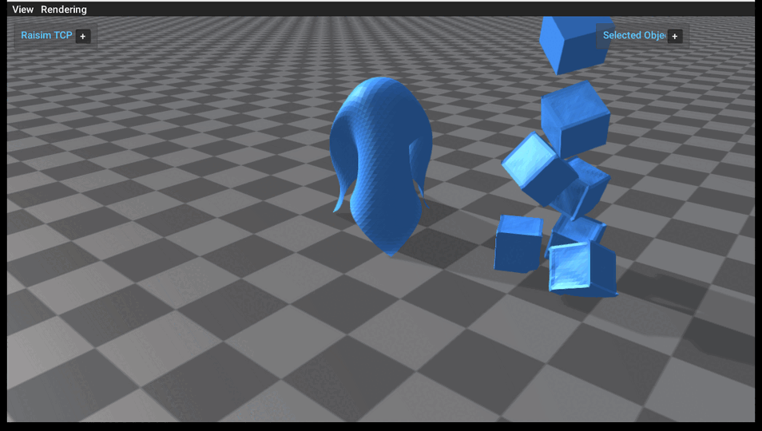
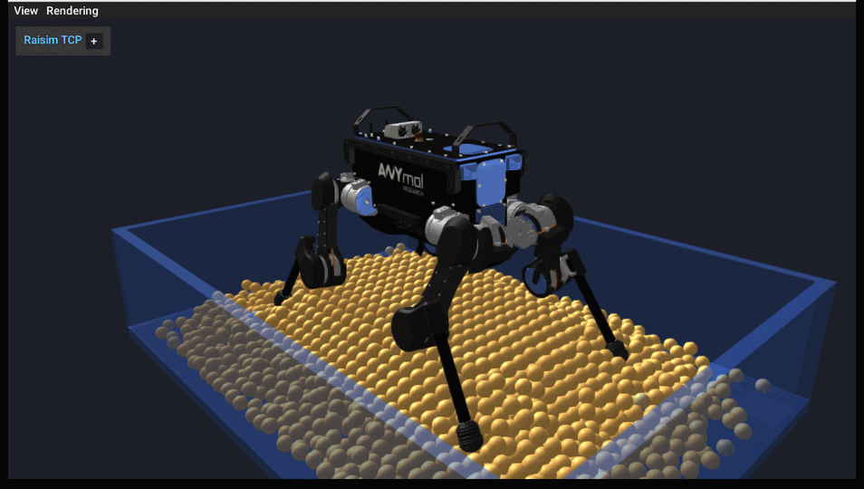

Changelog: v2.2.0
=================

.. raw:: html

   

     
Recent development notes

     
Rayrai, deformable objects, and granular media

     
Highlights for users upgrading to this release.

   

The latest changes are not just maintenance. They add three visible capabilities
that affect how users inspect, build, and demonstrate simulations: the rayrai
renderer, native deformable objects, and native granular media. The examples
below were run from the package examples build and captured through rayrai for
this changelog.

Rayrai becomes the main visual workflow
---------------------------------------

.. image:: ../../image/rayrai_pbr_texture_maps.png
   :alt: rayrai PBR texture maps example with textured material rendering
   :width: 100%

rayrai is now the supported in-process visualization path. For users, this means
examples can render directly inside the simulation process, expose RGB/depth
sensor buffers, preview LiDAR and point clouds, and show richer scenes without
starting a separate legacy visualizer stack.

This release adds and restores rayrai example documentation, source files,
and assets. They also bundle PBR material examples so users can immediately
inspect real textured models with renderer-side material support.

User impact:

* Run modern visualization examples directly from the installed package or examples build.
* Inspect RGB/depth camera output and raw sensor buffers through rayrai.
* Use bundled PBR assets instead of assembling renderer demo resources by hand.

Deformable objects are now example-ready
----------------------------------------

The deformable object example shows two workflows users can build on: an
explicit cloth grid draping over a rigid obstacle and a stack of mesh-based
deformable cubes. This makes the new deformable-body API concrete instead of
leaving it as a header-level feature.

The example demonstrates particle counts, triangle topology, material tuning,
mesh construction, and server streaming of dynamic deformable topology. Users can
start from this scene when building cloth, soft shells, or deformable collision
experiments.

User impact:

* Create cloth from explicit vertices and triangles.
* Build deformable objects from closed OBJ meshes.
* Stream deformable topology and vertex updates through ``RaisimServer`` and
  view them in rayrai.

Granular media gets a native robot example
------------------------------------------

Granular media is now visible as a native RaiSim feature through an ANYmal
example standing on a particle bed. The scene shows the part users care about:
rigid and articulated bodies interacting with granular particles while the
particles are rendered as instanced visuals in rayrai.

The example exposes practical controls for particle resolution, layers, radius,
spacing, stiffness, damping, friction, rolling friction, and substeps. It also
prints contact and stability statistics after headless runs, so users can tune
material behavior and check whether a configuration stayed stable.

User impact:

* Create granular beds with fixed and dynamic particles.
* Couple granular particles to an articulated robot.
* Visualize particle motion and tune material parameters from a runnable example.

Build, upgrade, and Python polish
---------------------------------

This release also improves the less visible surfaces that affect daily
use. Upgrade scripts were added for Linux and Windows, automatic upgrade support
was wired into CMake, Windows build configuration was adjusted, and RaiSimPy
symbol exposure was fixed.

User impact:

* Easier package upgrades on Linux and Windows.
* Fewer platform-specific CMake surprises.
* Cleaner Python binding behavior for articulated systems and sensors.
