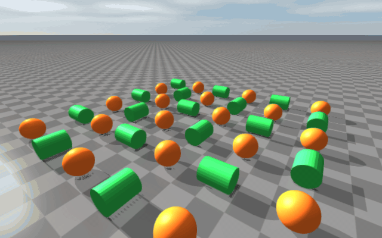

Changelog: v2.3.0
=================

.. raw:: html

   

     
Upcoming release

     
Rolling and spinning friction, rayrai out-of-the-box quality, and docs overhaul

     
Highlights for users upgrading from v2.2.0.

   

This release introduces native rolling and spinning friction in the
contact solver, interactive sim control (pause / step / force / pose
from the rayrai TCP viewer), MJCF loading into an existing
``raisim::World``, a persistent shader binary cache and multi-threaded
prewarming for rayrai, makes the rayrai renderer look right with zero
per-application tuning, splits the rayrai documentation into navigable
subsections, and adds compile-time-regenerated reference images for the
documentation.

Rolling and spinning friction
-----------------------------

RaiSim's contact solver now models two extra friction modes alongside
classical Coulomb friction:

* **Rolling friction** (:math:`\mu_r`) resists rotation that would roll a
  finite-radius body over a contact patch. This is what stops a ball or a
  cylinder from spinning freely down a slope under gravity alone — useful
  for ball bearings, wheels on soft ground, and any contact where the
  contact patch is non-zero.
* **Spinning friction** (:math:`\mu_s^{spin}`) resists torsional rotation
  about the contact normal — the kind of motion you see when a spinning
  top stops, or when a robot foot torques in place.

Both coefficients default to zero, so existing simulations behave exactly
as before. Opt in per material pair through ``World::setMaterialPairProp``:

.. code-block:: cpp

    world.setMaterialPairProp(
      "steel", "rubber",
      0.80,   // dynamic friction
      0.10,   // restitution
      0.001,  // restitution threshold
      0.90,   // static friction
      0.001,  // static-friction threshold velocity
      0.05,   // rolling friction
      0.02);  // spinning friction

If *any* active contact in a frame has nonzero rolling or spinning
friction, RaiSim switches to the extended contact solver that integrates
both terms. Pairs that opt out keep the cheaper classical path.

User impact:

* Realistic deceleration for balls, cylinders, and spinning objects.
* No retuning required for existing simulations — the defaults preserve
  the old behaviour.
* A runnable demo, ``rayrai_rolling_spinning_friction``, visualises
  rolling and spinning damping plus sleep transitions in an in-process
  rayrai window.

See :doc:`../MaterialSystem` for the full friction model and the worked
contact-impulse derivation, and
:doc:`../examples/rayrai/rayrai_rolling_spinning_friction` for the
example walkthrough.

Interactive sim control from the TCP viewer
-------------------------------------------

``RaisimServer`` and the rayrai TCP viewer can now drive the simulation
interactively. With the new ``PROTOCOL_FEATURE_SIM_CONTROL`` bit
negotiated (advertised by default on both sides), a connected client may
pause / resume / step the world and push external forces, torques, body
poses, and articulated-system generalized coordinates over the wire.

* New ``RaisimServer`` API: ``pauseSimulation()``, ``resumeSimulation()``,
  ``isSimulationPaused()``, ``stepSimulation(n)``,
  ``setBindLoopbackOnly(bool)``.
* New ``RaisimServer::integrateWorldThreadSafe(beforeStep)`` template
  overload — invokes the supplied callable inside the locked region after
  client requests are applied and before the integrator runs, so examples
  can spawn / move / modify objects each tick without dropping the world
  mutex.
* New client request types ``CR_PAUSE``, ``CR_RESUME``, ``CR_STEP_N``,
  ``CR_APPLY_FORCE``, ``CR_APPLY_TORQUE``, ``CR_SET_POSE``, ``CR_SET_GC``
  (server enum) and the mirroring ``raisin::tcp_viewer::ClientRequestType``
  / ``SimControlRequest`` types for custom clients.
* Server now binds to ``127.0.0.1`` by default. Opt back into
  ``INADDR_ANY`` with ``server.setBindLoopbackOnly(false)`` only on
  trusted networks — the bind address is the **only** access control the
  server provides; there is no token or capability handshake.

See :doc:`../RaisimServer` for the server-side API and
:doc:`../RayraiTcpViewer` for the viewer's Pause / Step / force / pose
UI workflow.

MJCF loading into an existing World
-----------------------------------

``World::loadMjcfFile(const std::string&)`` is a new public dispatch
that lets callers populate an already-constructed ``raisim::World`` from
an MJCF (``<mujoco>``-rooted XML) file. This is the same code path the
``World(configFile)`` constructor takes internally when the file's root
is ``<mujoco>``, but exposed as a method so applications (e.g. the rayrai
TCP viewer's drag-drop Joint Inspector) can switch a running world's
contents at runtime.

The world should normally be empty when called — MJCF files often
declare ground planes, ``worldbody`` lights, and option blocks that
overwrite world-level state.

Shader binary cache and parallel prewarming
-------------------------------------------

rayrai's PBR shader stack used to take 10-30 seconds to compile on first
run. Two new features eliminate that wait in production pipelines:

* **Persistent shader binary cache.** Compiled GL programs are now
  written to a per-driver cache (default
  ``$XDG_CACHE_HOME/raisim/rayrai`` or ``$HOME/.raisim/rayrai``) keyed by
  GL vendor / renderer / version + GLSL source. Subsequent runs skip
  the GLSL compile and load the cached binary directly. On by default;
  toggle with the new ``RayraiWindow`` constructor params
  ``shaderBinaryCacheEnabled`` / ``shaderBinaryCacheDirectory`` /
  ``logShaderBinaryCache``.
* **Multi-threaded prewarming** for parallel RL setups. The new static
  ``RayraiWindow::prewarmShadersForCurrentContext(threadingMode, dir)``
  lets one background thread (with its own offscreen GL context)
  pre-compile every shader; worker threads that later construct their
  own ``RayraiWindow`` instances find the cache already warm. Across
  the whole process each shader's GLSL→binary compile runs exactly
  once, regardless of worker count.
* New ``RayraiWindow::linkedShaderNames()``,
  ``warmupNextShader(done)``, and ``compileShaderByName(name)`` for
  applications that want to warm a specific subset (the ``pbrMeshHigh``
  shader alone is roughly half the total cost).
* New ``Shader::binaryCacheStats()`` returns process-global hit / miss
  / store / coordinated-wait counters for verifying that the cache is
  actually being consulted, plus ``Shader::resetBinaryCacheStats()`` and
  ``Shader::setBinaryCacheConfig(...)``.
* New constructor param ``shaderCompileThreadCount`` is passed to
  ``glMaxShaderCompilerThreadsARB`` — defaults to 1 (matching rayrai's
  single-threaded default); raise it only when the host is
  multi-threaded.

See :doc:`../rayrai/Performance` for the full workflow and code
examples.

Rayrai presets produce readable scenes out of the box
-----------------------------------------------------

The ``Fast`` / ``Balanced`` / ``High`` / ``Ultra`` render-quality presets in
``RenderQualitySettings`` were retuned so applications no longer need to
tweak ambient, diffuse, or shadow values to get a usable scene.

User-visible changes (preset defaults in
``defaultRenderQualitySettings(...)``):

* **Directional shadows are visible by default.** ``mainLightAmbient`` is
  lower across presets, ``mainLightDiffuse`` is higher, ``shadowStrength``
  is in the 0.75-0.90 range, and the directional shadow ortho box stays
  compact (``shadowOrthoHalfSize = 12.5``, single cascade) so the shadow
  doesn't dissolve into soft blur on small scenes.
* **Sky-driven ambient.** ``pbrEnvironmentIntensity`` is now 2.6 / 4.0 /
  4.5 for Balanced / High / Ultra (was 1.05 / 1.15 / 1.30), and
  ``mainLightAmbient`` is ``0.55`` across the higher presets. Shaded sides
  of surfaces pick up clear sky-blue daylight fill instead of going flat.
* **Reflective ground for High and Ultra.** Both presets set
  ``reflectiveGround = true`` with sensible roughness/metallic values and
  enable the planar-reflection blend path on the ground material.
* **Procedural sky as default background.** The struct default for
  ``proceduralSkyBackgroundEnabled`` is now ``true`` and the sun strength
  is tuned for outdoor daylight.

The ``raisin::Light`` API gained ``setSpotAngles(innerDeg, outerDeg)`` and
``setRange(meters)`` so common light setups don't require manual
cosine/attenuation math.

Documentation: split rayrai page, generated reference images
------------------------------------------------------------

The rayrai documentation, previously a single multi-thousand-line page, has
been split into a hub plus eleven topic pages: render quality, lighting,
materials, visuals, post-process, weather, capture, sensors, TCP protocol,
examples, and performance. Each page focuses on one subsystem and has its
own code examples + reference images.

The documentation build now includes a small library of C++ image
generators under ``docs/image_generators/`` that produce the rayrai
reference images at compile time. They link against the freshly-installed
rayrai package, render headlessly, write supersampled PNGs into
``docs/image/rayrai/``, and are wired into the Sphinx target so a fresh
doc build always uses up-to-date images. ``update_doc.sh`` was extended
to wipe stale generator stamps and retry the build if the SDL/GL teardown
races between successive headless processes.

Rayrai library improvements
---------------------------

Several rayrai APIs were added or refined in this release:

* ``raisin::PbrEnvironment`` — a one-struct alternative to passing the
  four IBL GL handles around. Build it with
  ``PbrEnvironment::loadFromHdrFile(path)`` and pass it to
  ``Visuals::setPbrEnvironment(env)``.
* ``glm::vec4`` colour overloads on ``addVisualSphere`` / ``Box`` /
  ``Cylinder`` / ``Capsule`` / ``Plane`` / ``Mesh`` so callers stop
  writing four floats by hand.
* ``raisin::Material`` static factories: ``Material::pbr``,
  ``Material::unlitColor``, ``Material::simpleColor``,
  ``Material::foliage``, ``Material::defaultGround``.
* New ``CloudQuality`` enum and ``cloudQuality`` field on
  ``RenderQualitySettings`` to pick between texture-cloud and volumetric
  cloud rendering per preset.
* TCP viewer protocol: explicit wire-format header, ``BufferReader``
  helper, and a build-time-overridable ``RAISIM_TCP_VIEWER_MAX_MESSAGE_BYTES``.
* Lazy shader compilation of optional shaders on first use, surfaced by
  ``shaderWarmupDiagnostics``.

Engine 2 editor CLI flags
-------------------------

The ``raisim_engine2_editor`` and ``raisim_engine2`` CLIs now accept the
``--script file.re2`` flag for running an authoring script against the
in-memory document. Outdated documentation references to
``--project`` / ``--exit-after-frames`` / ``--render-template-previews``
(none of which the editor binary implements) have been removed.

Bug fixes
---------

* Fixed an example-code bug in ``Contact.rst`` that compared a ``size_t``
  index against ``raisim::BodyType::STATIC``; the correct call is
  ``getPairObjectBodyType()``.
* Synced rayrai package headers (``RayraiWindow.hpp``,
  ``SkyAtmosphereSystem.hpp``, new ``CloudTextures.hpp``) so doc image
  generators and other downstream consumers build against the same
  struct layouts as the shipped ``librayrai.so``.
