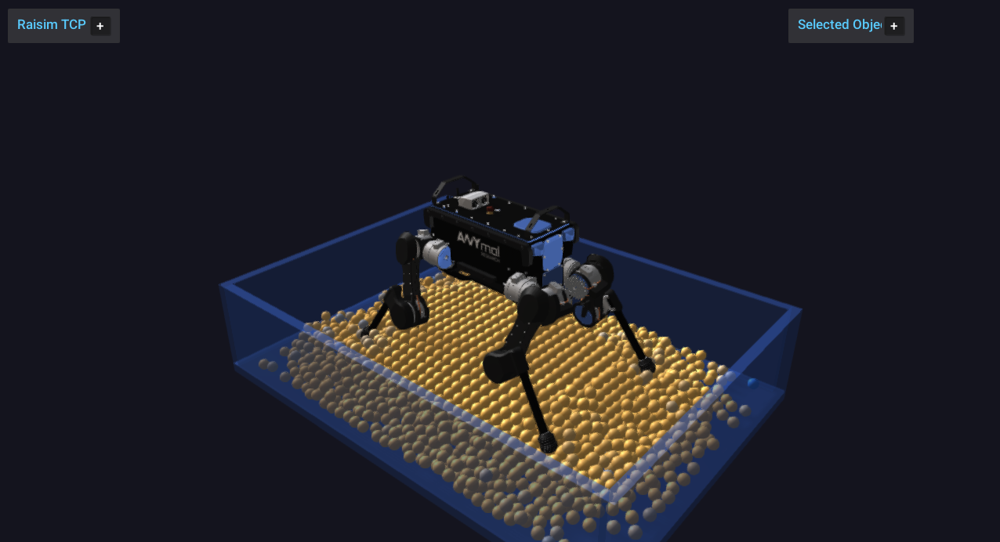

granular_media
==============

``granular_media`` demonstrates a granular bed interacting with an ANYmal model
through ``raisim::GranularSystem``.

Run:

.. code-block:: bash

   <raisim-install>/bin/granular_media

Start ``rayrai_raisim_tcp_viewer`` before running this example if you want to view the
simulation interactively.

