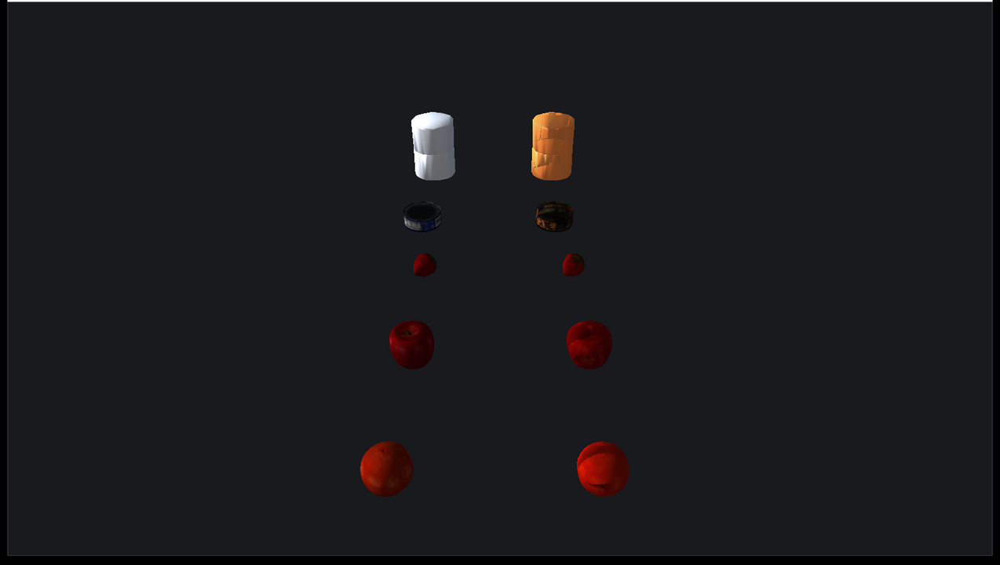

rayrai_coacd_mesh_approximation
===============================

This example compares original YCB mesh geometry against
CoACD convex decompositions generated through ``raisim::World::addMesh`` with
``MeshCollisionMode::CONVEX_APPROXIMATION``. The example displays the original mesh column
and the generated convex parts column in an in-process rayrai window.

The program prints original triangle counts and generated CoACD part counts for
each mesh.
