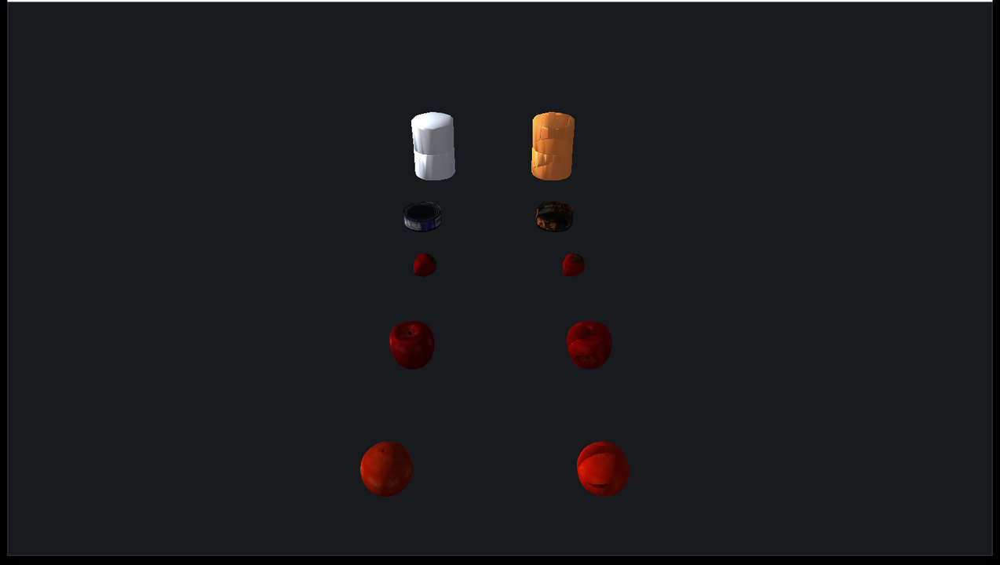

rayrai_coacd_mesh_approximation
===============================

This example compares original YCB mesh geometry against
CoACD convex decompositions generated through ``raisim::World::addMesh`` with
``MeshCollisionMode::CONVEXIFY``. The example displays the original mesh column
and the generated convex parts column in an in-process rayrai window.

The program builds the collision parts before it opens the window and prints
the number of CoACD parts generated for each mesh. See
:doc:`../rayrai/rayrai_coacd_mesh_approximation` for first-run timing and the
cache.
