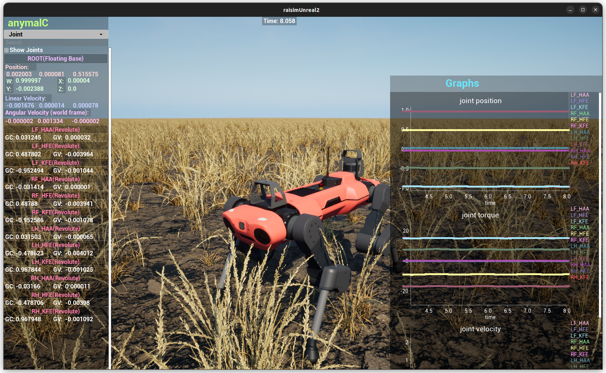

##########################
Map Example: Anymal Graphs
##########################

Overview
========
Runs two ANYmal variants (B and C) with PD control on a map and streams joint position, velocity, and torque graphs to the visualizer. It is a good reference for time-series graphing.

Screenshot
==========

Source Status
=============
Source file: ``examples/src/maps/map_anymal_graphs.cpp``.

This page is excluded from the published docs, and the current examples CMake
file does not register this source as an installed executable. Treat it as a
source reference unless you register it in a local examples build.

For visualization, use ``rayrai_raisim_tcp_viewer`` with RaisimServer-based
applications.

Details
=======
- Loads ANYmal B and C URDFs and applies PD targets for all leg joints.
- Sets the server map name to ``wheat`` and hides the ground; focuses on anymalC.
- Streams joint position/velocity/torque into three time-series graphs.

