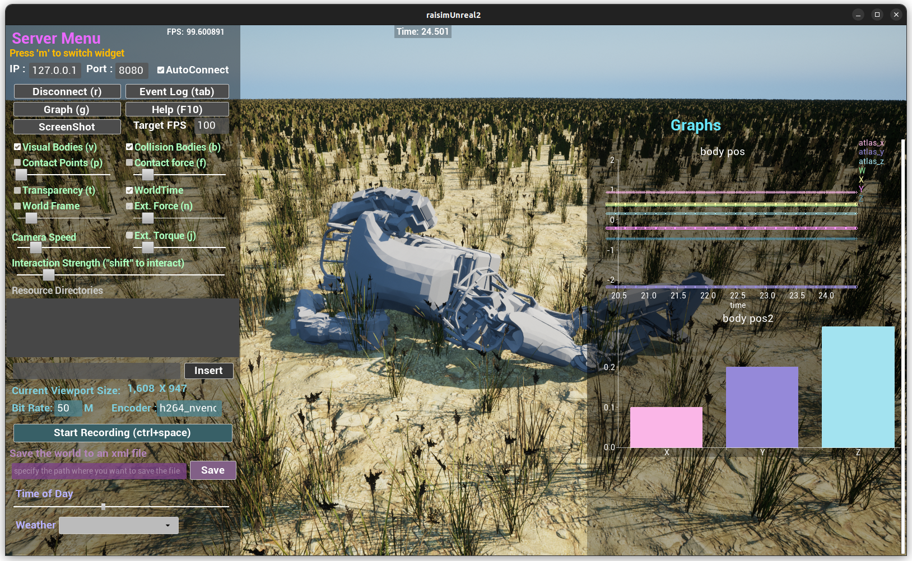

#########################
Map Example: Atlas Charts
#########################

Overview
========
Spawns Atlas on a map and demonstrates RaisimServer charting with time-series plots and bar charts. Use this to see how to publish telemetry to the visualizer.

Screenshot
==========

Source Status
=============
Source file: ``examples/src/maps/map_atlas_charts.cpp``.

This page is excluded from the published docs, and the current examples CMake
file does not register this source as an installed executable. Treat it as a
source reference unless you register it in a local examples build.

For visualization, use ``rayrai_raisim_tcp_viewer`` with RaisimServer-based
applications.

Details
=======
- Spawns Atlas robots and initializes the base pose with zero joint torques.
- Applies external force/torque each frame to perturb the robot.
- Demonstrates time-series and bar chart overlays in the visualizer.

