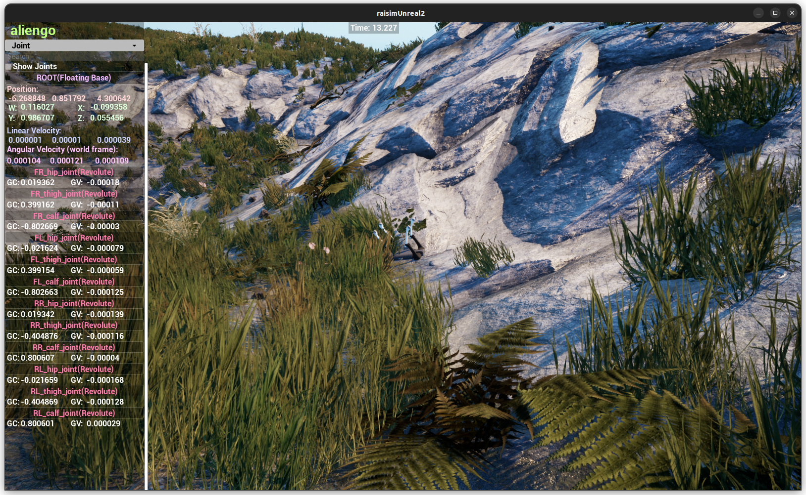

############################
Map Example: Hill1 Heightmap
############################

Overview
========
Loads the hill1 heightmap and drops Aliengo high above the terrain to demonstrate heightmap placement and scale. The map is set to "hill1" in the server.

Screenshot
==========

Binary
======
Installed executable: ``map_hill1_heightmap``.

Run
====
Run the installed executable:

.. code-block:: bash

   <raisim-install>/bin/map_hill1_heightmap

On Windows, run ``map_hill1_heightmap.exe`` instead.
This example uses RaisimServer. Start a visualizer client (RaisimUnity, RaisimUnreal, or the rayrai TCP viewer) and connect to port 8080.

Details
=======
- Loads the hill1 heightmap PNG with explicit scale/offset and hides the mesh.
- Drops Aliengo from height and holds posture with PD gains.
- Sets the Unreal map to ``hill1`` and focuses the camera on the robot.

