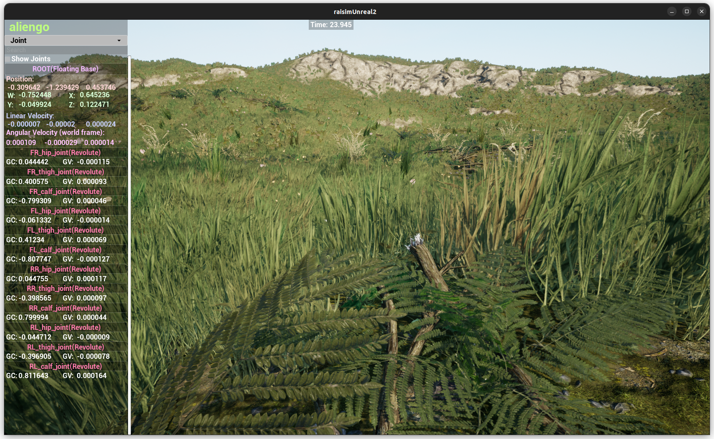

################################
Map Example: Mountain1 Heightmap
################################

Overview
========
Loads the bundled mountain1 heightmap assets and drops an Aliengo robot on it with PD control. It sets the RaisimServer map name to ``mountain1`` so ``rayrai_raisim_tcp_viewer`` matches the terrain.

Screenshot
==========

Source Status
=============
Source file: ``examples/src/maps/map_mountain1_heightmap.cpp``.

This page is excluded from the published docs, and the current examples CMake
file does not register this source as an installed executable. Treat it as a
source reference unless you register it in a local examples build.

For visualization, use ``rayrai_raisim_tcp_viewer`` with RaisimServer-based
applications.

Details
=======
- Loads the mountain1 heightmap PNG with scale/offset and hidden mesh.
- Spawns Aliengo with PD posture control.
- Sets the server map name to ``mountain1`` and focuses on the robot.

