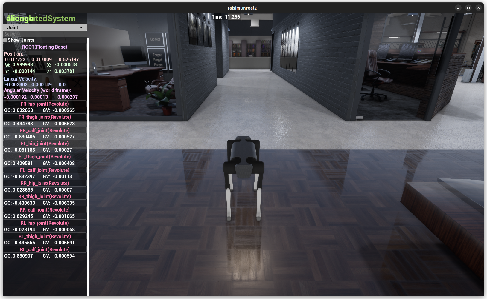

##########################
Map Example: Office1 Scene
##########################

Overview
========
Loads the office1 XML world, adds a dynamic ball, and spawns Aliengo with PD control. The server map is set to "office1" for the matching office environment.

Screenshot
==========

Binary
======
Installed executable: ``map_office1_scene``.

Run
====
Run the installed executable:

.. code-block:: bash

   <raisim-install>/bin/map_office1_scene

On Windows, run ``map_office1_scene.exe`` instead.
This example uses RaisimServer. Start a visualizer client (RaisimUnity, RaisimUnreal, or the rayrai TCP viewer) and connect to port 8080.

Details
=======
- Loads the office1 XML world and adds a moving sphere.
- Spawns Aliengo with PD posture control on top of the scene.
- Uses the ``office1`` map and focuses the camera on the robot.

