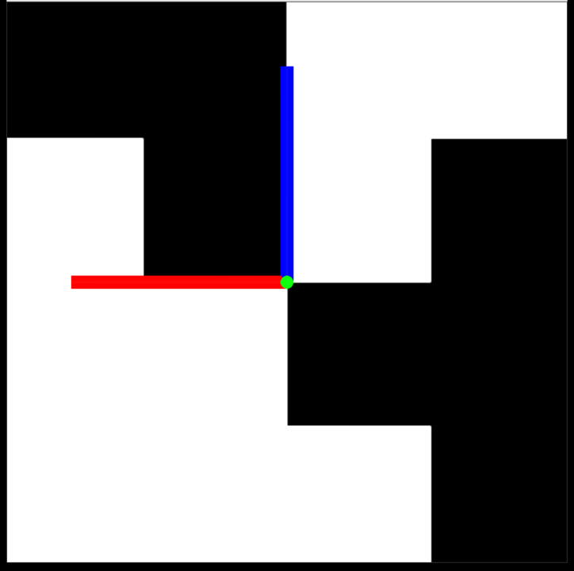

############################
Rayrai Example: Aruco Marker
############################

Overview
========
Uses an orthographic camera and flat lighting to render a textured mesh marker for detection-style pipelines. It is tuned for consistent marker appearance.

Binary
======
Installed executable: ``rayrai_aruco_marker``.

Run
====
Run the installed executable:

.. code-block:: bash

   <raisim-install>/bin/rayrai_aruco_marker

On Windows, run ``rayrai_aruco_marker.exe`` instead.
This example uses the in-process rayrai renderer (no external client required).

Details
=======
- Adds a mesh visual as a stand-in marker and rotates it to face the camera.
- Configures a directional light and disables shadows for flat lighting.
- Uses an orthographic camera to render a marker-like view.

