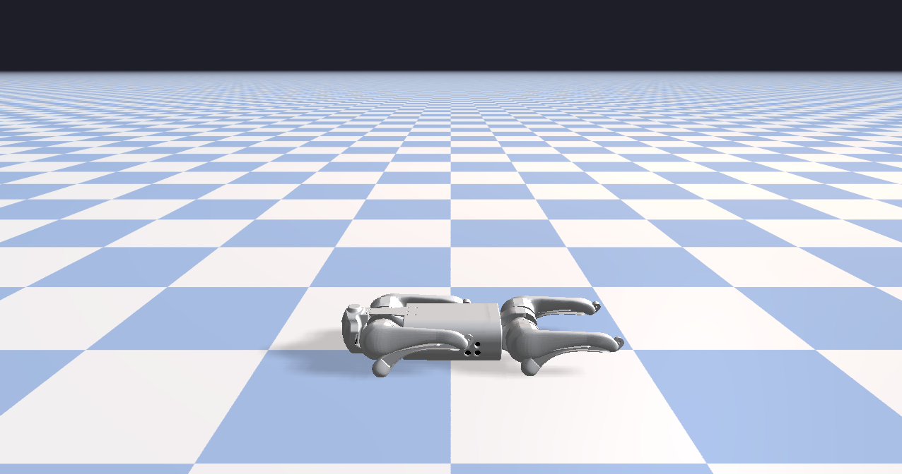

###########################
Rayrai Example: Basic Scene
###########################

Overview
========
Minimal scene with Go1 on a textured ground plane. It is a quick sanity check for loading a robot and rendering a basic environment.

Screenshot
==========

Binary
======
Installed executable: ``rayrai_basic_scene``.

Run
====
Run the installed executable:

.. code-block:: bash

   <raisim-install>/bin/rayrai_basic_scene

On Windows, run ``rayrai_basic_scene.exe`` instead.
This example uses the in-process rayrai renderer (no external client required).

Details
=======
- Loads the Go1 URDF, sets a nominal standing pose, and adds a ground plane.
- Sets a background color and a checkerboard ground texture.
- Minimal render loop for a basic rayrai scene.

