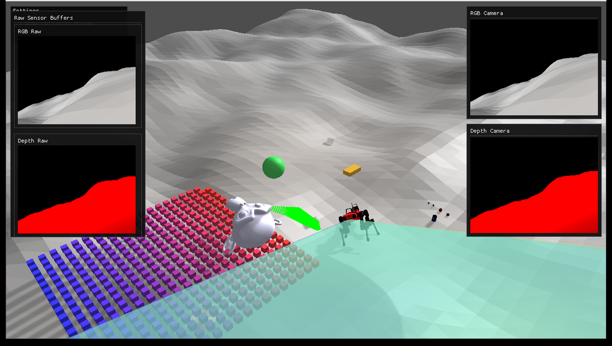

#################################
Rayrai Example: Complete Showcase
#################################

Overview
========
Comprehensive rayrai showcase with Go1, Livox LiDAR, D455 RGB/depth sensors, heightmap terrain, YCB objects, custom visuals, instanced geometry, and a live LiDAR point cloud. Use it as an end-to-end check for rayrai and sensor rendering.

Screenshot
==========

Target
======
CMake target: ``rayrai_complete_showcase``.

Run
====
Run the build-tree executable:

.. code-block:: bash

   ./build-examples/examples/rayrai_complete_showcase

On Windows, run ``rayrai_complete_showcase.exe`` instead.
This example uses the in-process rayrai renderer (no external client required).

Details
=======
- Loads a sensored ANYmal, heightmap terrain, primitives, and YCB objects.
- Updates LiDAR scans into a point cloud and renders RGB/depth sensors.
- Shows camera frustums and raw sensor buffers in ImGui.

Frame capture
=============
The example can write its rendered frames (scene plus the sensor panels) to disk
so the documentation GIF can be regenerated. Capture is off unless
``RAYRAI_SHOWCASE_CAPTURE_DIR`` is set; a normal run never reads the framebuffer
back. Frames are written as binary PPM, which ``ffmpeg`` reads directly.

.. list-table::
   :header-rows: 1
   :widths: 40 60

   * - Environment variable
     - Effect
   * - ``RAYRAI_SHOWCASE_CAPTURE_DIR``
     - Output directory. Setting it enables capture; the example exits once the
       requested frame count is written.
   * - ``RAYRAI_SHOWCASE_CAPTURE_FRAMES``
     - Number of frames to write (default 150).
   * - ``RAYRAI_SHOWCASE_CAPTURE_SKIP``
     - Rendered frames to skip before capturing (default 90), so assets and
       sensor buffers are populated in the first captured frame.
   * - ``RAYRAI_SHOWCASE_CAPTURE_EVERY``
     - Capture every ``N``-th frame (default 1). The loop advances one physics
       step per rendered frame, so a stride above 1 is what keeps the captured
       sequence from playing back in slow motion. At the default 5 ms time step,
       stride 16 puts 80 ms of simulation in every frame, which is exactly real
       time at 12.5 fps.

.. code-block:: bash

   RAYRAI_SHOWCASE_CAPTURE_DIR=/tmp/showcase_frames \
   RAYRAI_SHOWCASE_CAPTURE_FRAMES=75 \
   RAYRAI_SHOWCASE_CAPTURE_SKIP=120 \
   RAYRAI_SHOWCASE_CAPTURE_EVERY=16 \
     ./build-examples/examples/rayrai_complete_showcase

   ffmpeg -framerate 12.5 -i /tmp/showcase_frames/frame_%04d.ppm \
     -filter_complex "[0:v] scale=954:540:flags=lanczos,split [a][b];\
                      [a] palettegen=stats_mode=diff [p];\
                      [b][p] paletteuse=dither=bayer:bayer_scale=5:diff_mode=rectangle" \
     -loop 0 docs/image/rayrai_complete_showcase.gif

