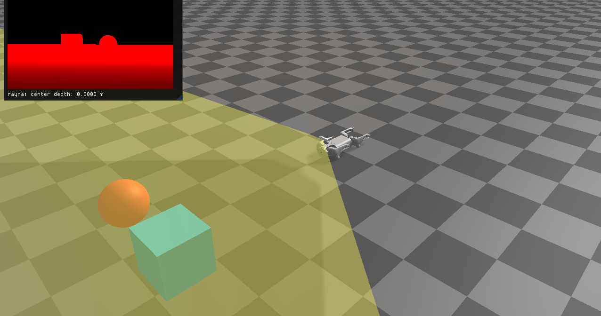

############################
Rayrai Example: Depth Camera
############################

Overview
========
Renders a linear depth texture from the Go1 depth camera and shows it in ImGui
with a frustum overlay. This is the recommended RGB/depth sensor path when
rayrai is available. The runnable path reads rendered depth from rayrai; the
commented ``World::captureDepthCamera`` block is kept only as a deterministic
CPU fallback for headless ray-query use.

Screenshot
==========

Binary
======
Installed executable: ``rayrai_depth_camera``.

Run
====
Run the installed executable:

.. code-block:: bash

   <raisim-install>/bin/rayrai_depth_camera

On Windows, run ``rayrai_depth_camera.exe`` instead.
This example uses the in-process rayrai renderer (no external client required).

Details
=======
- Loads Go1 with the D455 module and fetches the depth sensor.
- Renders a linear depth texture and shows it in an ImGui window.
- Reads the rayrai depth buffer with ``raisin::Camera::getRawImage``.
- Keeps a commented CPU ``World::captureDepthCamera`` fallback for depth,
  segmentation object id, optional hit point per pixel, timestamp, and
  deterministic depth noise when rayrai rendering is not available.
- Places a sphere and box in front of the camera using its pose.

