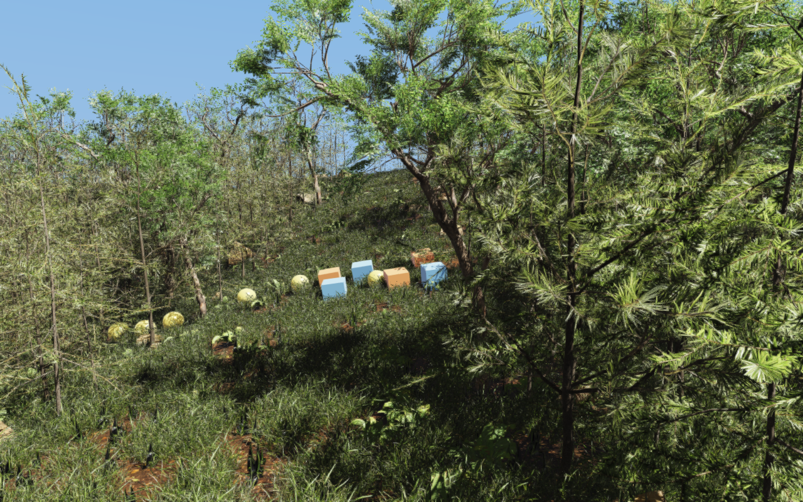

############################
Rayrai Example: Dense Forest
############################

``rayrai_forest`` demonstrates dense foliage rendering and RaiSim physics in
one native window. It uses the shared 161 by 161 heightmap for both collision
and terrain-grounded plant placement across an 80 by 80 metre landscape.

Scene and rendering
===================

* 1,888 trees: 880 pine saplings, 880 fir saplings, and 128 broadleaf trees.
* 61,200 ground-cover instances: 18,000 each of three grasses, plus 1,800 each
  of fern, dandelion, nettle, and periwinkle.
* 180 mossy rocks from six instanced meshes.
* Twelve dynamic RaiSim bodies: six crates and six balls.

Trees, ground cover, and rocks are visual-only. The static terrain and twelve
dynamic objects provide collision. Grass covers slopes, terrain edges, the
view corridor, and the physics clearing. A fixed scatter seed gives repeatable
placement; plants are rooted before scattering and rocks are embedded using
terrain samples around their bases.

Rendering uses automatic mesh LOD, projected-size instance thinning, shadow-only
foliage LOD, wind, three directional shadow cascades, and 4x MSAA. All vegetation
batches cast shadows by default; foliage impostors are disabled. Strong direct
sunlight, subdued neutral environment fill, and ACES tone mapping create bright
leaf highlights and shaded canopy areas. See :doc:`../../rayrai/Foliage` for
the APIs and their quality/performance tradeoffs.

The loading overlay tracks asynchronous import, LOD preparation, and GPU uploads.
Physics starts after all assets are ready, then advances eight 2 ms steps per
rendered frame on the calling thread. Camera input remains available while
loading. The interactive executable accepts only an optional ``--assets DIR``;
bounded runs and timing use separate test executables.

Build and run
=============

CMake target: ``rayrai_forest``. With the normal top-level examples build:

.. code-block:: bash

    cmake --build build-examples --target rayrai_forest -j12
    ./build-examples/examples/rayrai_forest

Windows builds place ``rayrai_forest.exe`` in ``build-examples/bin``.
For an isolated Linux build with the optional tests, run from the
``raisim2Lib`` root:

.. code-block:: bash

    cmake -S examples -B /tmp/raisim-forest-build -G Ninja \
      -DCMAKE_BUILD_TYPE=Release -DCMAKE_CXX_COMPILER=clang++-20 \
      -DRAISIM_PREFIX="$PWD/raisim" -DRAYRAI_PREFIX="$PWD/rayrai" \
      -DRAISIM_FOREST_EXAMPLE_TESTS=ON -DRAISIM_FOREST_GPU_TESTS=ON
    cmake --build /tmp/raisim-forest-build --target rayrai_forest \
      forest_scene_test forest_loading_test forest_render_test forest_shadow_test -j12
    /tmp/raisim-forest-build/rayrai_forest

Use the platform compiler/generator and a temporary build directory on macOS
or Windows. The forest target requires C++20 and a valid RaiSim activation key.
It opens its own renderer window and needs no external visualization client.

Assets default to ``examples/rsc/forest`` in the checkout. To relocate the
executable, copy that complete directory and select it explicitly:

.. code-block:: bash

    /tmp/raisim-forest-build/rayrai_forest --assets /path/to/forest

Tests and measurements
======================

.. code-block:: bash

    ctest --test-dir /tmp/raisim-forest-build -j12 --output-on-failure -R '^forest_'
    python3 examples/tools/benchmark_forest.py \
      --viewer /tmp/raisim-forest-build/forest_render_test \
      --out /tmp/forest-benchmark.json --frames 300 --runs 3

The checks cover terrain placement/physics, asset integrity, loading progress,
rendering, and foliage shadows. GPU tests run serially and require a working
desktop OpenGL context even for hidden windows. The benchmark runs one viewer
at a time with numerical-library thread counts set to one. It measures physics,
UI, rendering, swap, and GPU completion after loading and 60 warm-up frames.
Asynchronous asset preparation remains enabled.

First loading can take substantially longer while mesh LODs are generated.
Subsequent runs reuse persistent LOD caches. To measure cold and cached loading
separately, use a new, empty cache directory:

.. code-block:: bash

    python3 examples/tools/benchmark_forest_loading.py \
      --viewer /tmp/raisim-forest-build/forest_render_test \
      --out /tmp/forest-loading-results --cache-dir /tmp/forest-loading-cache \
      --runs 3

Source and assets
=================

The source is under ``examples/src/rayrai/worlds``:
``rayrai_forest.cpp`` supplies the application loop, ``forest_viewer.hpp``
configures rendering, ``forest_scene.hpp`` builds terrain/scatter/physics, and
``forest_loading.hpp`` implements the overlay. ``FOREST.md`` contains additional
asset preparation details and recorded measurements.

Models and ground textures are Poly Haven CC0 assets. The bundle records source
URLs and hashes in ``examples/rsc/forest/sources.json`` and prepared-file hashes
in ``manifest.json``. The optional download/preparation workflow is:

.. code-block:: bash

    python3 examples/tools/download_forest_assets.py /tmp/forest-assets
    python3 examples/tools/prepare_forest_assets.py /tmp/forest-assets
    python3 examples/tests/test_forest_assets.py /tmp/forest-assets/prepared

The viewer itself has no runtime Python or editor-scene dependency. Regenerating
assets downloads the current upstream versions; the shipped manifests identify
the versions used in the bundled scene.
