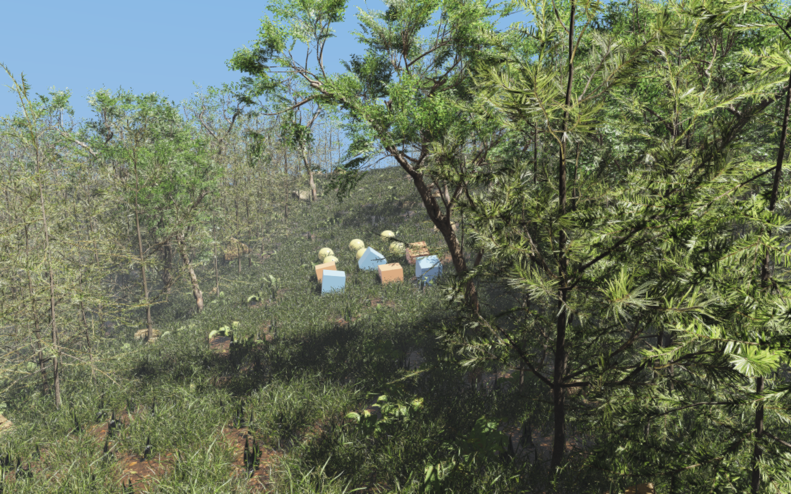

######################
Rayrai Example: Forest
######################

Overview
========
Renders an 80 m × 80 m rolling heightmap covered by instanced Poly Haven
vegetation: 1,888 trees, 61,200 ground-cover instances, and 180 mossy rocks.
Six crates and six balls fall onto the same heightmap that places the plants.
Vegetation and rocks are visual-only; collision comes from the terrain and the
twelve bodies.

Target
======
CMake target: ``rayrai_forest`` (C++20).

The example uses rayrai APIs that are newer than the 2.6.1 release package, so
it builds only against the upcoming rayrai release. With the 2.6.1 package,
build the other targets explicitly, for example
``cmake --build build-examples --target rayrai_basic_scene``.

Run
===
Run the build-tree executable:

.. code-block:: bash

   ./build-examples/examples/rayrai_forest
   ./build-examples/examples/rayrai_forest --assets /path/to/forest

On Windows, run ``rayrai_forest.exe`` instead. The asset directory defaults to
``rsc/forest`` in the checkout used to configure the build. Copy that
directory and pass ``--assets`` when you move the executable.

Loading and caches
==================
Meshes load asynchronously while a progress bar across the top of the window
counts the finished assets; physics starts once loading completes. The first
launch builds mesh LODs for the high-detail plants and can take tens of
seconds. Rayrai saves the prepared levels beside each model as
``rayrai_cache_model.gltf.lods`` and reads them on later launches. When the
asset directory is read-only, the cache goes to the system temporary directory
instead. Set ``RAYRAI_ASYNC_LOD_CACHE_DIR`` to choose a cache directory, or set
``RAYRAI_DISABLE_ASYNC_LOD_CACHE`` to disable the cache. The cache files are
ignored by Git and can be deleted at any time.

Details
=======
- Uses one 161 × 161 heightmap for both collision and plant placement, with a
  fixed-seed scatter.
- Renders ten plant types and six rock shapes as ``InstancedVisuals`` with
  automatic mesh LOD, projected-size thinning, foliage shadow LOD, per-type
  wind, and shadows enabled for every batch.
- Uses the ``High`` preset with ACES tone mapping, 4× MSAA, three directional
  shadow cascades out to 80 m, and clear weather with a distance haze.
- Integrates eight 2 ms physics steps per rendered frame.

Tests
=====
``-DRAISIM_FOREST_EXAMPLE_TESTS=ON`` registers terrain-placement/physics,
loading-overlay, and asset-integrity checks; the asset check needs Python 3.
``-DRAISIM_FOREST_GPU_TESTS=ON`` registers a rendering smoke test and a
foliage-shadow check; both need a display and OpenGL.

The assets are from Poly Haven under CC0; see
``rsc/forest/ATTRIBUTION.md``. ``examples/src/rayrai/worlds/FOREST.md``
documents asset preparation, the benchmark scripts, and measured loading times.
