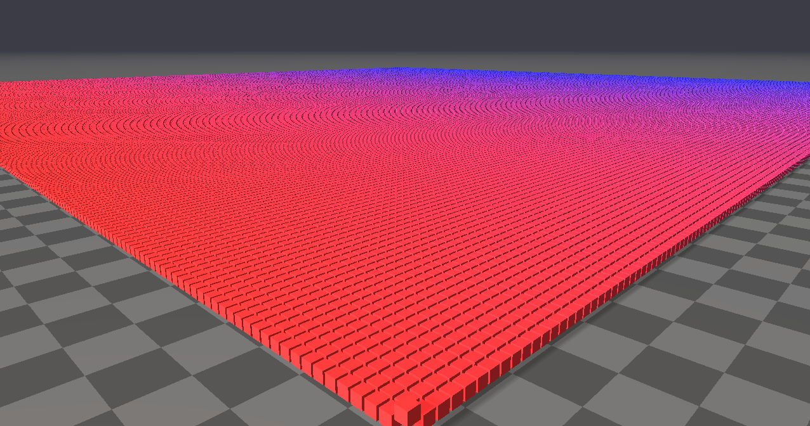

###############################
Rayrai Example: Instancing Grid
###############################

Overview
========
Renders a large grid of instanced boxes to demonstrate instancing performance and per-instance weighting.

Screenshot
==========

Target
======
CMake target: ``rayrai_instancing_grid``.

Run
====
Run the build-tree executable:

.. code-block:: bash

   ./build-examples/examples/rayrai_instancing_grid

On Windows, run ``rayrai_instancing_grid.exe`` instead.
This example uses the in-process rayrai renderer (no external client required).

Details
=======
- Creates a 300x300 grid of instanced boxes with per-instance color weights.
- Animates one instance to demonstrate dynamic updates.
- Uses ``InstancedVisuals`` for efficient bulk rendering.

