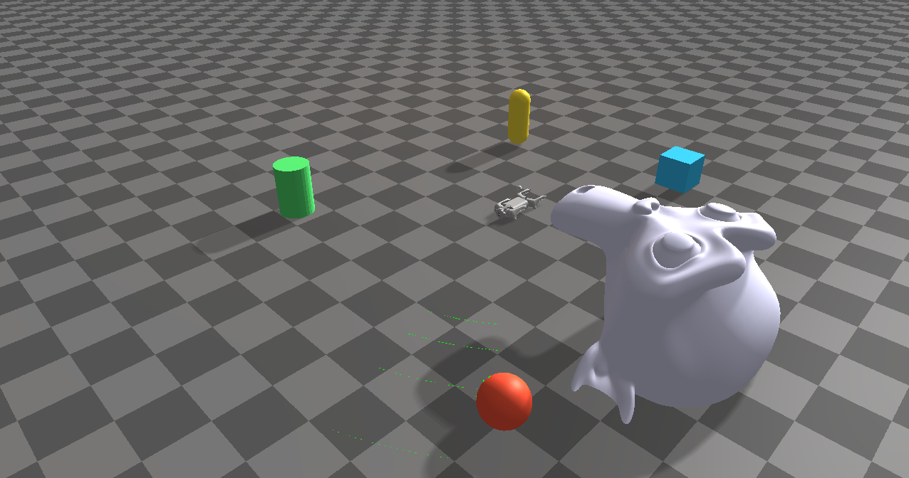

################################
Rayrai Example: LiDAR Pointcloud
################################

Overview
========
Attaches a Livox LiDAR module to Go1 and visualizes the scan as a point cloud every frame, with nearby primitives and a static mesh to generate richer returns.

Screenshot
==========

Binary
======
Installed executable: ``rayrai_lidar_pointcloud``.

Run
====
Run the installed executable:

.. code-block:: bash

   <raisim-install>/bin/rayrai_lidar_pointcloud

On Windows, run ``rayrai_lidar_pointcloud.exe`` instead.
This example uses the in-process rayrai renderer (no external client required).

Details
=======
- Loads Go1 with a Livox LiDAR module and updates scans each frame.
- Transforms LiDAR points from sensor to world frame.
- Visualizes the scan as a point cloud with adjustable point size.

