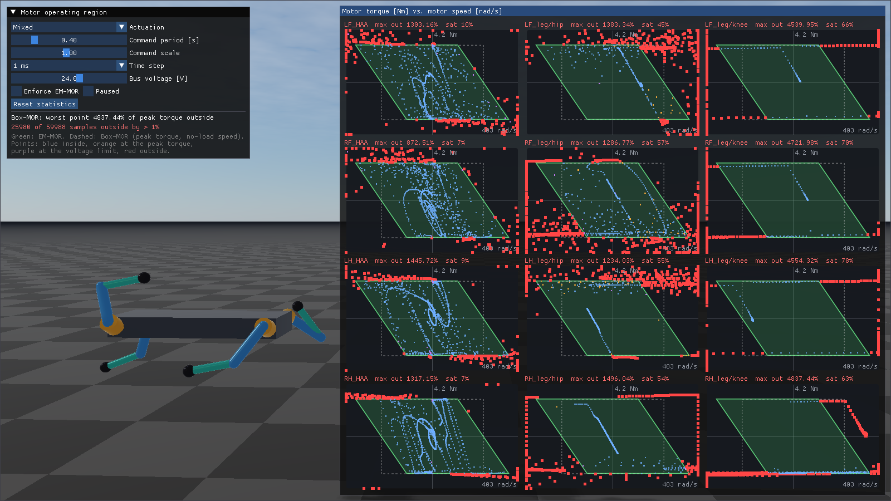

###########################################
Rayrai Example: Motor Operating Region
###########################################

Overview
========
This example drives the twelve motors of a fixed-base quadruped rig with random commands and plots,
for every motor, its operating region and the operating points of the last second in the motor's
torque-speed plane. Use it to check that RaiSim keeps every motor inside its region
(see :doc:`../../Actuators`).

.. image:: ../../../../rsc/docs/image/rayrai_motor_operating_region.png
   :alt: twelve torque-speed plots with green parallelogram regions next to a quadruped rig
   :width: 100%

With **Enforce EM-MOR** unticked, the joints only get the URDF effort limits (Box-MOR), and the same
commands leave the region far behind:

Target
======
CMake target: ``rayrai_motor_operating_region``.

Run
===

.. code-block:: bash

   ./build-examples/examples/rayrai_motor_operating_region

On Windows, use ``rayrai_motor_operating_region.exe``. The example uses the in-process rayrai
renderer and does not need a TCP viewer.

The control window sets the random actuation (mixed, position targets, velocity sweeps beyond the
no-load speed, or raw torques), its period and scale, the time step (1, 2.5 or 5 ms) and the bus
voltage. The **Bus voltage** slider calls ``setBusVoltage()``: the regions shrink and grow with it
while the speed axis stays at the voltage of the actuator files. **Enforce EM-MOR** switches between
the motor operating region and the URDF effort limits alone, and **Reset statistics** clears the
counters.

The model
=========
``rsc/motorOperatingRegion/quadruped_rig.urdf`` attaches two actuators to every leg. Their
parameters are in the linked files in ``rsc/motorOperatingRegion/actuators/``:

.. code-block:: xml

   <actuator name="LF_HAA" joints="LF_HAA" file="abduction_actuator.xml"/>
   <actuator name="LF_leg" joints="LF_HFE LF_KFE" file="hound_leg_actuator.xml"/>

All twelve motors are the same DC motor on a 24 V bus: :math:`R = 0.4\ \Omega`,
:math:`K_t = 0.1` Nm/A, :math:`K_v = 10` rad/s/V and a peak torque of 3 Nm, i.e., a 6 Nm stall
torque and a 240 rad/s no-load speed. The actuator files also set the friction and damping of the
drives, measured at the joints; they add to the 0.02 Nm s/rad joint damping of the URDF.

* ``abduction_actuator.xml``: the hip abduction motor behind a 6:1 reducer.

  .. code-block:: xml

     <motor_group name="abduction_6to1" gear_ratio="6" bus_voltage="24">
       <motor resistance="0.4" torque_constant="0.1" velocity_constant="10" peak_torque="3"
              output_damping="0.01" output_friction="0.2"/>
     </motor_group>

* ``hound_leg_actuator.xml``: the hip and knee motors of a leg, coupled like KAIST Hound. Both sit
  on the body and the knee reducer's ring gear turns with the thigh, so the knee motor speed is
  :math:`\omega_{HFE} + 10\,\omega_{KFE}`:

  .. code-block:: xml

     <motor_group name="hound_leg" motor_from_joint="10 0 1 10" bus_voltage="24">
       <motor name="hip" resistance="0.4" torque_constant="0.1" velocity_constant="10" peak_torque="3"
              output_damping="0.02" output_friction="0.3"/>
       <motor name="knee" resistance="0.4" torque_constant="0.1" velocity_constant="10" peak_torque="3"
              output_damping="0.02" output_friction="0.3"/>
     </motor_group>

The motors are named ``LF_HAA`` and ``LF_leg/hip``, ``LF_leg/knee`` and so on.

What the plots show
===================
* **Green parallelogram:** the operating region (EM-MOR). Its top and bottom edges are the peak
  torque and its slanted edges the bus-voltage limit. It extends beyond the no-load speed in the
  braking quadrants (II and IV).
* **Dashed rectangle:** the Box-MOR of the peak torque and the no-load speed.
* **Points:** the operating points of the last second, i.e., the step-averaged motor speed and the
  applied motor torque from ``getMotorStates()``. Blue points are inside the region, orange points
  are at the peak torque, purple points are at the voltage limit, and red points are outside by more
  than 1 % of the peak torque.
* **Title:** the largest distance outside the region since the last reset, as a percentage of the
  peak torque, and the fraction of steps in which the motor saturated. The control window sums up
  all motors.

The region holds at 5 ms as well, because RaiSim integrates the back-EMF torque implicitly.

Full source
===========

.. literalinclude:: ../../../../examples/src/rayrai/dynamics/rayrai_motor_operating_region.cpp
   :language: cpp
   :linenos:
