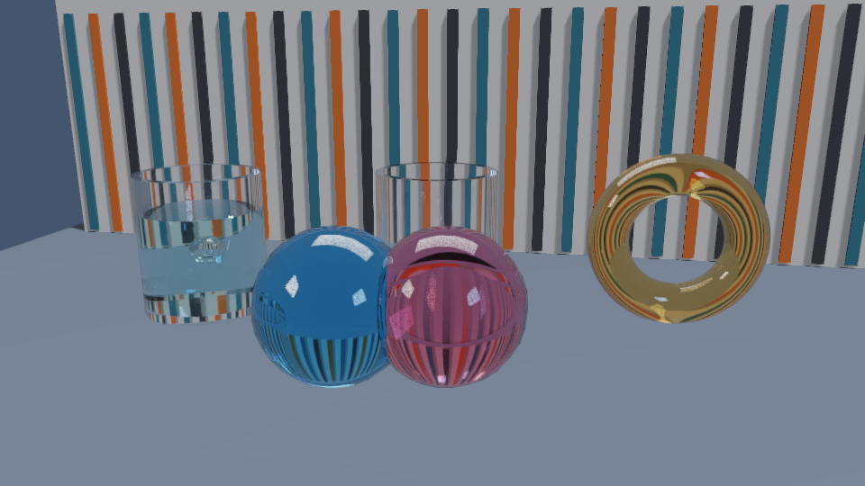

############################
Rayrai Example: Nested Glass
############################

Overview
========
The in-process Rayrai example traces a water-filled glass with an enclosed air
bubble, an empty hollow cup, a concave amber torus, and two overlapping tinted
glass solids. The media have explicit indices of refraction and dielectric
priorities so overlapping interfaces resolve in a defined order. The default
backend uses hardware ray tracing when available and otherwise selects the
portable OpenGL tracer. It starts with 10 paths per frame and at most 10
bounces; ``--backend=portable`` selects the OpenGL tracer explicitly.

Screenshot
==========

Target and run
==============
CMake target: ``rayrai_nested_glass``.

.. code-block:: bash

   ./build-examples/examples/rayrai_nested_glass

On Windows, run ``rayrai_nested_glass.exe``. Drag to look, use WASD and Space
to move, and click an object to orbit it. The Geometry refraction panel controls
the backend, samples per frame, and bounce count. The example needs no TCP viewer.

For a finite PNG capture or a stacked-media stress scene:

.. code-block:: bash

   ./build-examples/examples/rayrai_nested_glass --backend=portable --out=nested_glass.png --frames=24 --warmup=0
   ./build-examples/examples/rayrai_nested_glass --layers=4

``--layers=N`` supports 1 through 16 concentric glass/water boxes; ``--layers=0``
returns to the default composition. ``--benchmark`` runs a finite timing pass,
and ``--width``, ``--height``, ``--bounces``, and ``--msaa`` control its render.
