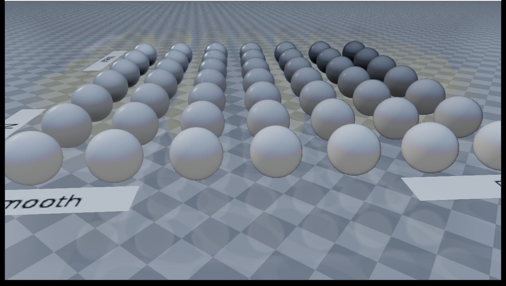

#################################
Rayrai Example: PBR Material Grid
#################################

Overview
========
Renders the Khronos MetalRoughSpheres glTF asset to check metallic-roughness material import, lighting, and shadow response in rayrai.

Screenshot
==========

Binary
======
CMake target and executable name: ``rayrai_pbr_material_grid``.

Run
====
Build and run from your build directory:

.. code-block:: bash

   cmake --build . --target rayrai_pbr_material_grid
   ./rayrai_pbr_material_grid

On Windows, run ``rayrai_pbr_material_grid.exe`` instead.
This example uses the in-process rayrai renderer (no external client required).

Details
=======
- Loads ``rayrai/pbr/MetalRoughSpheres/glTF/MetalRoughSpheres.gltf``.
- Displays a grid of spheres spanning metallic and roughness values.
- Animates the mesh orientation so highlights and shadows can be checked over time.

Source
======
.. literalinclude:: ../../../../examples/src/rayrai/rayrai_pbr_material_grid.cpp
   :language: cpp
