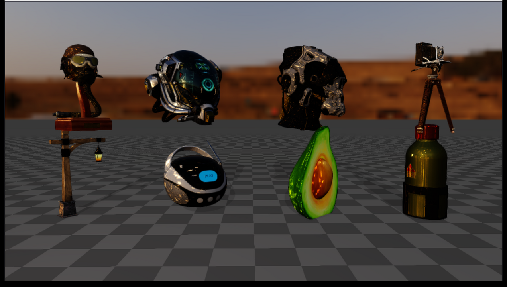

#################################
Rayrai Example: PBR Texture Maps
#################################

Overview
========
Loads eight Khronos glTF Sample Assets in one interactive RayRai scene. The example is
an asset inspector for textured PBR import, HDR image-based lighting, normal maps,
metallic-roughness maps, occlusion maps, emissive maps, and mixed asset scales/units.
The sample assets are CC0 and free for commercial use.

Screenshot
==========

Binary
======
Installed executable: ``rayrai_pbr_texture_maps``.

Run
====
Run the installed executable:

.. code-block:: bash

   <raisim-install>/bin/rayrai_pbr_texture_maps

On Windows, run ``rayrai_pbr_texture_maps.exe`` instead.
This example uses the in-process rayrai renderer (no external client required).

Details
=======
- Loads these glTF assets from ``examples/rsc/rayrai/pbr``:
  ``FlightHelmet``, ``DamagedHelmet``, ``SciFiHelmet``, ``AntiqueCamera``,
  ``Lantern``, ``BoomBox``, ``Avocado``, and ``WaterBottle``.
- Normalizes asset scale after asynchronous mesh loading completes so all eight assets
  are visible and large enough for close inspection.
- Keeps assets upright in RayRai/RaiSim's Z-up coordinate convention.
- Uses the Ultra quality preset with tuned exposure, shadows, and additional scene
  lights.
- Adds ``small_harbour_sunset_1k.hdr`` as an HDR environment. The HDR is used both for
  the visible background and for PBR reflections through environment, irradiance,
  prefiltered environment, and BRDF lookup textures.
- Lets the user move the camera around and inspect assets up close; this is the
  preferred example for checking whether imported PBR texture maps are actually active.

