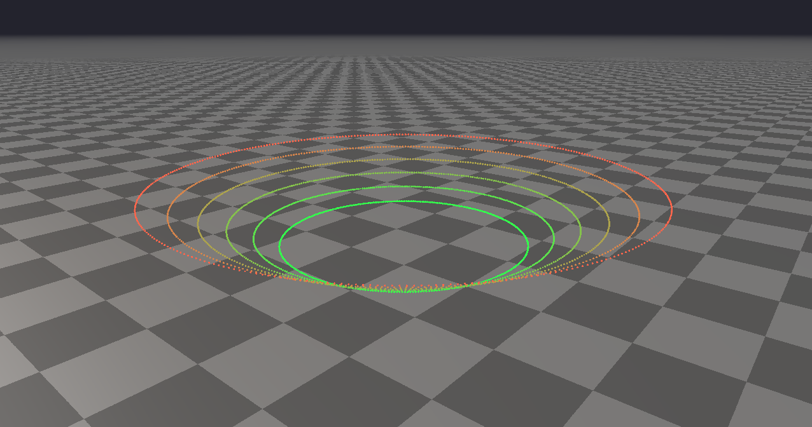

####################################
Rayrai Example: Pointcloud Animation
####################################

Overview
========
Generates animated ring point clouds to show per-point color updates and dynamic point buffer uploads.

Screenshot
==========

Binary
======
Installed executable: ``rayrai_pointcloud_animation``.

Run
====
Run the installed executable:

.. code-block:: bash

   <raisim-install>/bin/rayrai_pointcloud_animation

On Windows, run ``rayrai_pointcloud_animation.exe`` instead.
This example uses the in-process rayrai renderer (no external client required).

Details
=======
- Builds a synthetic multi-ring point cloud with per-ring colors.
- Updates positions every frame to create an orbiting animation.
- Good for testing point-cloud upload and rendering.

