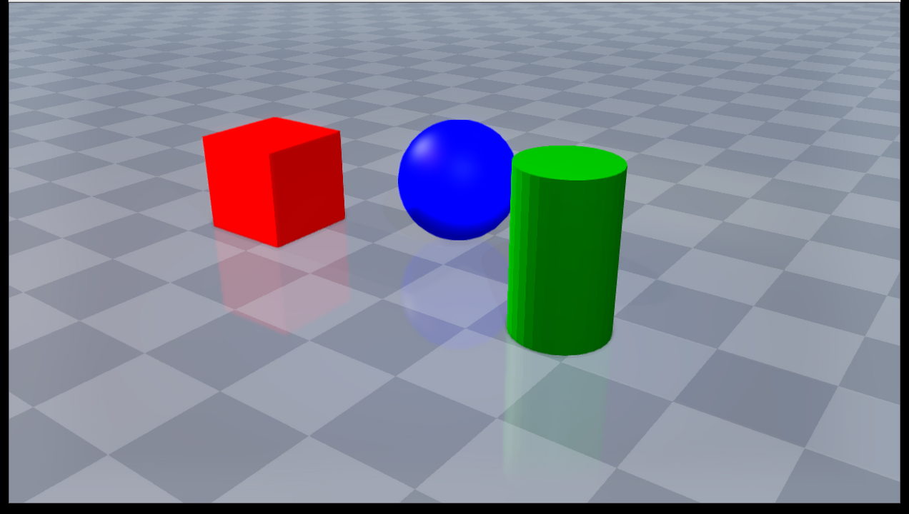

##########################################
Rayrai Example: Quality Lighting and FXAA
##########################################

Overview
========
Demonstrates rayrai's high-fidelity viewer controls with a reflective ground,
FXAA, depth of field, and multiple additional light types. The main directional light
owns the cheapest shadow map, while point lights use cube shadow maps and directional,
spot, and area-style lights use 2D shadow maps when they are selected into the shadow
budget. The example is intended for inspection and presentation rather than maximum
batch data-generation throughput.

Screenshot
==========

Binary
======
Installed executable: ``rayrai_quality_lighting``.

Run
====
Run the installed executable:

.. code-block:: bash

   <raisim-install>/bin/rayrai_quality_lighting

On Windows, run ``rayrai_quality_lighting.exe`` instead. This example uses the
in-process rayrai renderer and does not need the TCP viewer.

Details
=======
- Enables the ``Ultra`` render-quality preset and explicitly keeps ``fxaaEnabled``, ``depthOfFieldEnabled``, and reflective ground on, using a 5 m focus distance, broad focus range, and conservative blur radius.
- Adds one point light, one spotlight with inner/outer cone falloff, and one area-light approximation.
- Demonstrates the extra-light path used by authored visual scenes. Fast/Balanced
  presets keep the default one-light path inexpensive; High/Ultra can spend more
  budget on additional lights, shadow maps, reflection probes, and postprocessing.
- Uses the real planar reflection path on the ground material instead of placing duplicate reflection geometry.

