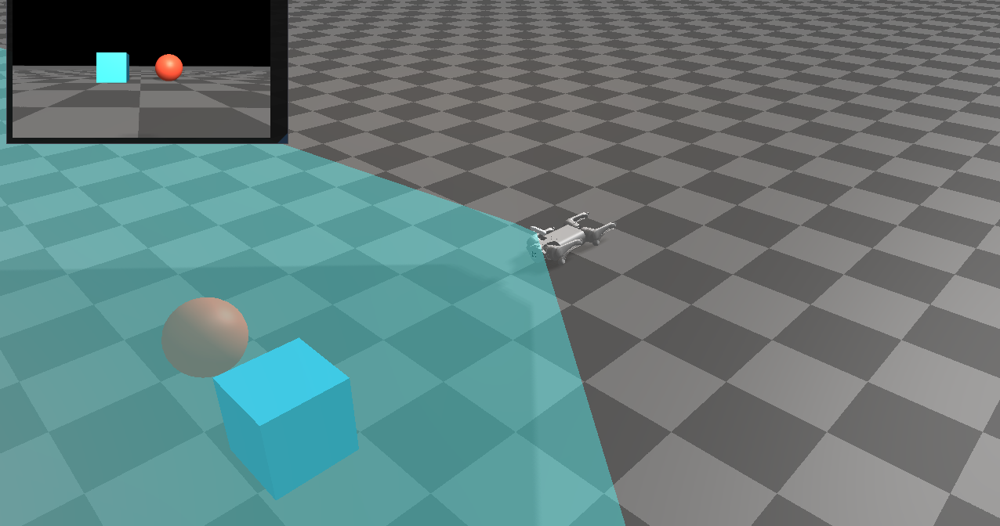

##########################
Rayrai Example: RGB Camera
##########################

Overview
========
Renders the Go1 RGB camera into an ImGui window and draws the camera frustum in the scene. It demonstrates the RGB sensor rendering path and UI texture display.

Screenshot
==========

Binary
======
Installed executable: ``rayrai_rgb_camera``.

Run
====
Run the installed executable:

.. code-block:: bash

   <raisim-install>/bin/rayrai_rgb_camera

On Windows, run ``rayrai_rgb_camera.exe`` instead.
This example uses the in-process rayrai renderer (no external client required).

Details
=======
- Loads Go1 with the D455 module and fetches the RGB camera.
- Renders the RGB frame with an external camera and shows it in ImGui.
- Adds a camera frustum overlay for debugging intrinsics.

