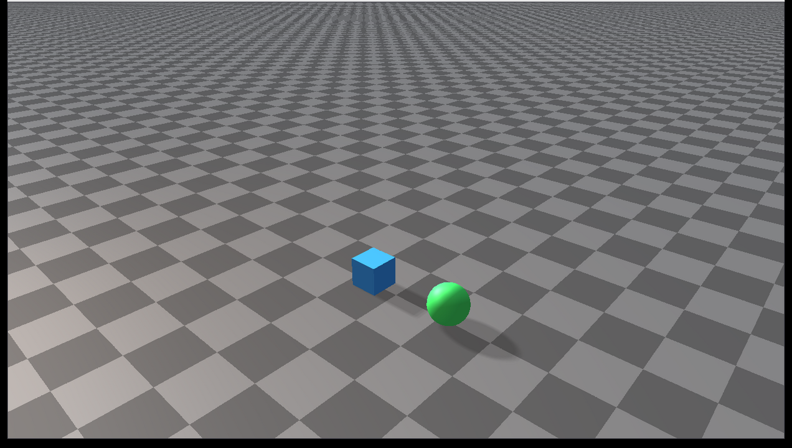

#####################################
Rayrai Example: Runtime Scene Editing
#####################################

Overview
========
Visualizes runtime scene editing operations that are useful for reset-heavy
workloads: stable object id lookup, single-body snapshots, collision filter
changes, cloning, and object removal.

Use this example when building reset, randomization, replay, or scripted scene
editing workflows. It shows how to mutate a running world between simulation
steps without reconstructing the whole world.

Binary
======
Installed executable: ``rayrai_runtime_scene_editing``.

This example is only built when the installed RaiSim package exposes the
runtime scene editing APIs.

Run
===
Run the installed executable:

.. code-block:: bash

   <raisim-install>/bin/rayrai_runtime_scene_editing

On Windows, run ``rayrai_runtime_scene_editing.exe`` instead.
This example uses the in-process rayrai renderer.

Details
=======
- Captures and restores a ``World::SingleBodySnapshot``.
- Clones a primitive single-body object with ``cloneSingleBodyObject``.
- Looks up a body by stable object id.
- Toggles the sphere collision mask during the simulation.
- Removes and recreates a cloned body while the world is running.

What to look for
================
The scene contains a source box, a cloned box, and a sphere. During the loop:

- The source box is restored from a snapshot and relaunched.
- The cloned box is periodically removed and recreated.
- The sphere alternates between normal collision and a filtered collision mask.

These operations are intentionally visible so users can verify that the object
state changes are reflected by rayrai immediately.

API pattern
===========
The important pattern is:

.. code-block:: cpp

   raisim::World::SingleBodySnapshot snapshot;
   world->captureSingleBodySnapshot(body, snapshot);
   world->restoreSingleBodySnapshot(body, snapshot);

   auto* clone = world->cloneSingleBodyObject(body, "clone");
   world->setObjectCollisionFilter(clone, group, mask);

Call these APIs between simulation steps. The example keeps the world
single-threaded and performs all edits from the same loop that calls
``world->integrate()``.

