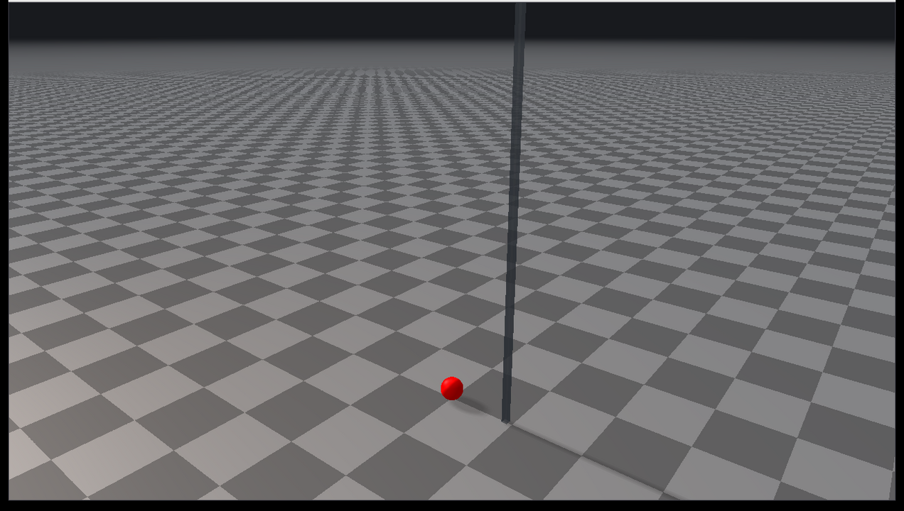

##############################
Rayrai Example: Swept CCD
##############################

Overview
========
Shows swept continuous collision detection on a fast sphere falling toward the
ground with a deliberately large simulation time step.

Use this example when tuning high-speed primitive contacts. It demonstrates the
settings needed to reduce tunneling for supported swept CCD pairs.

Binary
======
Installed executable: ``rayrai_swept_ccd``.

This example is only built when the installed RaiSim package exposes swept CCD
settings in ``contact::ContactSettings``.

Run
===
Run the installed executable:

.. code-block:: bash

   <raisim-install>/bin/rayrai_swept_ccd

On Windows, run ``rayrai_swept_ccd.exe`` instead.
This example uses the in-process rayrai renderer.

Details
=======
- Enables ``sweptCcdEnabled`` through ``World::setContactSettings``.
- Uses ``sweptCcdMinSpeed`` so only fast bodies trigger the swept path.
- Uses ``sweptCcdSpeculativeMargin`` to keep the contact generation margin
  explicit.
- Resets the sphere periodically so the CCD event is easy to inspect.

What to look for
================
The sphere is reset above the ground and assigned a large downward velocity.
With swept CCD enabled, the contact is generated along the swept path rather
than relying only on the final pose at the end of the time step.

API pattern
===========

.. code-block:: cpp

   auto settings = world->getContactSettings();
   settings.sweptCcdEnabled = true;
   settings.sweptCcdMinSpeed = 8.0;
   settings.sweptCcdSpeculativeMargin = 1e-4;
   world->setContactSettings(settings);

``sweptCcdMinSpeed`` avoids extra work for slow bodies. Keep the value near the
speed range where tunneling becomes visible in your task.

