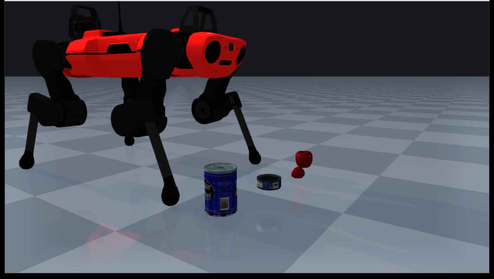

rayrai_visual_asset_support
===========================

Shows visual asset loading on realistic URDF assets with image textures. The
example loads the textured ANYmal C URDF and several YCB object URDFs whose OBJ
or DAE visual meshes reference texture image files, then renders them in rayrai.

Run:

.. code-block:: bash

   <raisim-install>/bin/rayrai_visual_asset_support

This example opens an in-process rayrai window and does not require the TCP
viewer.

What it demonstrates:

- Loading a realistic URDF with visual assets.
- Loading textured visual meshes referenced from URDF ``visual`` tags.
- Keeping visual assets and collision assets separate through URDF ``visual``
  and ``collision`` tags.
- Rendering image textures from packaged mesh assets such as
  ``rsc/anymal_c/meshes/*.jpg`` and ``rsc/ycb/*/google_16k/texture_map.png``.
- Using renderer-facing mesh assets for rayrai while RaiSim continues to use
  the collision geometry defined by the URDF.
