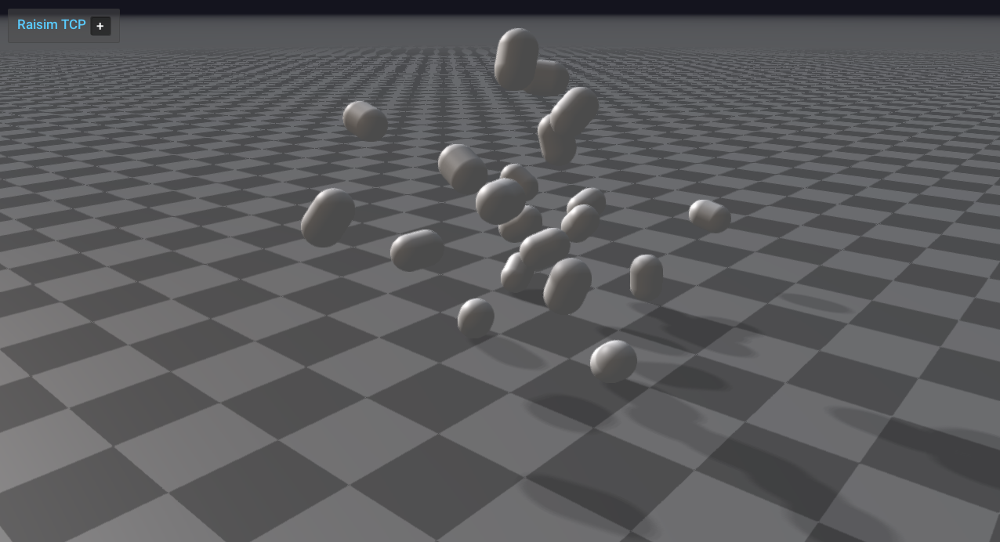

###############################
Server Example: Compound Object
###############################

Overview
========
Builds a compound object from many capsule children with random transforms, then drops it into the scene. It shows how to create and visualize compound shapes.

Screenshot
==========

Target
======
CMake target: ``compound_object``.

Run
====
Run the build-tree executable:

.. code-block:: bash

   ./build-examples/examples/compound_object

On Windows, run ``compound_object.exe`` instead.
This example uses RaisimServer. Start ``rayrai_tcp_viewer`` and connect to port 8080.

Details
=======
- Builds a compound object from 20 capsule children with random poses.
- Adds the compound to the world with custom inertia and appearance.
- Shows how to assemble compound shapes programmatically.

