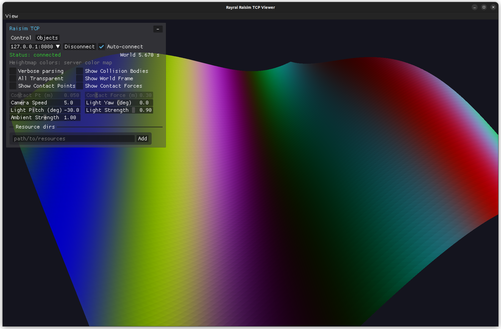

##################################
Server Example: Dynamic Heightmap
##################################

Overview
========
Updates a heightmap height field and color map every frame to animate terrain.
Use the rayrai TCP viewer for supported visualization. RaisimUnity and
RaisimUnreal are no longer supported.

Screenshot
==========

Binary
======
Installed executable: ``dynamic_heightmap``.

Run
====
Run the installed executable:

.. code-block:: bash

   <raisim-install>/bin/dynamic_heightmap

On Windows, run ``dynamic_heightmap.exe`` instead.
This example uses RaisimServer. Start the rayrai TCP viewer and connect to port 8080. RaisimUnity and RaisimUnreal are no longer supported.

Details
=======
- Creates a heightmap grid and updates heights and colors every frame.
- Uses visualization mutex locking while updating the heightmap.
- Intended for dynamic heightmap rendering in visualizers.

