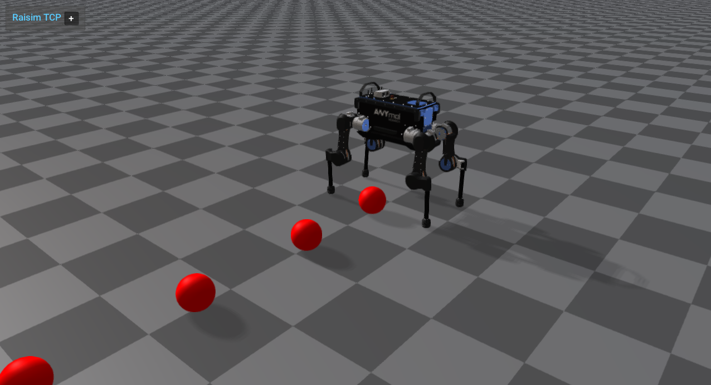

#######################################
Server Example: Dynamic Object Addition
#######################################

Overview
========
Runs an ANYmal with PD control and periodically throws balls into the scene. It shows interaction forces and how to spawn objects during a running simulation.

Screenshot
==========

Target
======
CMake target: ``dynamic_object_addition``.

Run
====
Run the build-tree executable:

.. code-block:: bash

   ./build-examples/examples/dynamic_object_addition

On Windows, run ``dynamic_object_addition.exe`` instead.
This example uses RaisimServer. Start ``rayrai_tcp_viewer`` and connect to port 8080.

Details
=======
- Spawns ANYmal with PD control and periodically adds spheres at runtime.
- Sets initial velocities for new objects to create a "ball throw" effect.
- Demonstrates safe world mutation while the server is running.

