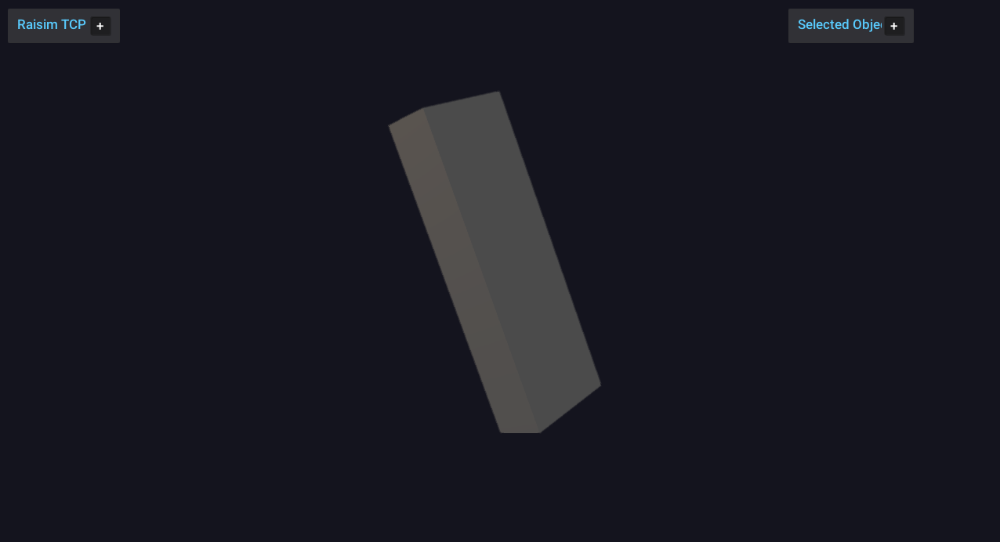

##################################
Server Example: Dzhanibekov Effect
##################################

Overview
========
Demonstrates the Dzhanibekov effect by spinning a box in zero gravity and visualizing the unstable rotation.

Screenshot
==========

Binary
======
Installed executable: ``dzhanibekov_effect``.

Run
====
Run the installed executable:

.. code-block:: bash

   <raisim-install>/bin/dzhanibekov_effect

On Windows, run ``dzhanibekov_effect.exe`` instead.
This example uses RaisimServer. Start ``rayrai_raisim_tcp_viewer`` and connect to port 8080.

Details
=======
- Simulates a freely rotating asymmetric box in zero gravity.
- Shows the intermediate-axis (Dzhanibekov) flipping behavior.
- Focuses the camera on the box for clear visualization.

