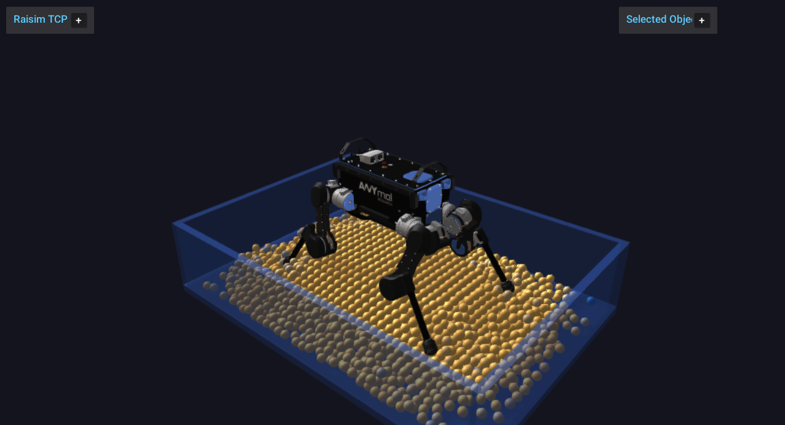

granular_media
==============

CMake target: ``granular_media``.

Run the build-tree executable and connect with ``rayrai_tcp_viewer``:

.. code-block:: bash

   ./build-examples/examples/granular_media

On Windows, run ``granular_media.exe`` instead.

This example shows ANYmal standing on a native granular bed with instanced granular-particle visuals.

