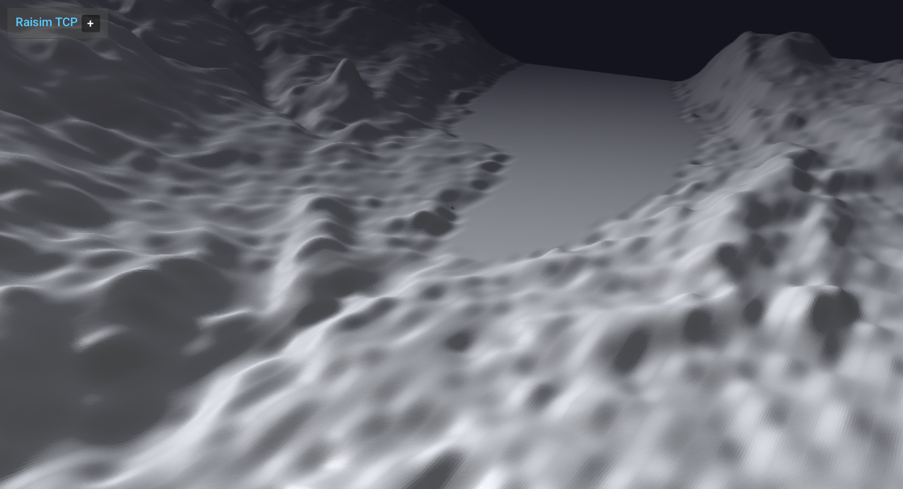

##################################
Server Example: Heightmap From Png
##################################

Overview
========
Loads a PNG heightmap (Zurich dataset) and drops ANYmal on it. This is the reference for heightmap-from-image workflows.

Screenshot
==========

Binary
======
Installed executable: ``heightmap_from_png``.

Run
====
Run the installed executable:

.. code-block:: bash

   <raisim-install>/bin/heightmap_from_png

On Windows, run ``heightmap_from_png.exe`` instead.
This example uses RaisimServer. Start the rayrai TCP viewer and connect to port 8080. RaisimUnity and RaisimUnreal are no longer supported.

Details
=======
- Loads a heightmap directly from a PNG file with scale/offset.
- Drops ANYmal onto the terrain and sets a terrain appearance.
- Reference for ``World::addHeightMap`` using images.

