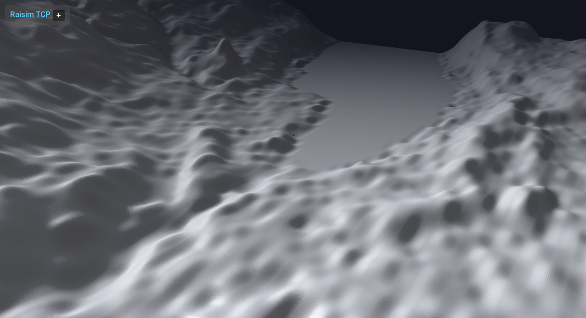

##################################
Server Example: Heightmap From Png
##################################

Overview
========
Loads a PNG heightmap (Zurich dataset) and drops ANYmal on it. This is the reference for heightmap-from-image workflows.

Screenshot
==========

Target
======
CMake target: ``heightmap_from_png``.

Run
====
Run the build-tree executable:

.. code-block:: bash

   ./build-examples/examples/heightmap_from_png

On Windows, run ``heightmap_from_png.exe`` instead.
This example uses RaisimServer. Start ``rayrai_tcp_viewer`` and connect to port 8080.

Details
=======
- Loads a heightmap directly from a PNG file with scale/offset.
- Drops ANYmal onto the terrain and sets a terrain appearance.
- Reference for ``World::addHeightMap`` using images.

