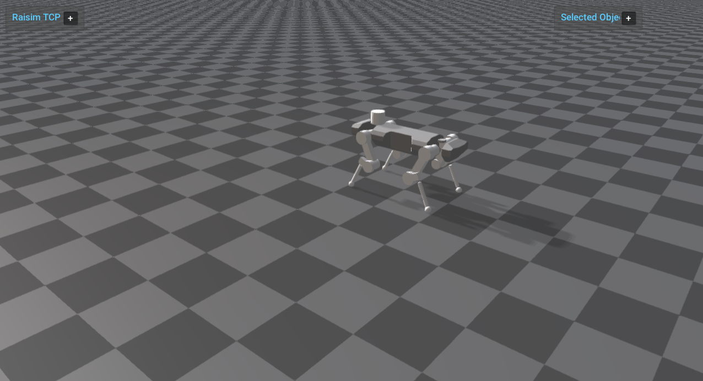

################################
Server Example: Inverse Dynamics
################################

Overview
========
Enables inverse dynamics on ANYmal and prints the resulting joint forces and torques. It compares inverse dynamics outputs to the applied generalized forces.

Target
======
CMake target: ``inverse_dynamics``.

Run
====
Run the build-tree executable:

.. code-block:: bash

   ./build-examples/examples/inverse_dynamics

On Windows, run ``inverse_dynamics.exe`` instead.
This example uses RaisimServer. Start ``rayrai_tcp_viewer`` and connect to port 8080.

Details
=======
- Enables inverse dynamics and applies external forces on the robot.
- Reads joint forces/torques in the world frame after integration.
- Prints inverse-dynamics results alongside commanded torques.

