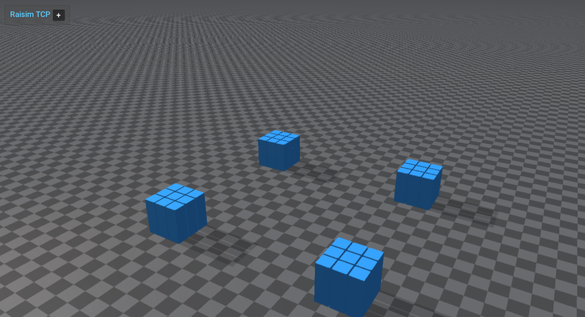

########################
Island Sleep Benchmark
########################

This example visualizes the sleeping-island system. A "sleeping island" is a
connected group of bodies that has come to rest (low velocity and low contact
activity) and is marked as sleeping by the simulator to skip expensive updates
until something wakes it.

The scene builds several separated box stacks (islands). Boxes turn blue when
sleeping and red when active. Midway through the run, a large sphere is launched
into one stack to wake that island and propagate motion.

Run
====

Build and run the example on one thread. It launches a RaiSim TCP server, so
start the packaged viewer separately when you want to inspect the islands:

.. code-block:: bash

    OMP_NUM_THREADS=1 OPENBLAS_NUM_THREADS=1 \
      ./build-examples/examples/island_sleep_benchmark --steps=12000
    ./rayrai/bin/rayrai_raisim_tcp_viewer

Arguments
=========

* ``--steps=``: number of simulation steps to run (default: 12000).
* ``--hit-step=``: step index to launch the wake sphere (default: ``2500``;
  clamped to the last step for shorter runs).
