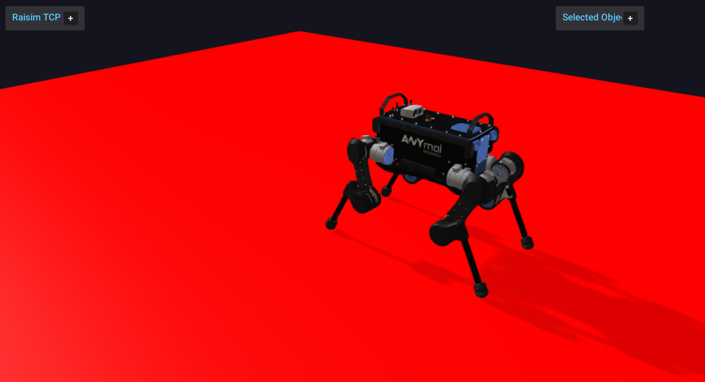

##################################
Server Example: Kinematic Platform
##################################

Overview
========
Creates a kinematic ground platform that moves sinusoidally under an ANYmal. It demonstrates kinematic bodies and their interaction with dynamic robots.

Screenshot
==========

Binary
======
Installed executable: ``kinematic_platform``.

Run
====
Run the installed executable:

.. code-block:: bash

   <raisim-install>/bin/kinematic_platform

On Windows, run ``kinematic_platform.exe`` instead.
This example uses RaisimServer. Start ``rayrai_raisim_tcp_viewer`` and connect to port 8080.

Details
=======
- Creates a kinematic ground platform (infinite mass) and moves it sinusoidally.
- Places ANYmal on top with PD posture control.
- Demonstrates ``BodyType::KINEMATIC`` and prescribed motion.

